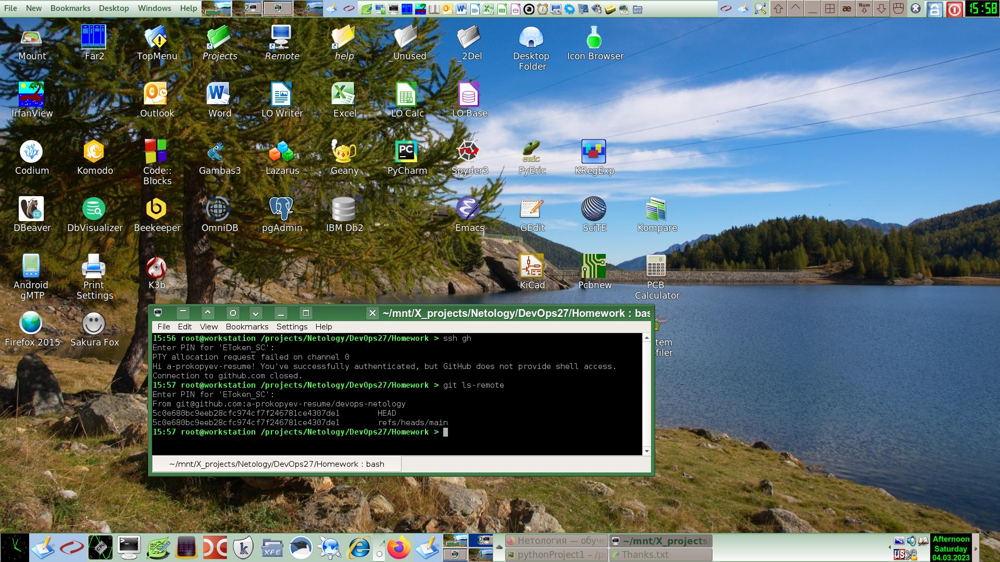

# Домашнее задание к занятию «Системы контроля версий»

### Цель задания

В результате выполнения задания вы: 

* научитесь подготоваливать новый репозиторий к работе;
* сохранять, перемещать и удалять файлы в системе контроля версий.  
   
------

## Задание 1. Создать и настроить репозиторий для дальнейшей работы на курсе

В рамках курса вы будете писать скрипты и создавать конфигурации для различных систем, которые необходимо сохранять для будущего использования. 
Сначала надо создать и настроить локальный репозиторий, после чего добавить удалённый репозиторий на GitHub.

### Создание репозитория и первого коммита

### Создание файлов `.gitignore` и второго коммита

### Эксперимент с удалением и перемещением файлов (третий и четвёртый коммит)

В результате предыдущих шагов в репозитории должно быть как минимум пять коммитов (если вы сделали ещё промежуточные — нет проблем):

    * `Initial Commit` — созданный GitHub при инициализации репозитория. 
    * `First commit` — созданный после изменения файла `README.md`.
    * `Added gitignore` — после добавления `.gitignore`.
    * `Prepare to delete and move` — после добавления двух временных файлов.
    * `Moved and deleted` — после удаления и перемещения временных файлов. 

### Отправка изменений в репозиторий

## Решение задания 1.

### Описание строк в файле .gitignore
 
1. ***/.terraform/* -- игнорировать вложенные скрытые папки ".terraform" и их содержимое
2. *.tfstate -- игнорировать все файлы с расширением ".tfstate"
3. *.tfstate.* -- игнорировать все файлы, содержащие в своем имени строку ".tfstate."
4. *.tfvars -- игнорировать все файлы с расширением ".tfvars"
5. override.tf -- игнорировать файл "override.tf"
6. override.tf.json -- игнорировать файл "override.tf.json"
7. *_override.tf -- игнорировать все файлы, имя которых заканчивается строкой "_override.tf"
8. *_override.tf.json -- игнорировать все файлы, имя которых заканчивается строкой "_override.tf.json"
9. .terraformrc -- игнорировать скрытый файл ".terraformrc"
10. terraform.rc -- игнорировать скрытый файл "terraform.rc"

Выполнение остальных шагов данной задачи видно в логе изменений репозитория git.

## Задание 2. Знакомство с документаций

Один из основных навыков хорошего специалиста — уметь самостоятельно находить ответы на возникшие вопросы.  
Чтобы начать знакомиться с документацией, выполните в консоли команды `git --help`, `git add --help` и изучите их вывод.  

## Решение задания 2.

### Почитал документацию, сделал небольшой конспект для себя:
  - Просмотр истории коммитов: git log
  - Отмена последнего коммита:    
    - Локально с сохранением незакоммиченных исходников: git reset --soft HEAD~1
    - Локально с удалением незакоммиченных исходников: git reset --hard HEAD~1
  - Удаленно: git revert HEAD
  - Создание новой ветки: git checkout -b BranchName 
  - Создание нового тэга: git tag -a Version -m "Message"
  - Исключение файла из индексирования: список исключаемых (игнорируемых) командой `git add` файлов указывается в файле .gitignore
  - Разрешение конфликта при слиянии веток
    - Нахождение конфликта: git status 
    - Разрешение конфликата в текстовом редакторе: joe, nano, etc.
    - Коммит: git commit -am "conflict resolution description"
    - Push: git push
  - Pre-commit и post-commit hooks предназначены для обработки событий перед и после коммита для кастомных автоматизаций позволяющих настроить тестирование и оповещение.
  - Изменение последнего коммита без создания нового коммита: git commit --amend

Настроил работу git push через ssh с использованием аппаратного крипто на смарткарте, фрагмент конфига для ssh клиента: 
    
    Host gh github github.com
        Hostname github.com
        User git
    #   User a-prokopyev-resume
        Compression yes
        CompressionLevel 9
        PKCS11Provider /secret_path_xxx/pkcs11_xxx.so

Пример логина с использованием смарткарты для аутентификации:

