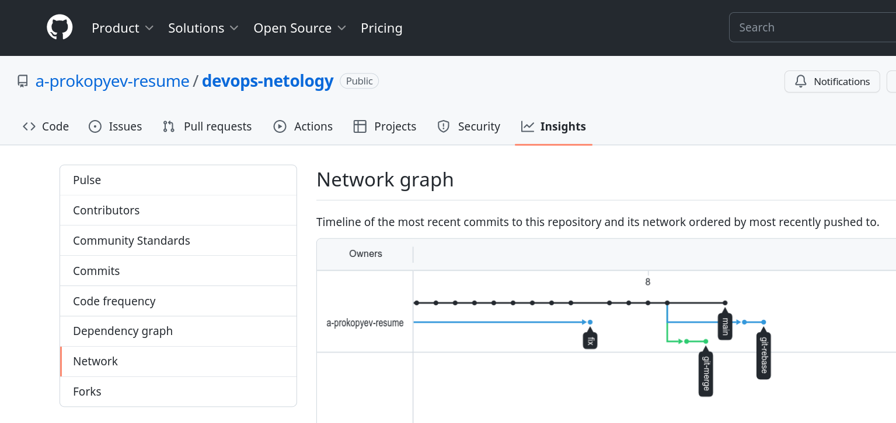
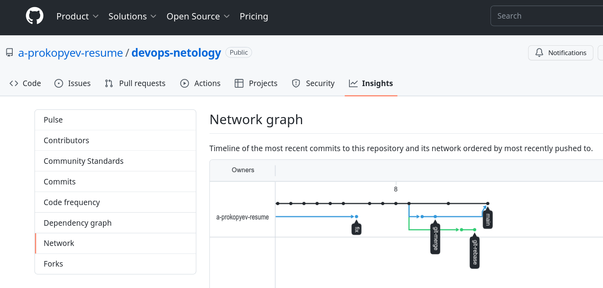
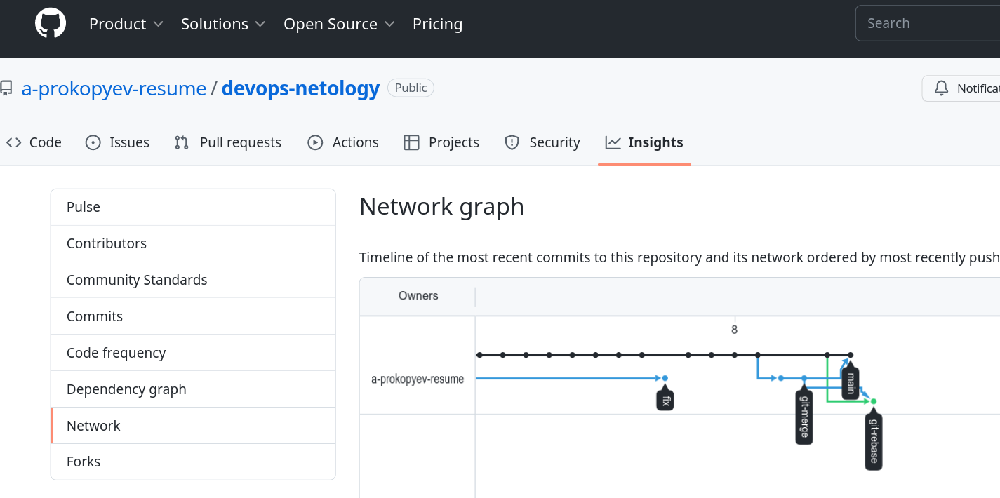
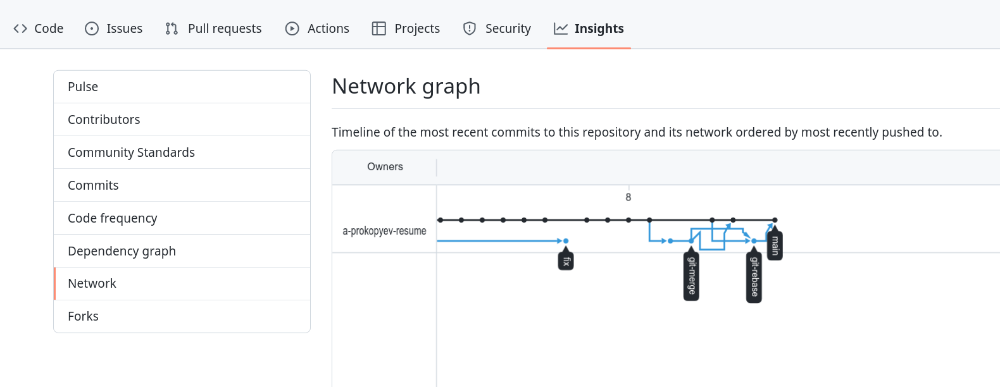

# [Домашнее задание](https://github.com/a-prokopyev-resume/sysadm-homeworks/tree/devsys10/02-git-02-branching) к занятию [«Ветвления в Git»](https://netology.ru/profile/program/git-dev-27/lessons/241718/lesson_items/1283986)


### Цель задания

В процессе работы над заданием вы потренируетесь делать merge и rebase. В результате вы поймете разницу между ними и научитесь решать конфликты.   

Обычно при нормальном ходе разработки выполнять `rebase` достаточно просто. 
Это позволяет объединить множество промежуточных коммитов при решении задачи, чтобы не засорять историю. Поэтому многие команды и разработчики предпочитают такой способ.   

### Полезные ссылки:
1. [Тренажёр LearnGitBranching](https://learngitbranching.js.org/) - можно потренироваться в работе с деревом коммитов и ветвлений.
2. [Habr.com - Git Rebase: руководство по использованию](https://habr.com/ru/post/161009/)
3. [Pro Git book - Ветвление в Git - Перебазирование](https://git-scm.com/book/ru/v2/%D0%92%D0%B5%D1%82%D0%B2%D0%BB%D0%B5%D0%BD%D0%B8%D0%B5-%D0%B2-Git-%D0%9F%D0%B5%D1%80%D0%B5%D0%B1%D0%B0%D0%B7%D0%B8%D1%80%D0%BE%D0%B2%D0%B0%D0%BD%D0%B8%D0%B5)

------

### Решение задания «Ветвление, merge и rebase»  

Создаю файлы `merge.sh` и `rebase.sh` в каталоге `Homework/02-git-03-branching/branching` :
```
    mkdir /home/alex/DevOps27/Homework/02-git-03-branching/branching -p
    cd /home/alex/DevOps27/Homework/02-git-03-branching/branching
    joe merge.sh
    cp merge.sh rebase.sh
    ../utils/chown.sh
```

Создаю commit `prepare for merge and rebase` и отправляю его в ветку main: 
```commandline
    git add ../02-git-03-branching
    git commit -m "02-git-03-branching - prepare for merge and rebase"
```

#### Подготовка файла merge.sh 
Создаю ветку `git-merge` и меняю содержимое `merge.sh` на указанное в задаче:  
```commandline
    git branch git-merge
    git checkout git-merge
    joe merge.sh
    git commit -a -m "merge: @ instead *"
#   git push # пока не делал, отложил на потом на всякий случай, потому что иногда использую git reset и zfs rollback во время обучения
    joe merge.sh 
    git commit -a -m "merge: use shift"
#   git push # сделаю потом
```

#### Подготовка файла rebase.sh
Возвращаюсь в ветку main и меняю файл rebase.sh:
```commandline
    git checkout main
    joe rebase.sh
    git commit -a -m "rebase: updated first time"
#   git push # сделаю потом
```

Возвращаюсь на commit "02-git-03-branching - prepare for merge and rebase" и опять меняю файл rebase.sh:
```commandline
    git log # ищу "prepare for merge and rebase", можно опцией -S
    git checkout cd352894f0c6efd56bf7e5f702aa84c487bda6eb
    git checkout -b git-rebase
    joe rebase.sh
    git commit -a -m "git-rebase 1"
#   git push # сделаю потом
    joe rebase.sh
    git commit -a -m "git-rebase 2"
#   git push # сделаю потом    
``` 

Пора делать push на Github, чтобы посмотреть сетевую диаграмму ветвления на Github:
```commandline
    git push --set-upstream origin git-rebase
    git checkout git-merge
    git push --set-upstream origin git-merge
    git checkout main
    git push
```  
Теперь диаграмму ветвления можно посмотреть по адресу: https://github.com/a-prokopyev-resume/devops-netology/network
Видим на ней все наши три новые ветки. Скриншот этой диаграммы:


#### Merge
Сольем ветку git-merge в основную ветку main: 
```commandline
    git checkout main 
    git merge git-merge
    git push
```

Диаграмма ветвления после первого merge:
  

#### Rebase
Сделаем rebase ветки git-rebase на ветку main (на текущее состояние ветки main):
```commandline
    git checkout git-rebase 
    git rebase -i main # Interactive rebase
#   Вручную разрешаю первый конфликт в процессе выполнения git rebase
    joe rebase.sh
    git add rebase.sh; git rebase --continue
#   Вручную разрешаю второй конфликт в процессе выполнения git rebase
    joe rebase.sh
    git add rebase.sh; git rebase --continue    
#   Пишу комментарий к коммиту при завершении операции git rebase        
    git push -f # --set-upstream origin git-rebase больше указывать ненужно
```  
Диаграмма ветвления после завершения rebase:


Сольем ветку git-rebase после rebase в основную ветку main (должно пройти без конфликтов простой перемоткой указателя ветки вперед):
```commandline
    git checkout main
    git merge git-rebase
    git push
```
Диаграмма ветвления после второго merge:


Последний merge почему-то прошел не с помощью fast-forward и диаграмма получилась достаточно сложная вместо упрощения.

Для того чтобы в процессе выполнения задания файл README.MD, в который я постоянно вносил изменения по ходу работы, не менялся, 
я указывал README.MD и каталог img в локальном файле .gitignore, который теперь можно удалить:
```commandline
    rm /home/alex/Homework/02-git-03-branching/.gitignore
    git -a -m "Adding homework MD file with images"
    git push
```
Теперь результат выполнения работы видел в репозитории на Github по адресу: https://github.com/a-prokopyev-resume/devops-netology/tree/main/02-git-03-branching
