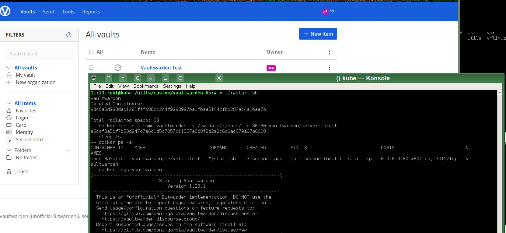
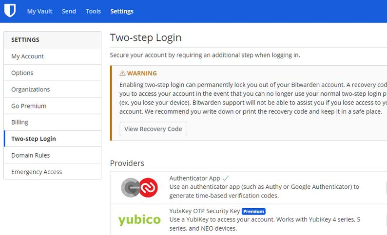
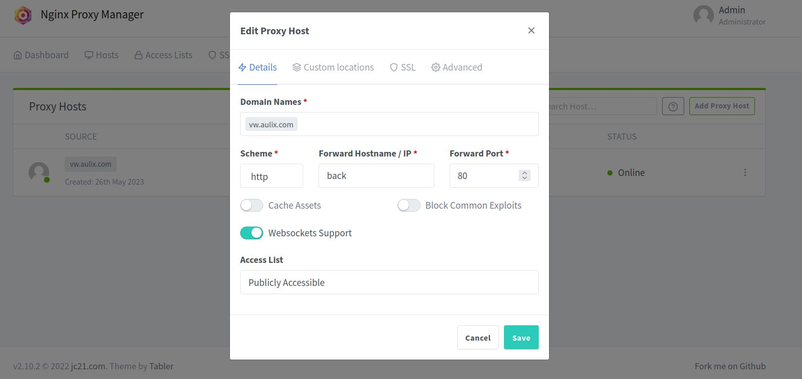
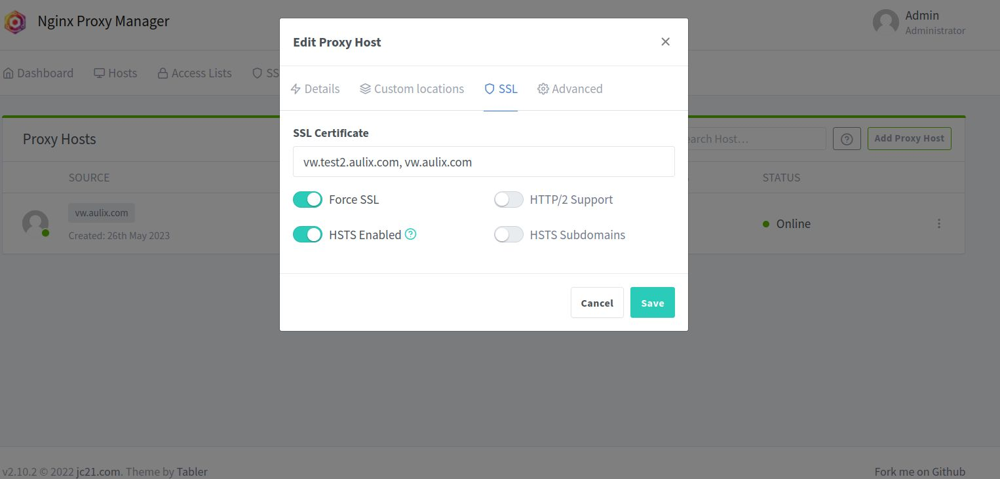
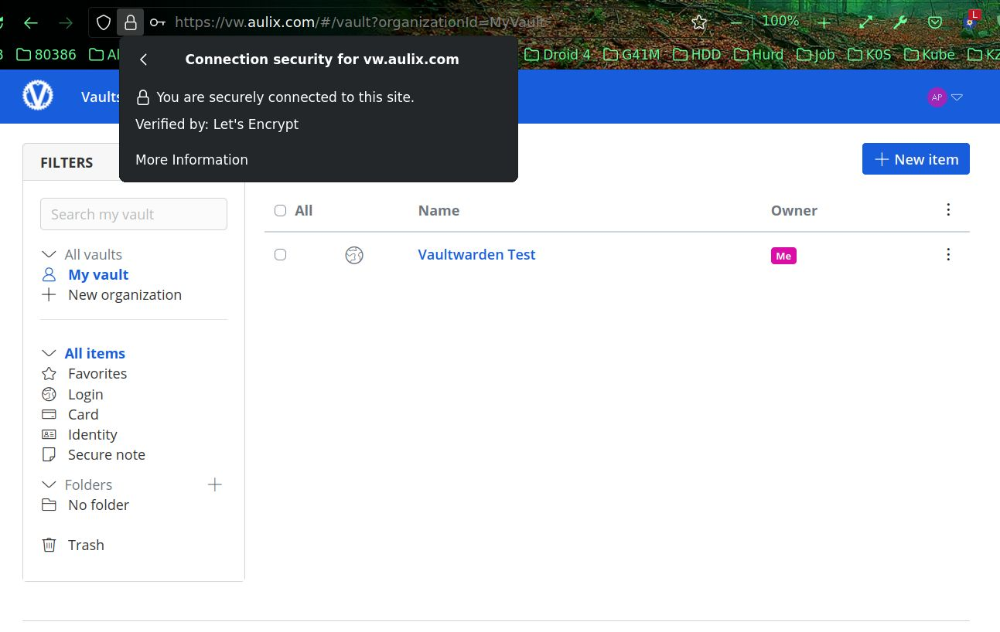

# [Домашнее задание](https://github.com/a-prokopyev-resume/sysadm-homeworks/tree/devsys10/03-sysadmin-09-security) к занятию [«Элементы безопасности информационных систем»](https://netology.ru/profile/program/sys-dev-27/lessons/242284/lesson_items/1286617)

### Цель задания

В результате выполнения задания вы: 

* настроите парольный менеджер, что позволит не использовать один и тот же пароль на все ресурсы и удобно работать со множеством паролей;
* настроите веб-сервер на работу с HTTPS. Сегодня HTTPS является стандартом в интернете. Понимание сути работы центра сертификации, цепочки сертификатов позволит сконфигурировать SSH-клиент на работу с разными серверами по-разному, что даёт большую гибкость SSH-соединений. Например, к некоторым серверам мы можем обращаться по SSH через приложения, где недоступен ввод пароля;
* поработаете со сбором и анализом трафика, которые необходимы для отладки сетевых проблем.

------

## Решение задач

1. Установите плагин Bitwarden для браузера. Зарегестрируйтесь и сохраните несколько паролей.

Решение:

Создал учетку на сайте bitwarden.com, установил плагин в браузер и заполнил данные учетной записи. 


Кроме того установил на свой VPS аналог под названием Vaultwarden: https://github.com/dani-garcia/vaultwarden
От оригинального Bitwarden он отличается тем, что написан на языке Rust вместо C#, не требует для работы относительно тяжелый Microsoft SQL Server.
В результате места на диске он занимает примерно в 50-100 раз меньше оригинала:
```
root@kube ~ 3:# > docker images | grep vault
vaultwarden/server                1.28.1              39c214581b30   7 weeks ago     204MB
vaultwarden/server                latest              39c214581b30   7 weeks ago     204MB
vaultwarden/server                1.25.2-alpine       272962d08f77   10 months ago   90.7MB
```


2. Установите Google Authenticator на мобильный телефон. Настройте вход в Bitwarden-акаунт через Google Authenticator OTP.

Решение:



Для второго варианта хранилища паролей vaultwarden включил второй фактор аутентификации с помощью аппаратной криптографии FIDO2, используя оборудование Feitian: https://www.ftsafe.com/Products/FIDO
По словам поддержки в модели K9B для криптографии они используют банковский чип, аналогичный смарткартам.

Это намного более надежная защита, чем приложение на планшете или телефоне, потому что участились случаи появления вирусов и троянов для Android.

3. Установите apache2, сгенерируйте самоподписанный сертификат, настройте тестовый сайт для работы по HTTPS.

Решение:

Установлю сертификат для контейнера с Vaultwarden.
Для этого я воспользуюсь готовым образом очень популярного (более 13K звезд) контейнера nginx-proxy-manager, в котором есть обратный прокси (NGINX вместо apache) с удобным GUI для настройки и автоматическим продлением всех выпущенных сертификатов: https://github.com/NginxProxyManager/nginx-proxy-manager

Для запуска и использования этого контейнера вместе с Vaultwarden я сделал свой [docker-compose.yml](docker-compose.yml)
И соответствующие настройки файрвола Firehol, описанные в решении задачи 9 этой работы.
После запуска docker-compose видим следующие контейнеры:
```
root@kube /utils/custom/vaultwarden 204:# > docker ps
CONTAINER ID   IMAGE                             COMMAND       CREATED          STATUS                    PORTS                                            NAMES
85ba79a7dc74   vaultwarden/server:1.28.1         "/start.sh"   36 minutes ago   Up 36 minutes (healthy)   80/tcp, 3012/tcp                                 vw-back-1
2c66a11ca239   jc21/nginx-proxy-manager:2.10.2   "/init"       36 minutes ago   Up 36 minutes             0.0.0.0:80-81->80-81/tcp, 0.0.0.0:443->443/tcp   vw-npm-1
```
Настраиваем их с помощью браузера:





Как вариант можно было бы использовать и другой похожий (но без GUI админки) образ контейнера: https://docs.linuxserver.io/general/swag  
SWAG иногда может быть даже удобнее для использования в своих IaC скриптах, чтобы делать все полностью автоматически.

4. Проверьте на TLS-уязвимости произвольный сайт в интернете (кроме сайтов МВД, ФСБ, МинОбр, НацБанк, РосКосмос, РосАтом, РосНАНО и любых госкомпаний, объектов КИИ, ВПК и т. п.).

Решение:

На уязвимость я буду проверять свой же сайт с установленным Vaultwarden: https://vw.aulix.com

Проверка скриптом testssl.sh: `root@chimaera:/download/testssl.sh# ./testssl.sh vw.aulix.com`
[Результат проверки](testssl.txt)

Итоговый рейтинг проверки:
```
 Rating (experimental) 

 Rating specs (not complete)  SSL Labs's 'SSL Server Rating Guide' (version 2009q from 2020-01-30)
 Specification documentation  https://github.com/ssllabs/research/wiki/SSL-Server-Rating-Guide
 Protocol Support (weighted)  100 (30)
 Key Exchange     (weighted)  100 (30)
 Cipher Strength  (weighted)  90 (36)
 Final Score                  96
 Overall Grade                A+

 Done 2023-05-26 13:05:31 [ 337s] -->> xxx.155.94.xxx:443 (vw.aulix.com)
```
Явных проблем с безопасностью настройки SSL на этом сайте не обнаружено.

Еще одна проверка с помощью nmap, которая просто показывает свойства сертификата и названия поддерживаемых алгоритмов шифрования:
<details>

<summary>

```
root@chimaera:/#nmap --script ssl-cert -p 443 vw.aulix.com

Starting Nmap 7.80 ( https://nmap.org ) at 2023-05-26 13:17 UTC
Nmap scan report for vw.aulix.com (xxx.155.94.xxx)
Host is up (0.038s latency).
rDNS record for xxx.155.94.xxx: li614-178.members.linode.com
```

</summary>

```
PORT    STATE SERVICE
443/tcp open  https
| ssl-cert: Subject: commonName=vw.aulix.com
| Subject Alternative Name: DNS:vw.aulix.com, DNS:vw.test2.aulix.com
| Issuer: commonName=R3/organizationName=Let's Encrypt/countryName=US
| Public Key type: ec
| Public Key bits: 384
| Signature Algorithm: sha256WithRSAEncryption
| Not valid before: 2023-05-26T09:46:18
| Not valid after:  2023-08-24T09:46:17
| MD5:   99a6 4b00 8ddb 49b6 2d7e 2363 734f de9a
|_SHA-1: e58b af0e 6526 b593 e5da e491 4fd2 0ed2 0ed2 ac35

Nmap done: 1 IP address (1 host up) scanned in 1.69 seconds


root@chimaera:/# nmap --script ssl-enum-ciphers -p 443 vw.aulix.com
Starting Nmap 7.80 ( https://nmap.org ) at 2023-05-26 13:18 UTC
Nmap scan report for vw.aulix.com (xxx.155.94.xxx)
Host is up (0.038s latency).
rDNS record for xxx.155.94.xxx: li614-178.members.linode.com

PORT    STATE SERVICE
443/tcp open  https
| ssl-enum-ciphers: 
|   TLSv1.2: 
|     ciphers: 
|       TLS_ECDHE_ECDSA_WITH_AES_128_GCM_SHA256 (secp256r1) - A
|       TLS_ECDHE_ECDSA_WITH_AES_256_GCM_SHA384 (secp256r1) - A
|       TLS_ECDHE_ECDSA_WITH_CHACHA20_POLY1305_SHA256 (secp256r1) - A
|     compressors: 
|       NULL
|     cipher preference: client
|     warnings: 
|       Key exchange (secp256r1) of lower strength than certificate key
|_  least strength: A

Nmap done: 1 IP address (1 host up) scanned in 5.61 seconds
```

</details>


5. Установите на Ubuntu SSH-сервер, сгенерируйте новый приватный ключ. Скопируйте свой публичный ключ на другой сервер. Подключитесь к серверу по SSH-ключу.

Решение:

Сгенерируем ключ RSA длиной 8192 бит:
```
ssh-keygen -t rsa -b 8192 -f rsa8192
Generating public/private rsa key pair.                                                                                                                                                                          
Enter passphrase (empty for no passphrase):                                                                                                                                                                      
Enter same passphrase again:                                                                                                                                                                                     
Your identification has been saved in rsa8192                                                                                                                                                                    
Your public key has been saved in rsa8192.pub                                                                                                                                                                    
The key fingerprint is:                                                                                                                                                                                          
SHA256:hnAaMZaQwXC4Qcn/EyUoWHZRfQB/jpcTzufBsFrY68g root@workstation
The key's randomart image is:
+---[RSA 8192]----+
|=*B+B+oo..       |
|+*o+.+ o. .      |
| oo o + ..+      |
|.  . * . O *     |
|    o o S @ +    |
|     o . + = .   |
|      . . . .    |
|       . o       |
|        E .      |
+----[SHA256]-----+
```
Скопируем его на сервер:
```
root@workstation /download/14 17:# > source /utils/ssh/sc/agent.sh; ssh_agent etoken add; ssh ice exit; ssh-copy-id  -f -i rsa8192.pub ice
# Следующее нужно для автоматической аутентификации последующих команд: source /utils/ssh/sc/agent.sh; ssh_agent etoken add; ssh ice exit;

Agent pid 29944
Enter passphrase for PKCS#11: 
Card added: /usr/lib/pkcs11_etoken.so
Warning: No xauth data; using fake authentication data for X11 forwarding.
/usr/bin/ssh-copy-id: INFO: Source of key(s) to be installed: "rsa8192.pub"
Warning: No xauth data; using fake authentication data for X11 forwarding.

Number of key(s) added: 1

Now try logging into the machine, with:   "ssh 'ice'"
and check to make sure that only the key(s) you wanted were added.
```

На серверах как и на клиентах тоже можно использовать аппаратную криптографию, а при физическом доступе к серверу в пределах нескольких метров 
в той же комнате и квартире наверно можно и желательно даже использовать второй фактор типа нажатия кнопки на токене, подключенном к серверу, если он такое поддерживает, что позволяет лучше защититься от буткитов, которые теоретически могут сами подтверждать даже аппаратные транзакции, эмулируя подобное подтверждение типа набора пина для реальных аппаратных токенов.
 
6. Переименуйте файлы ключей из задания 5. Настройте файл конфигурации SSH-клиента так, чтобы вход на удалённый сервер осуществлялся по имени сервера.

Решение:
```
mv rsa8192 rsa8192new
mv rsa8192.pub rsa8192new.pub
joe /root/.ssh/config

Host ice
        Hostname 127.0.0.1
	Port 1222
        User ice
        IdentityFile /download/14/rsa8192new
```
Уточнение: в решениях почти всех задач этой работы и других работ я использую SSH хосты, определенные через имена типа ice, kube и т.п.
Пример конфига:
```
Host lish
        Hostname lish-atlanta.linode.com
        User xxx
        PKCS11Provider /xxx/xxx/xxx_etoken.so
```

7. Соберите дамп трафика утилитой tcpdump в формате pcap, 100 пакетов. Откройте файл pcap в Wireshark.

Решение:

Соберем пакеты на VPS сервере kube:
```
root@workstation /download/14 10:# > ssh kube
Enter PIN for 'EToken_SC': 

root@kube ~ 4:# > tcpdump -i eth0 -c 100 -w packets.pcap
tcpdump: listening on eth0, link-type EN10MB (Ethernet), snapshot length 262144 bytes
100 packets captured
106 packets received by filter
0 packets dropped by kernel

root@kube ~ 5:# > exit
logout
Connection to kube closed.
```

Скопируем файл с собранными пакетами на рабочую станцию:
```
root@workstation /download/14 11:# > /utils/rsync.sh data kube:/root/packets.pcap ./
root@workstation /download/14 12:# > wireshark packets.pcap
```
[Скриншот](images/wireshark.jpg)

---
 
## Задание со звёздочкой* 

8. Просканируйте хост scanme.nmap.org. Какие сервисы запущены?

Решение:

Сначала отключаю в файрволе полный доступ со своего IP адреса и потом запускаю nmap:
```
root@kube /utils/custom/vaultwarden 34:# > cd /etc/firehol/

root@kube /etc/firehol 35:# > joe firehol.conf
#       server4 all accept src "$HOME_IP";
        server4 ssh accept src "$HOME_IP";

root@kube /etc/firehol 36:# > firehol nofast restart
FireHOL: Saving active firewall to a temporary file...  OK 
FireHOL: Processing file '/etc/firehol/firehol.conf'...  OK  (204 iptables rules)
FireHOL: Activating new firewall (204 rules)...  OK 
FireHOL: Saving activated firewall to '/var/spool/firehol'...  OK 
```
Теперь запускаем сканирование:


Сначала с хоста workstation:
```
19:23 root@workstation /download 1:# > nmap vw.aulix.com

Starting Nmap 7.40 ( https://nmap.org ) at 2023-05-26 19:23 +05
sendto in send_ip_packet_sd: sendto(4, packet, 40, 0, xxx.155.94.xxx, 16) => Operation not permitted
Offending packet: TCP 192.168.0.2:47108 > xxx.155.94.xxx:80 A ttl=59 id=16060 iplen=40  seq=0 win=1024 
Nmap scan report for vw.aulix.com (xxx.155.94.xxx)
Host is up (0.16s latency).
rDNS record for xxx.155.94.xxx: k3s
Not shown: 997 filtered ports
PORT    STATE  SERVICE
22/tcp  closed ssh
80/tcp  open   http
443/tcp open   https

Nmap done: 1 IP address (1 host up) scanned in 11.87 seconds
```
Как и предполагалось, открыты только порты ssh, http и https.
Но сервис SSH запущен на другом порте, поэтому его показывает как `closed`.

Теперь запустим сканирование более современной версией nmap из виртуальной машины Devuan Chimaera:
```
19:18 root@workstation /download 1:# > ssh ice
Enter PIN for 'EToken_SC': 
Warning: No xauth data; using fake authentication data for X11 forwarding.
Last login: Fri May 26 12:59:04 2023 from 10.0.2.2
root@chimaera:~# nmap vw.aulix.com
Starting Nmap 7.80 ( https://nmap.org ) at 2023-05-26 14:19 UTC
Nmap scan report for vw.aulix.com (xxx.155.94.xxx)
Host is up (0.00073s latency).
rDNS record for xxx.155.94.xxx: li614-178.members.linode.com
Not shown: 995 filtered ports
PORT    STATE  SERVICE
22/tcp  closed ssh
80/tcp  open   http
443/tcp open   https
513/tcp open   login
514/tcp open   shell

Nmap done: 1 IP address (1 host up) scanned in 6.90 seconds
root@chimaera:~# telnet vw.aulix.com 513
Trying xxx.155.94.xxx...
Connected to kube.aulix.com.
Escape character is '^]'.
```
Почему-то показывает еще два открытых порта 513 и 514, пока не знаю, почему, разбираюсь. У этой виртуалки KVM хостовая сеть, поэтому результаты сканирования должны быть точно такие же как и на хостовой рабочей станции.

9. Установите и настройте фаервол UFW на веб-сервер из задания 3. Откройте доступ снаружи только к портам 22, 80, 443.

Решение:

Обычно я использую другой скрипт для настройки iptables: https://github.com/firehol/firehol

Его преимущество в том, что он с точки зрения многих его пользователей является наиболее интуитивно понятный и человекочитаемый.
Кроме того его настройки хранятся в Bash скрипте аналогично тому, как настройки Vagrant хранятся в скрипте на языке программирования Ruby.
Поэтому прямо в файле настроек можно создавать любые логические конструкции, ветвления и даже при необходимости циклы.
Этот скрипт позволял мне настроить любые нужные мне конфигурации, включая фильтрацию на прозрачном bridge, фильтрацию при маршрутизации, SNAT и DNAT в т.ч. для работы с контейнерами,
маркировку трафика, например, для шейпинга и/или policy routing, VLANs.
Firehol при желании также позволяет использовать и вставки непосредственно команд iptables, но у меня такой потребности никогда не было, всегда хватало его собственных высокоуровневых команд.
Скрипт написан на Bash. К недостаткам можно отнести наверно то, что он не поддерживает современные nftables и почти не развивается последнее время,
но в связи с тем, что его жизненный цикл был достаточно длительным (почти два десятка лет), этот скрипт очень тщательно отладили и со старым интерфейсом
iptables он работает безупречно в т.ч. и в режиме обратной совместимости, который доступен в nftables.

[Пример скрипта с моего сервера, где установлен NGINX Proxy Manager и Vaultwarden](firehol.conf)
В скрипте показано, как настроить SNAT и входящие порты для использованных контейнеров и SSH.
