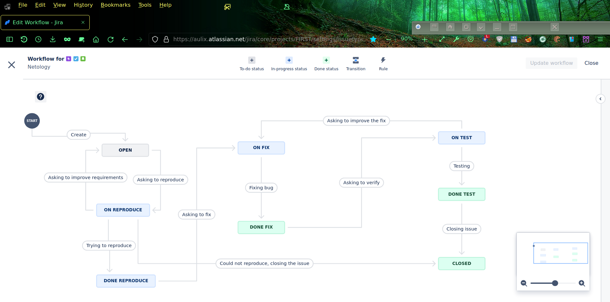
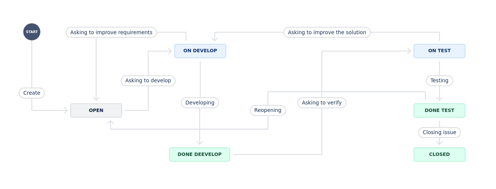

# === ПОКА НЕ ГОТОВО ДЛЯ ПРОВЕРКИ === 

# Домашнее задание к занятию 7 «Жизненный цикл ПО»

# Пока доделываю эту работу (полное решение будет доступно по тому же самому линку в Github), а сегодня уже техническое закрытие модуля, поэтому отправил линк заранее. Зачёт по модулю в целом я уже получил (достаточно трёх работ, у меня сдано четыре работы), но хотелось бы сдать и эту (последнюю пока ещё несданную в этом модуле) работу.

# Пожалуйста, пока не берите эту работу на проверку. Если уже взяли эту работу на проверку, то пожалуйста, оставьте её в состоянии "на проверке"  в непроверенном состоянии (НЕ СТАВЯ НЕЗАЧЁТ и НЕ ОТПРАВЛЯЯ эту работу на доработку), пока проверяете работы других студентов. Когда возьмёте на проверку другую работу, то эта работа или автоматически снимется с проверки или окажется в списке уже взятых на проверку, но ещё не проверенных, в зависимости от настройки LMS для учётки соответствующего проверяющего.

# === ПОКА НЕ ГОТОВО ДЛЯ ПРОВЕРКИ === 

# Домашнее задание к занятию 7 «Жизненный цикл ПО»

## Подготовка к выполнению

Создал учётную запись в manajed Jira SaaS, произвёл первоначальные настройки и создал новый проект с требуемыми видами issues и досками Kanban и Scrum.

## Основная часть

Создаю workflow для issue типа Bug:

 и workflow для issue других типов:
 

**Что нужно сделать**

1. Создайте задачу с типом bug, попытайтесь провести его по всему workflow до Done. 
1. Создайте задачу с типом epic, к ней привяжите несколько задач с типом task, проведите их по всему workflow до Done. 
1. При проведении обеих задач по статусам используйте kanban. 
1. Верните задачи в статус Open.
1. Перейдите в Scrum, запланируйте новый спринт, состоящий из задач эпика и одного бага, стартуйте спринт, проведите задачи до состояния Closed. Закройте спринт.
2. выгрузите схемы workflow для импорта в XML. 
   Файлы с workflow и скриншоты workflow приложите к решению задания.

