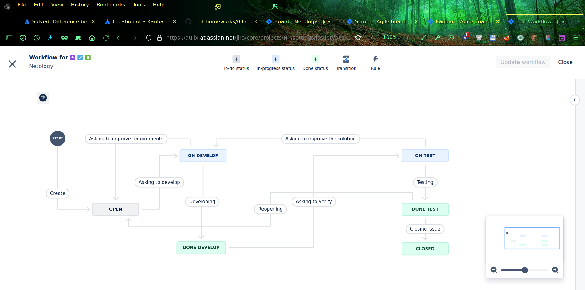

# Домашнее задание к занятию 7 «Жизненный цикл ПО»

## Пока ищу, где можно выгрузить workflow в XML, остальное всё сделал, сегодня уже техническое закрытие модуля, поэтому отправил линк заранее. Зачёт по модулю в целом я уже получил (достаточно трёх работ, у меня сдано четыре работы), но хотелось бы сдать и эту (последнюю пока ещё несданную в этом модуле) работу.

### Если для зачёта выполненной работы пока недостаточно, то пожалуйста, пока не берите эту работу на проверку. Если уже взяли эту работу на проверку, то пожалуйста, оставьте её в состоянии "на проверке"  в непроверенном состоянии (НЕ СТАВЯ НЕЗАЧЁТ и НЕ ОТПРАВЛЯЯ эту работу на доработку), пока проверяете работы других студентов. Когда возьмёте на проверку другую работу, то эта работа или автоматически снимется с проверки или окажется в списке уже взятых на проверку, но ещё не проверенных, в зависимости от настройки LMS для учётки соответствующего проверяющего.

## Подготовка к выполнению

Создал учётную запись в manajed Jira SaaS, произвёл первоначальные настройки и создал новый проект с требуемыми видами issues и досками Kanban и Scrum.

 

## Основная часть

Создаю workflow для issue типа Bug:

 и workflow для issue других типов:
 

**Что нужно сделать**

1. Провёл `Bug`` по всему workflow до `Done`.

 

2. Создал задачу с типом `Epic` и аналогично провёл её до `Done`. 
3. На скриншотах выше видно использование доски `Kanban`. 
4. Вернул задачи в статус `Open``.
5. Запланировал в `Scrum`, новый спринт, состоящий из задач эпика и одного бага, стартовал спринт, провёл задачи до состояния `Closed` и закрыл спринт.
6. В разделе настроек почему-то нет workflow, которые я редактировал в проекте Netology, пока пытаюсь найти, где их можно выгрузить в XML кроме этой локации их GUI.

