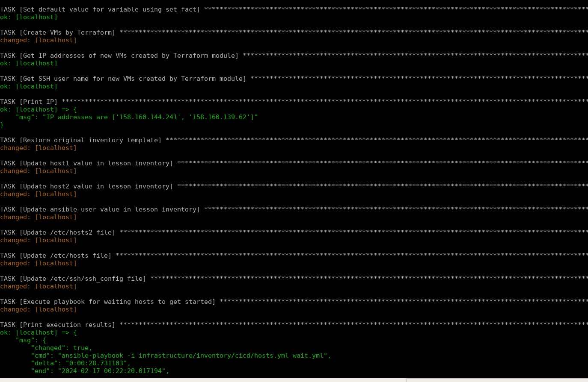
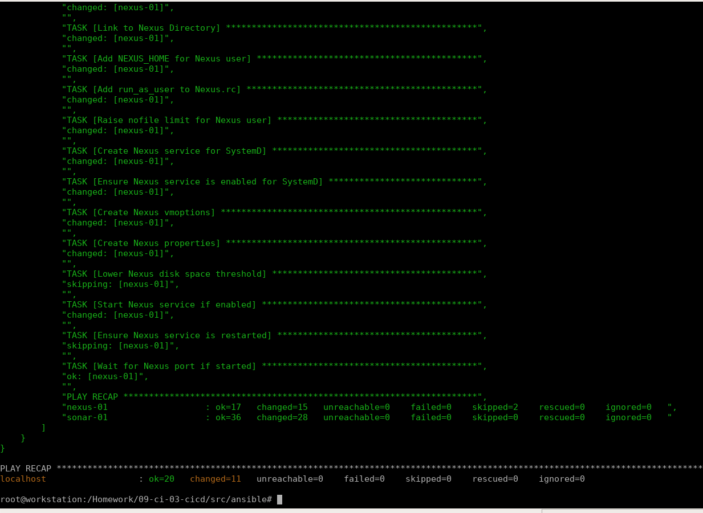
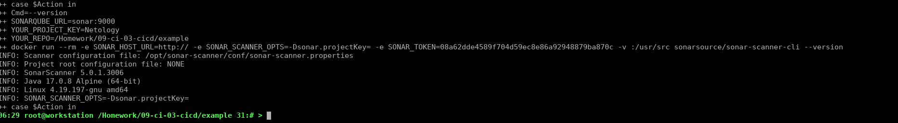
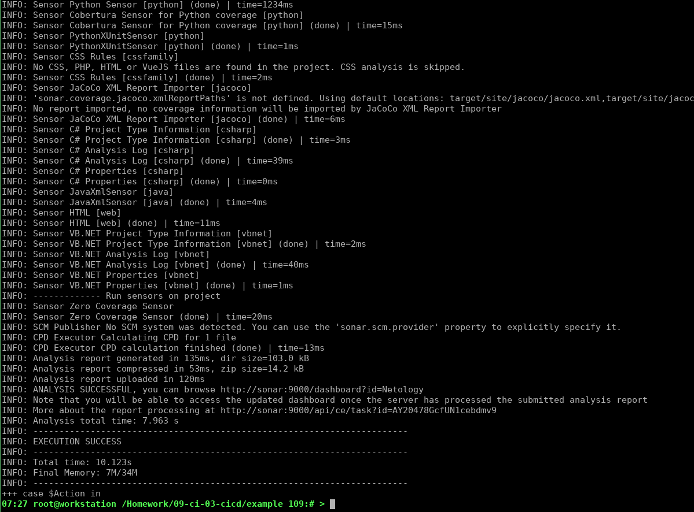
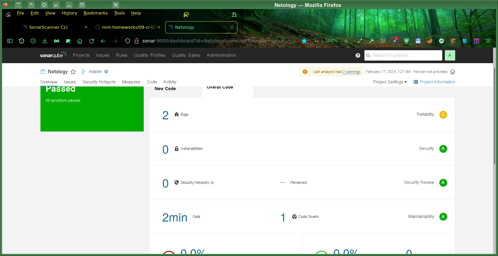
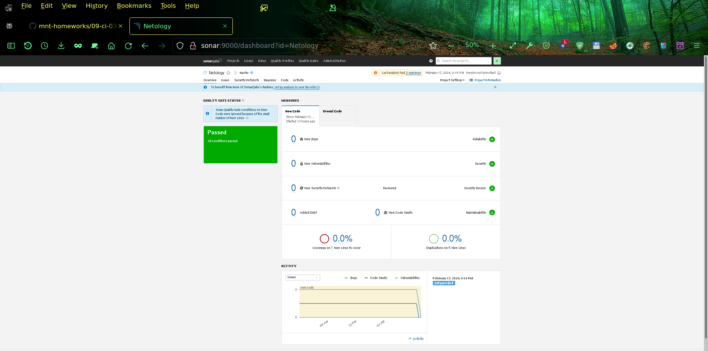
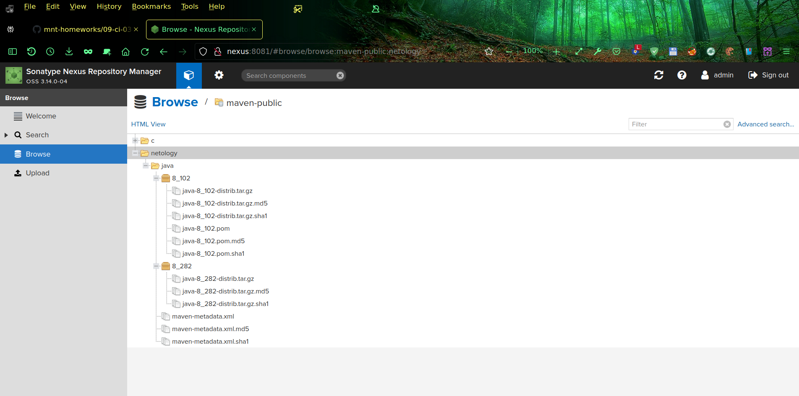
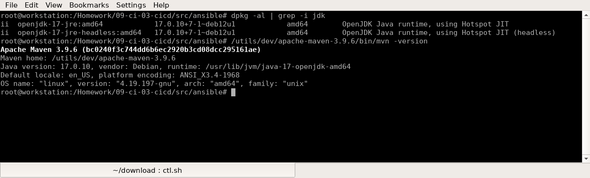
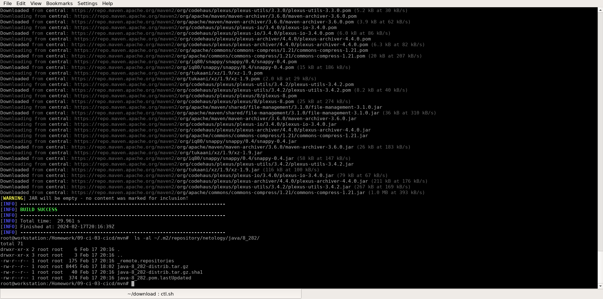

# [Домашнее задание](https://github.com/netology-code/mnt-homeworks/blob/MNT-video/09-ci-03-cicd/README.md) к занятию [9 «Процессы CI/CD»](https://netology.ru/profile/program/cicd-dev-27/lessons/305482/lesson_items/1652074)

## Подготовка к выполнению
Написал свой [Ansible playbook](src/ansible/main.yml) и [модуль Terraform](src/terraform/yandex.tf) для создания требуемых в задании виртуальных машин одной группой (yandex_compute_instance_group):
```
    - name: Create VMs by Terraform
      community.general.terraform:
        project_path: ../terraform
        state: present
        complex_vars: true
        variables:
          group="work-09-ci-03-cicd"
          image_family="centos-7"
          cores=2
          ram=4
          amount=2
      register: TerraformResult
      tags: 
        - create
        - terraform
```
 Мой playbook сам запускает модуль Terraform с параметрами, получает из него результат (айпи адреса созданных виртуалок и имя пользователя для входа через SSH) через registered Ansible переменную  `{{ TerraformResult.outputs }}`. Далее playbook прописывает хосты в /etc/hosts, настраивает опции /etc/ssh/ssh_config для соответствующих хостов и автоматически прописывает имена хостов в inventory учебного готового плейбука (для создания сервисов), который потом сам и запускает, регистрируя и показывая на экране результат его выполнения:
```
    - name: Execute lesson infrastructure playbook for installing required CI/CD services
      ansible.builtin.shell: ansible-playbook -i infrastructure/inventory/cicd/hosts.yml infrastructure/site.yml
      register: AnsibleResult

    - name: Print execution results
      ansible.builtin.debug:
        msg:  "{{ AnsibleResult }}"
```
Пришлось немного переделать предложенный в уроке playbook, потому что PostgreSQL 11-ой версии уже убрали из официального репозитория. Заменил 11-ую версию на 13-ую и немного доработал текст playbook, добавив один task:
```
    - name: InitDB
      become_user: postgres
      become: true
      command: /usr/pgsql-{{ postgresql_version }}/bin/initdb -D /var/lib/pgsql/{{ postgresql_version }}/data/
      failed_when: false
```
и заменил константные упоминания версии PostgreSQL на соответствующую переменную, которая уже была в проекте, но использовалась далеко не везде, где это было возможно/необходимо.
Результат запуска playbook:



Копирую на хост `workstation` адреса виртуалок, созданных в инструментальном iac контейнере: `cat utils/get_hosts.sh`
```
docker cp iac:/etc/hosts /tmp/;
echo >> /etc/hosts;
cat /tmp/hosts >> /etc/hosts;
```
После этого на `workstation` уже можно работать в браузере с удобными URLs типа таких:  
http://nexus:8081/  
http://sonar:9000/projects  

## Знакомоство с SonarQube

### Основная часть

1. Создал проект Netology, токен `09-ci-03-cicd`: `08a62dde4589f704d59ec8e86a92948879ba870c`.
SonarCube предложил следующую команду для запуска:
```
mvn clean verify sonar:sonar \
  -Dsonar.projectKey=Netology \
  -Dsonar.host.url=http://sonar:9000 \
  -Dsonar.login=08a62dde4589f704d59ec8e86a92948879ba870c
```

Устанавливаю клиента SonarCube: `docker pull sonarsource/sonar-scanner-cli` и проверяю его версию:


4. Я дополнил свой скрипт /utils/iac/ctl.sh соответствующим разделом для SonarQube:
```
 ( sonar )
                SonarURL="http://sonar:9000";
                REPO="${PWD}";
                Project="$2";
                Token=$3;
                
                Cmd=${@:4};

                docker run --rm -dti --name sonar -v "${REPO}:/usr/src" sonarsource/sonar-scanner-cli bash \
                        && cat /etc/hosts | docker exec -i  sonar bash -c "cat >> /etc/hosts"; # Shall be run from inside an IaC tooling container!

                docker exec -ti \
                    -e SONAR_HOST_URL="${SonarURL}" \
                    -e SONAR_SCANNER_OPTS=" -Dsonar.projectKey=${Project} -Dsonar.sources=/usr/src/ " \
                    -e SONAR_TOKEN="$Token" \
                    sonar /usr/bin/entrypoint.sh $Cmd;
                    
  ;;
```
Запускаю анализатор для кода из директории `example` с дополнительным ключом `-Dsonar.coverage.exclusions=fail.py`, `cat sonar.sh`:
```
/utils/iac/ctl.sh sonar Netology 08a62dde4589f704d59ec8e86a92948879ba870c -Dsonar.coverage.exclusions=/usr/src/fail.py;
```
Этот код в результате запускает примерно такую команду:
```
docker exec -ti -e SONAR_HOST_URL=http://sonar:9000 -e 'SONAR_SCANNER_OPTS= -Dsonar.projectKey=Netology -Dsonar.sources=/usr/src/ ' -e SONAR_TOKEN=08a62dde4589f704d59ec8e86a92948879ba870c sonar /usr/bin/entrypoint.sh -Dsonar.coverage.exclusions=/usr/src/fail.py
```




1. Исправил выявленные ошибки и повторно запустил анализ, результат выполнения:


## Знакомство с Nexus



[maven-metadata.xml](mvn/maven-metadata.xml).

### Знакомство с Maven

### Подготовка к выполнению

Установил OpenJDK и Maven:


Разблокировал HTTP соединения.

### Основная часть

Запуск `mvn package`:


Исправленный файл [pom.xml](mvn/pom.xml).

