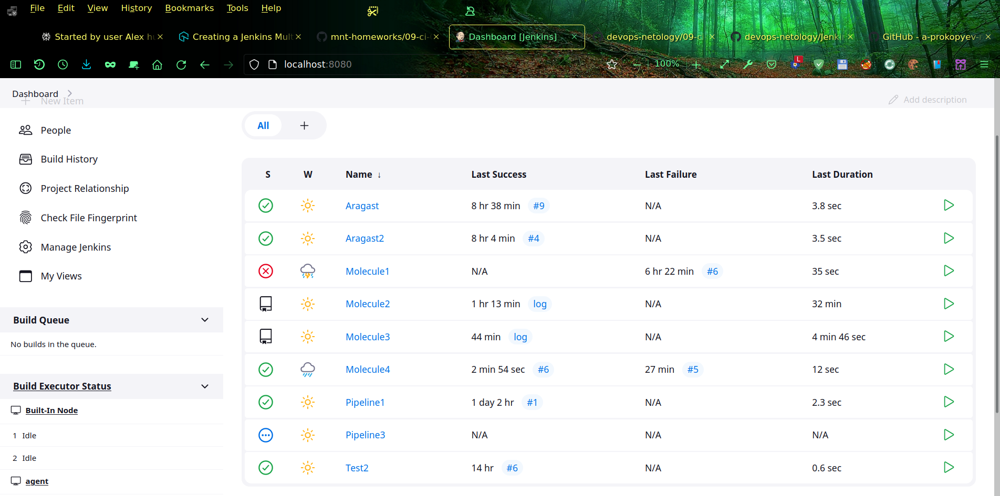

# Домашнее задание к занятию 10 «Jenkins»
# Студент: Прокопьев Александр Борисович (AlexPro/AlexPro2 in Netology DevOps27 group)

## Подготовка к выполнению

Написал свой [Ansible playbook](src/ansible/main.yml) и [модуль Terraform](src/terraform/yandex.tf) для создания требуемых в задании виртуальных машин одной группой (yandex_compute_instance_group):
```
   - name: Create VMs by Terraform
      community.general.terraform:
        project_path: ../terraform
        state: present
        complex_vars: true
        variables:
          group="{{ Lesson }}"
          image_family="almalinux-8"
          cores=2
          ram=4
          amount=2
          is_temporary=false
      register: TerraformResult
      tags: 
        - create
        - terraform      
```
Было интересно, попробовать разные типы дисков Yandex Cloud для сравнения скорости установки:
```
network-ssd-nonreplicated (Fastest):
Monday 19 February 2024  14:30:58 +0000 (0:00:00.140)       0:10:10.938 ******* 
=============================================================================== 
Execute lesson infrastructure playbook for installing required CI/CD services   276.60s
Execute playbook for waiting hosts to get started                               147.40s
Destroy old VMs by Terraform                                                    94.97s
Create VMs by Terraform                                                         84.35s

network-ssd-io-m3 (Fast):
Monday 19 February 2024  13:55:57 +0000 (0:00:00.156)       0:09:32.550 ******* 
=============================================================================== 
Execute lesson infrastructure playbook for installing required CI/CD services  290.62s
Execute playbook for waiting hosts to get started ----------------------------151.84s
Create VMs by Terraform ------------------------------------------------------97.95s
Destroy old VMs by Terraform -------------------------------------------------24.15s

network-ssd (Slow):
Monday 19 February 2024  14:15:20 +0000 (0:00:00.138)       0:13:50.621 ******* 
=============================================================================== 
Execute lesson infrastructure playbook for installing required CI/CD services  379.86s
Execute playbook for waiting hosts to get started -----------------------------273.29s
Destroy old VMs by Terraform --------------------------------------------------92.76s
Create VMs by Terraform -------------------------------------------------------76.88s
```
В результате выбрал самый быстрый: `network-ssd-nonreplicated`. Резервирование мне пока ненужно, а потом можно будет создать отдельный файлер хост с ZFS, где для быстрого dataset будет отключено безопасное сохранение: `sync=disable`, что позволит достичь почти максимально возможной скорости работы с файлами и при этом одновременно получать безопасные снэпшоты.

 Мой playbook сам запускает модуль Terraform с параметрами, получает из него результат (айпи адреса созданных виртуалок и имя пользователя для входа через SSH) через registered Ansible переменную  `{{ TerraformResult.outputs }}`. Далее playbook прописывает хосты в /etc/hosts, настраивает опции /etc/ssh/ssh_config для соответствующих хостов и автоматически прописывает имена хостов в inventory учебного готового плейбука (для создания сервисов), который потом сам и запускает, регистрируя и показывая на экране результат его выполнения и потом выводит ключ доступа к админке Jenkins:
```
    - name: Execute lesson infrastructure playbook for installing required CI/CD services
      ansible.builtin.shell: ansible-playbook -i infrastructure/inventory/cicd/hosts.yml infrastructure/site.yml
      register: AnsibleResult2
      tags: 
        - provision

    - name: Print execution results
      ansible.builtin.debug:
        msg:  "{{ AnsibleResult2 }}"
      tags: 
        - provision

    - name: Get admin access key
      ansible.builtin.shell: cat /var/lib/jenkins/secrets/initialAdminPassword
      register: AnsibleResult3
      tags: 
        - provision

    - name: Print admin access key
      ansible.builtin.debug:
        msg:  "{{ AnsibleResult3 }}"
      tags: 
        - provision
```
Пришлось немного переделать предложенный в уроке playbook, потому что Jenkins уже не поддерживает Centos v7, я использовал AlmaLinux v8.

Копирую на хост `workstation` адреса виртуалок, созданных в инструментальном iac контейнере: `cat utils/get_hosts.sh`
```
docker cp iac:/etc/hosts /tmp/;
echo >> /etc/hosts;
cat /tmp/hosts >> /etc/hosts;
```
После этого на `workstation` уже можно работать в браузере с удобными URLs типа таких:   
http://master:8080/

Чтобы обезопасить доступ и не генерировать SSL сертификаты, я пробросил порт Jenkins локально через SSH: `ssh -L 8080:localhost:8080 master`, поэтому захожу в админку Jenkins по такому адресу: `http://localhost:8080/`.


После автоматической установки софта SSH ключи для Ansible отключаются и включаются другие более безопасные аппаратные SSH ключи, расположенные внутри смарткарты eToken. Файловый SSH ключ остаётся только для межхостового взаимодействия между `master` и `agent` узлами. Для доступа к админке сгенерировал в KeePassX длинный пароль из случайных символов.

На хосте `agent` в файле /etc/sudoers добавил следующую строку: `jenkins ALL=(ALL) NOPASSWD: /bin/su`, чтобы нормально работали Ansible playbooks, которые сами не предусмотрели указание пароля для sudo.


## Основная часть

1. - 2. Поэкспериментировал с Freestyle и Declarative pipelines:


3. Перенёс declarative pipeline в репозиторий в файл [Jenkinsfile](src/ansible/roles/role1/Jenkinsfile), который вызывается из другого файла [Jenkinsfile](../Jenkinsfile) в корневом каталоге общего репозитория всех моих учебных работ:
```
pipeline {

    agent {
        node {
            label 'agent'
        }
    }

    stages {
        stage('Build') {
            steps {
                dir('09-ci-04-jenkins/src/ansible/roles/role1') {
                    script {
                        def Role1_Jenkinsfile = load 'Jenkinsfile'
                        Role1_Jenkinsfile()
                    }
                }
            }
        }
    }
}
```
4. Создал multibranch pipeline с одноимённым его типу именем:
   
5. Создал исправленный scripted pipeline [ScriptedJenkinsfile](pipeline/ScriptedJenkinsfile):


Ссылки на соответствующие файлы пайплайнов указаны выше по тексту (при каждом упоминании Jenkinsfile).

## Необязательная часть

У меня подобным образом решаются подготовительные работы к задачам, например, в этой работе так подготавливаются виртуалки для Jenkins: [Ansible playbook](src/ansible/main.yml) и [модуль Terraform](src/terraform/yandex.tf).

Единственное, что нужно было доделать, - это только добавить запуск из Scripted Pipeline.
