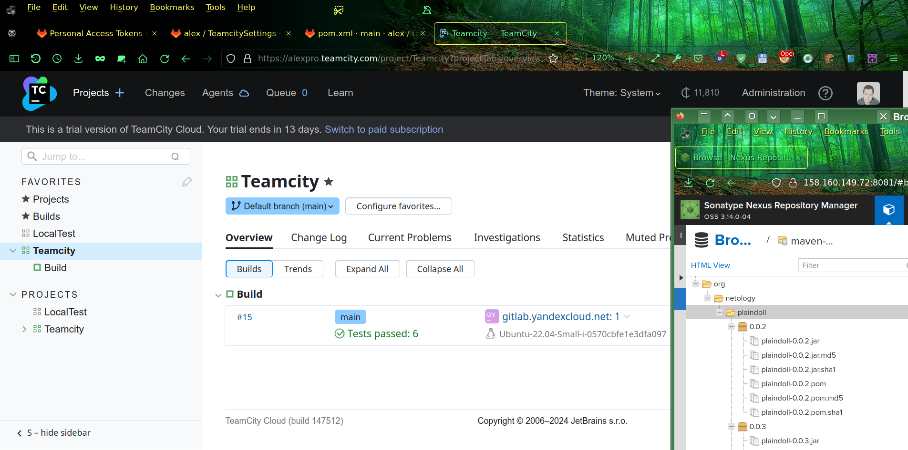

# Домашнее задание к занятию 11 «Teamcity»

## Подготовка к выполнению

Чтобы сэкономить время перед уже скорым техническим закрытием модуля воспользовался manaqed Teamcity от производителя, у них есть бесплатный пробный период на 2 недели. 

Виртуалки для Nexus создал с помощью [модуля Terraform](https://github.com/a-prokopyev-resume/devops-netology/tree/main/09-ci-03-cicd/src/terraform), разработанного в предыдущих работах этого учебного модуля.

Далее запустил playbook для установки Nexus:

## Основная часть

1. Создал форк Java проекта в GitLab: https://alexpro.gitlab.yandexcloud.net/alex/teamcity

2. Сделал autodetect конфигурации:

3. Проверка работоспособности сборки:

4. Настроил сборку, учитывающую особенности ветки main и остальных:
   

5. Настроил `settings.xml`.

6. В `pom.xml` поменял ссылку на репозиторий в Nexus:
   

7. Запустил сборку по master, после успешной сборки артефакт появился в nexus:

8.  Настроил репозиторий для конфигураций:
 

9.  Создал в GitLab требуемую ветку `feature/add_reply`.

10. Написал новый метод `sayHelloween` для класса `Welcomer`:

11. Дополнил тест методом `welcomerSayHelloween` для нового метода на поиск слова `hunter` в новой реплике.

12. Push происходил при каждом сохранении изменений в online редакторе GitLab, потом воспользовался опцией squash для объединения нескольких коммитов в один при слиянии веток.

13. Cборка N13 запустилась самостоятельно, тесты прошли успешно:

 

14. Внес изменения из ветки `feature/add_reply` в `main` через функцию merge request в GitLab:

15. Собранного артефакта в сборке по ветке `master` нет, потому что произошла коллизия версий, а замена одинаковой версии не разрешена по умолчанию в Nexus:

16. Настройка конфигурации для сборки артефактов:

17. Кроме того обновил версию в pom.xml, сборка и deploy прошли успешно:

18. Конфигурация в репозитории содержит настройки из teamcity:
https://alexpro.gitlab.yandexcloud.net/alex/teamcitysettings/-/tree/main/.teamcity?ref_type=heads

19. Ссылка на репозиторий Java проекта: https://alexpro.gitlab.yandexcloud.net/alex/teamcity  
Конфиг сохраняется в репозитории: https://alexpro.gitlab.yandexcloud.net/alex/teamcitysettings
