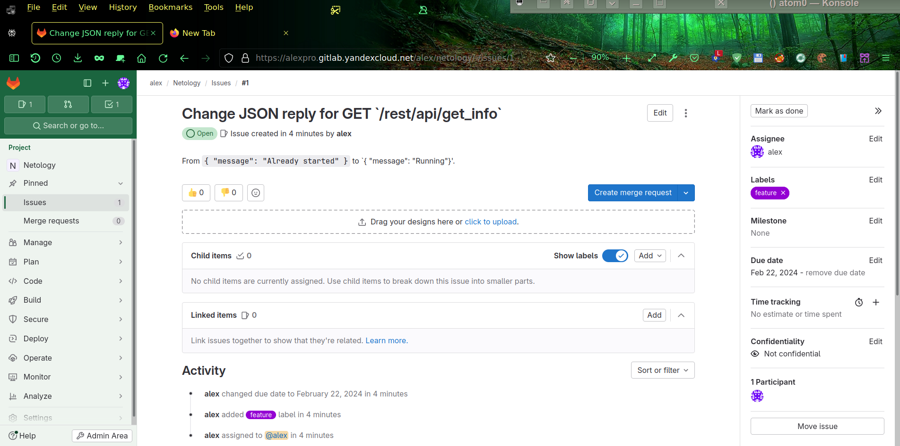
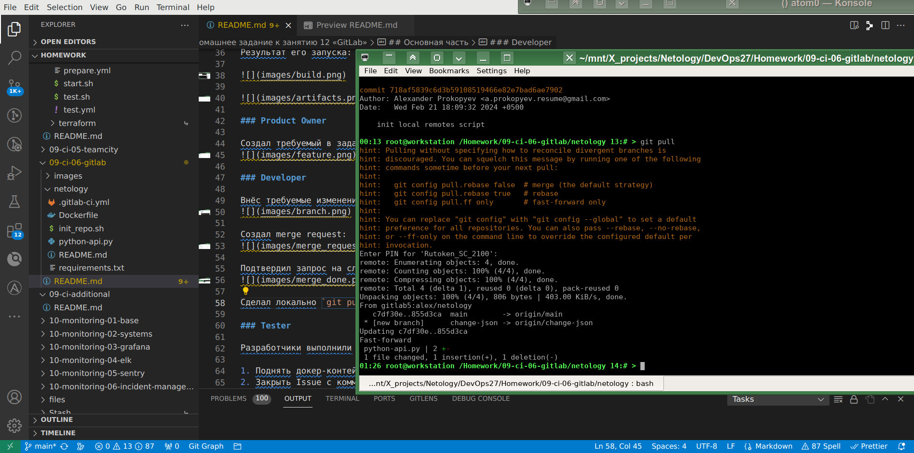

# Домашнее задание к занятию 12 «GitLab»

## Подготовка к выполнению

Создал managed GitLab в Yandex Cloud: https://alexpro.gitlab.yandexcloud.net/ и пару раннеров на уже готовом `agent` хосте из предыдущей работы.


Создал новый public проект Netology, репозиторий для него и скрипт настройки [git remote](https://alexpro.gitlab.yandexcloud.net/alex/netology/-/blob/main/init_repo.sh?ref_type=heads)


## Основная часть

### DevOps

Создал требуемый [pipeline](netology/.gitlab-ci.yml) для сборки требуемого [Dockerfile](netology/Dockerfile) в `shell runner`:
```
stages:
    - build
    - deploy
builder:
    stage: build
    script:
        - docker build -t hello:gitlab-$CI_COMMIT_SHORT_SHA .
    except:
        - main
deployer:
    stage: deploy
    script:
        - docker build -t $CI_REGISTRY/$CI_PROJECT_PATH/hello:gitlab-$CI_COMMIT_SHORT_SHA .
        - docker login -u $CI_REGISTRY_USER -p $CI_REGISTRY_PASSWORD $CI_REGISTRY
        - docker push $CI_REGISTRY/$CI_PROJECT_PATH/hello:gitlab-$CI_COMMIT_SHORT_SHA
    only:
        - main
```

Результат его запуска:


### Product Owner

Создал требуемый в задаче issue:


### Developer

Внёс требуемые изменения в новую ветку `change-json`:


Создал merge request:


Подтвердил запрос на слияние, сборка  прошла успешно:


Сделал локально `git pull` для синхронизации изменений, сделанных онлайн, на рабочую станцию:


### Tester

Проверил результат:


и закрыл issue:

