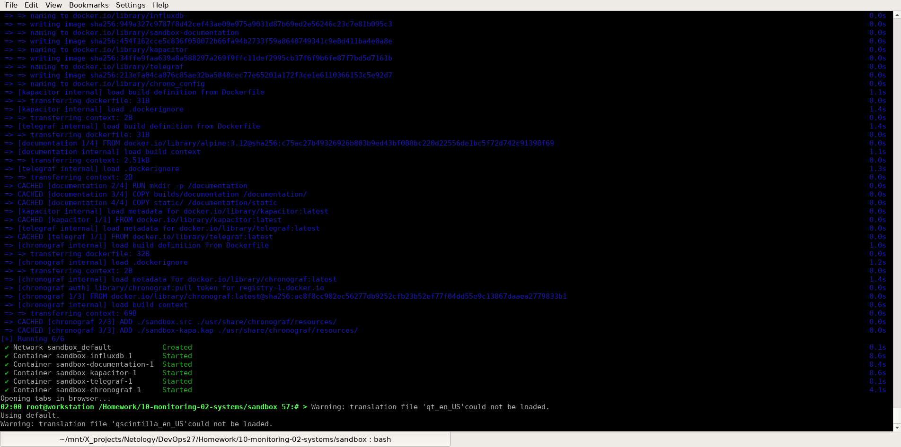
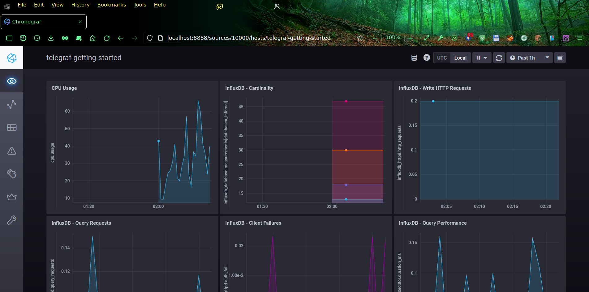
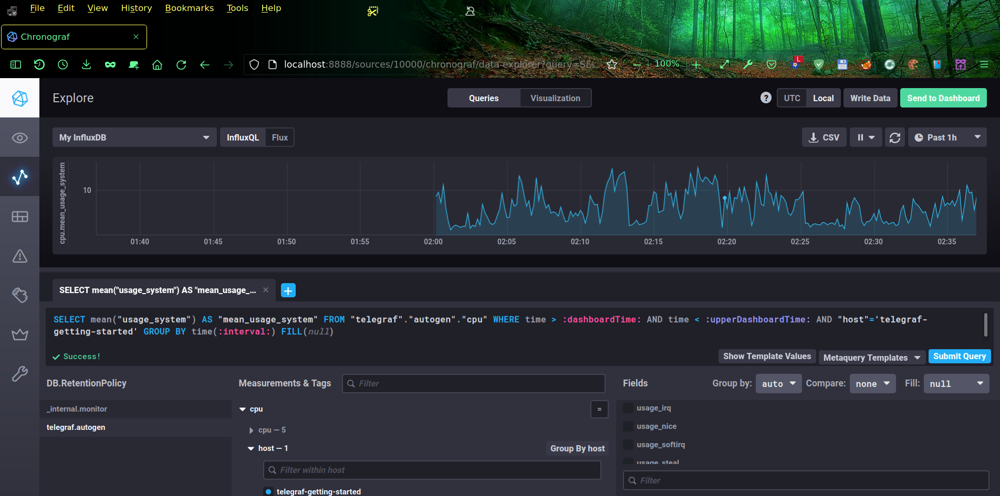
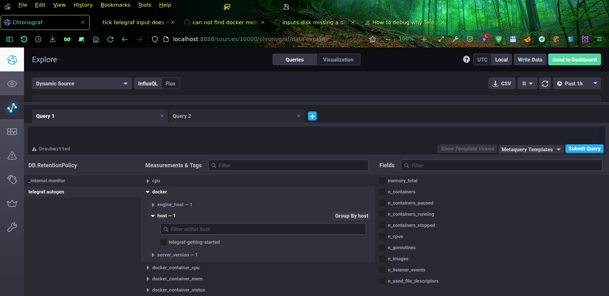

# Домашнее задание к занятию "13.Системы мониторинга"

## Обязательные задания

1.  
    * Мониторинг по оценке работоспособности ПО
      * Мониторинг количества http запросов к данному приложению
       * Количество неудачных ответов (ошибки 400 и 404)
       * Доступность ПО из различных регионов

    * Мониторинг по оценке работоспособности оборудования
      * CPU
        * Общая загрузка ЦПУ
        * Часть нагрузки ЦПУ от приложения
      * RAM
        * Количество занятой и оставшейся памяти
      * HDD
        * Нагрузка на диск
        * Остаточная ёмкость
        * SMART показатели состояния диска
        * График заполняемости свободного места на диске
      * LAN
        * Объем проходящего трафика

    * Бизнес мониторинг:
    * Количество отчётов
      * успешно выданных
      * неудачных
      * в работе
    * Среднее время формирования отчетов

    * Мониторинг безопасности ИС:
      * Нестандартное количество попыток авторизаций
      * Актуальность сертификатов
      * Нестандартное количество запросов на формирование отчетов
      * Трафик из нестандартных регионов

2. 
   * RAM - количество занятой и оставшейся памяти
   * inodes - количество свободных индексных дескрипторов файлов
   * Load Average - показывает соответствие нагрузки количеству доступных процессорных ядер, этот показатель не должен длительно превышать количество доступных ядер.

Менеджеры и клиенты могут оценивать метрики системы с помощью SLIs (Service Level Indicators), которые  должны стремиться к SLO (Service Level Objectives), что прописывается в SLA (Service Level Agreement).

3. Для эффективного сбора ошибок нужно где-то хранить информацию о них, поэтому всё же желательно выделить хоть какую-то минимальную инфраструктуру для бесплатного специализированного программного обеспечения типа Sentry. Если нет даже этого, то можно хотя бы мониторить ошибки скриптами в логах приложений пользователей, которые приходят с их рабочих станций.

4. Нужно учитывать также значения кодов 1xx и 3xx:  (summ_2xx_requests + summ_3xx_requests + summ_1xx_requests)/summ_all_requests

5. Преимущества и недостатки разных моделей передачи данных мониторинга
Push модель:  
  * Плюсы:
    * Точки приёма метрик настраиваются на агентах, поэтому можно настроить вывод метрик в несколько систем   *   * мониторинга и даже реализовать репликацию
    * Обычно используется более лайтовый UDP протокол, что положительно сказывается на производительности
    * Работает за (S)NAT, если сервер снаружи.
    * На каждом клиенте можно задать уникальные параметры отправки (частоту и данные).

  * Минусы:
    * Затрудняется верификация данных в системах мониторинга, поэтому возможен подлог данных мониторинга злоумышленниками
    * Агенты могут зафлудить сервера запросами
    * Нет гарантий доставки данных по UDP протоколу

Pull модель:  
  * Плюсы:
    * Возможно контролировать аутентичность данных, опрашиваются только обозначенные на сервере агенты
    * Безопасность намного выше потому что сервер отправляет только исходящие запросы, нередко по зашифрованным протоколам хотя бы типа TLS.
    * Легче отлаживать особенно в случае использования HTTP протокола, когда можно отправить такие запросы вручную из браузера
    * Сервер забирает данные по мере возможности, когда ему удобнее исходя из своей доступности
   * Минусы:
    * Более высокие требования к ресурсам сервера
    * Не работает за (S)NAT без дополнительной настройки, если сервер находится снаружи.

6.
* Prometheus	    Pull (Push с Pushgateway)
* TICK		        Push
* Zabbix 		      Push (Pull с Zabbix Proxy)
* VictoriaMetrics	Push/Pull, зависит от источника
* Nagios 		      Pull

7.

8.

9.
