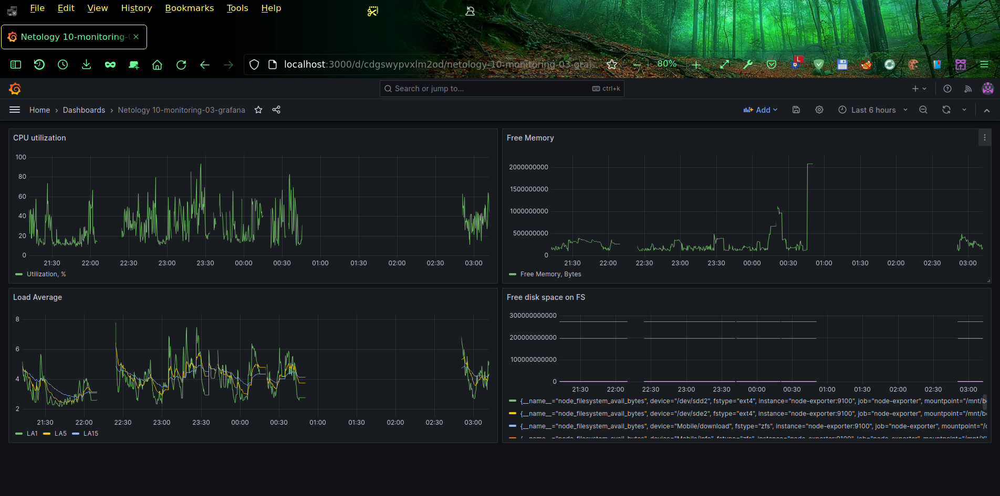

# Домашнее задание к занятию 14 «Средство визуализации Grafana»

### Задание 1

Доработал предложенный [docker-compose.yml](src/docker-compose.yml), добавил в него дополнительные сервисы:
* mail - для docker-mailserver, который в этой работе используется в качестве канала нотификации. Его настройки находятся в файле [dms.env](src/dms.env)
* roundcube - почтовый клиент для чтения писем
* rainloop - второй почтовый клиент для чтения писем, просто было интересно его посмотреть и сравнить с roundcube
* Добавил секцию настроек:
```
configs:
  grafana-ini:
    file: ./grafana/etc/grafana.ini
  grafana-repositories:
    file: ./grafana/etc/repositories
```
где указаны хостовые файлы, подставляемые при запуске в контейнер `grafana`, что позволяет указать более новый репозиторий `edge` для тестовой установки утилиты `swaks`, которая позволяет проверить отправку почты из CLI контейнера и файл настроек `grafana.ini`, где указаны настройки почтового сервера для отправки нотификаций по e-mail. Кроме того после разовой установки `swaks` в контейнер, я сделал `docker commit` с новым тагом `:swaks`, чтобы не устанавливать эту утилиту при каждом перезапуске контейнеров. Создал файлы для запуска, остановки и перезапуска docker-compose: `up.sh`, `down.sh`, `restart.sh`.

Добавил Prometheus в качестве источника:


Для теста добавил готовый dashboard "Node Exporter Full" из стоковой коллекции:


## Задание 2

Изучил PromQL по предложенным ссылкам.

Создал Dashboard `Netology 10-monitoring-03-grafana` и в ней необходимые Panels со следующими PromQL запросами:
- утилизация CPU для nodeexporter (в процентах, 100-idle): `(1 - avg(irate(node_cpu_seconds_total{job="node-exporter", mode="idle"}[1m])) )* 100`
- CPU LA 1, 5, 15:
```
avg(node_load1{job="node-exporter"})
avg(node_load5{job="node-exporter"})
avg(node_load15{job="node-exporter"})
```
- количество свободной оперативной памяти: `node_memory_MemFree_bytes`
- количество места на файловой системе: `node_filesystem_avail_bytes`

Скриншот получившегося Dashboard:


## Задание 3
Добавил алерты. Пример полученных нотификаций от Grafana:


## Задание 4
[Модель Dashboard](dashboard_model.json)