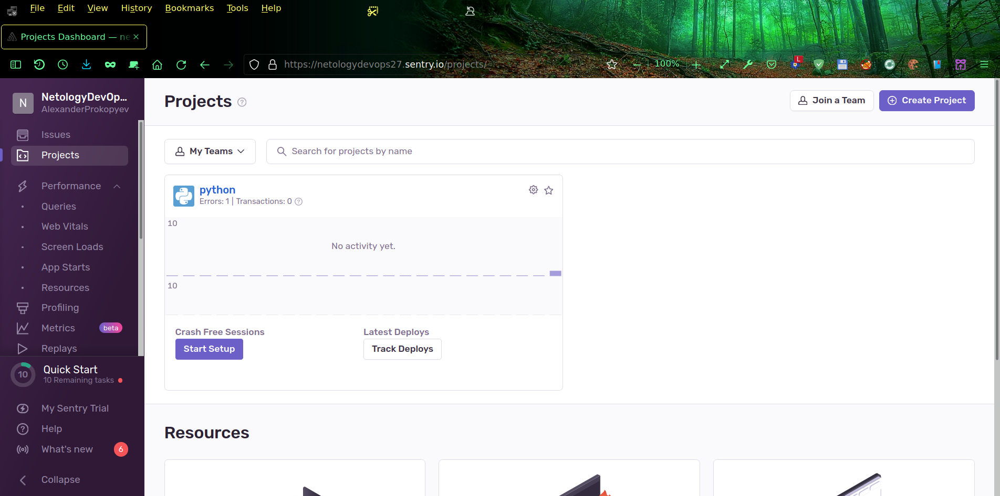
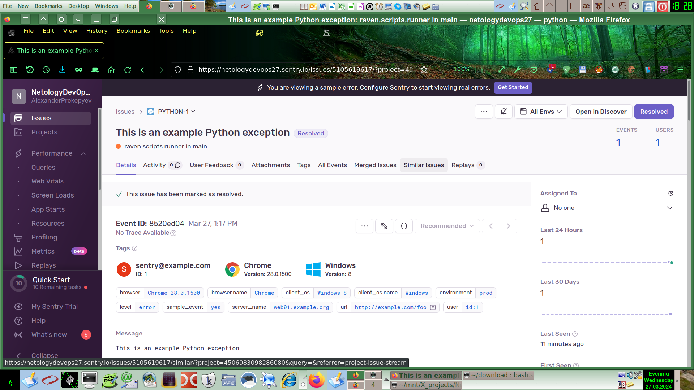
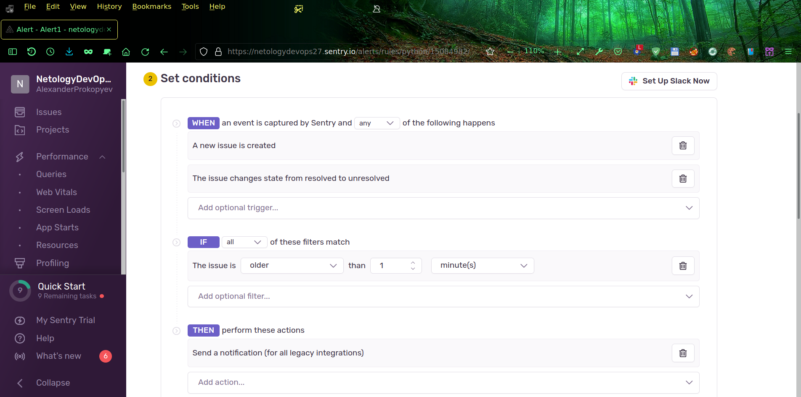
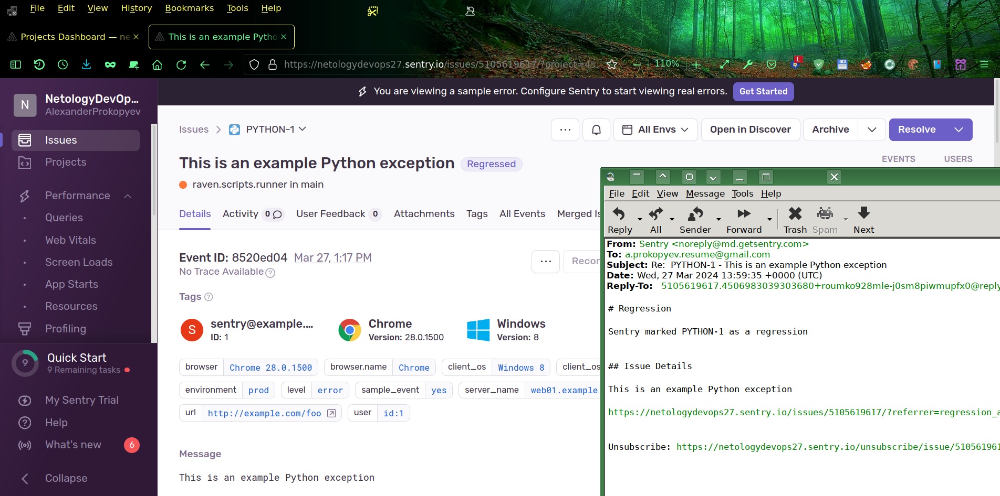

# Домашнее задание к занятию 16 «Платформа мониторинга Sentry»

## Задание 1

Зарегистрировался на sentry.io по своей учётке на Github.

## Задание 2

Создал Python проект, сгенерировал тестовое событие, изучил содержимое страницы события, отметил событие как `Resolved`

[Копия всей страницы события до резолюции](1.html)  
[Копия всей страницы события после резолюции](2.html)

## Задание 3

