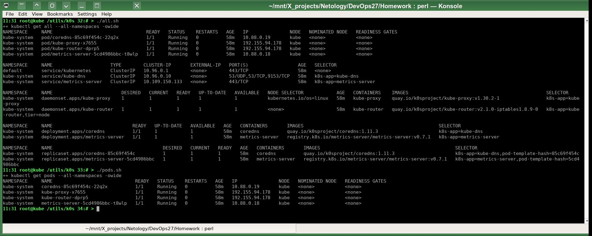
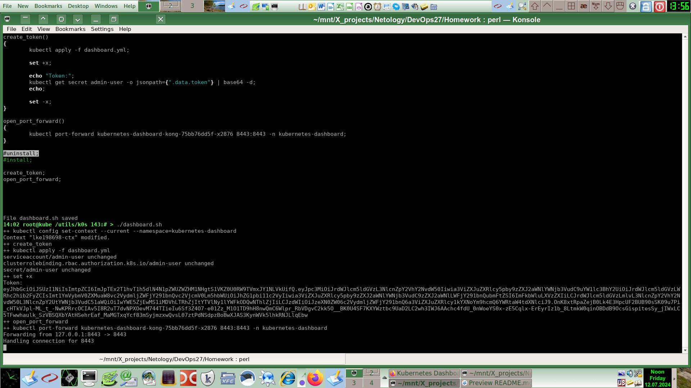
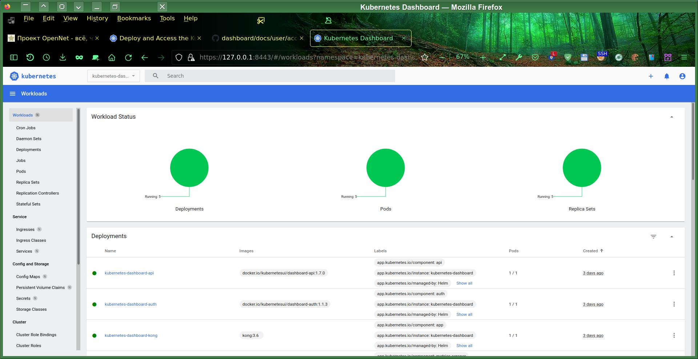

# Домашнее задание к занятию «Kubernetes. Причины появления. Команда kubectl»
# Автор решения - студент курса Netology DevOps27: Прокопьев Александр Борисович

Полезные линки по теме занятия:
* [Обзор kubectl](https://kubernetes.io/ru/docs/reference/kubectl/overview/)
* [Install and Set Up kubectl on Linux](https://kubernetes.io/docs/tasks/tools/install-kubectl-linux/)
* [Шпаргалка по kubectl](https://kubernetes.io/ru/docs/reference/kubectl/cheatsheet/)
* [50+ Commonly Used Kubectl Commands](https://www.tecmint.com/kubectl-commands/)
* [dennyzhang / cheatsheet-kubernetes-A4](https://github.com/dennyzhang/cheatsheet-kubernetes-A4)

### Задание 1. Установка *K8S

Вместо `MicroK8S` я буду использовать [k0s](https://k0sproject.io/).  

Преимущества `k0s`:
* Независимость `k0s` от `Linux` диструбутива (нет привязки к `snapd`,`Ubuntu` и т.п.). Поэтому `k0s` легко устанавливается даже на дистрибутивы без `systemd`. Причём разработчиками `k0s` кроме юнита `systemd` предусмотрен в т.ч. и инициализационный скрипт для `OpenRC`.
* У `k0s` почти нет пакетных зависимостей, все бинарники, включая `containerd` и т.п., автоматически устанавливаются самостоятельно инстолятором `k0s` из своего родного репозитория.
* Очень лайтовое потребление в дефолтном конфиге, можно использовать даже на слабеньких одноплатниках `ARMv7`, что хорошо подходит для `IoT`.
* Можно запускать `k0s` в `Docker` контейнере аналогично `KinD`, но удобнее.
* Можно использовать в `production` среде. Можно подключить почти любые плагины полноценного тяжеловесного `K8s`.
* Совершенные комплексные скрипты установки `k0s`, в т.ч. для многонодового развёртывания.
* В целом это получается наиболее универсальный из известных мне дистрибутивов `Kubernetes`.
* Пытаюсь настроить работу `k0s` даже внутри привилегированного `LXD` контейнера на `Devuan` и `Alpine`.  
Пробросить хостовый `ZFS` внутрь контейнера `LXD` уже получилось, т.е. внутри контейнера нормально работают `API` и `CLI` `ZFS`: `zpool`, `zfs` и т.п., что позволяет задействовать хостовый пул `ZFS` внутри `LXD` контейнера в качестве `ZFS` storage для `Docker` и `Kubernetes`.

Я разработал скрипты для автоматической установки на любом `Deb` дистрибутиве:
* `k0s` (пока ещё НЕ получается настроить в гостевом `LXD` контейнере): [reinstall.sh](src/reinstall.sh) 
* `helm`, `kubectl`: [install_tools.sh](src/install_tools.sh)

Запускаю установку `k0s`: `/utils/k0s/reinstall.sh`  

### Задание 2. Установка и настройка локального kubectl

Запускаю установку утилит своим скриптом: `/utils/k0s/install_tools.sh`. Он сам добавляет нужные `deb` репозитории, их ключи и устанавливает соответствующие пакет `helm` и `kubectl`.  

Устанавливаю локальный конфиг утилиты `kubectl`: `source /utils/k0s/config.sh k0s.yml`  
Далее проверяю все созданные объекты Kubernetes: `/utils/k0s/all.sh`  
Запущенные поды: `/utils/k0s/pods.sh`  

Устанавливаю `Dashboard` по инструкциям:
* https://kubernetes.io/docs/tasks/access-application-cluster/web-ui-dashboard/
* https://github.com/kubernetes/dashboard/blob/master/docs/user/access-control/creating-sample-user.md

Чтобы упростить установку и сделать её более легко повторяемой я создал скрипт [dashboard.sh](src/dashboard.sh),который:
1) устанавливает имя `namespace` по умолчанию, равное `kubernetes-dashboard`
2) устанавливает в кластер `helm chart` `kubernetes-dashboard` с помощью `helm` CLI
3) применяет спецификацию `dashboard.yml` для создания `bearing token`, - это теперь единственно поддерживаемый способ аутентифиции в актуальных версиях `kubernetes-dashboard`

5) создаёт `port-forward` в `Kong` pod, к которому я подключаюсь через веб браузер:

