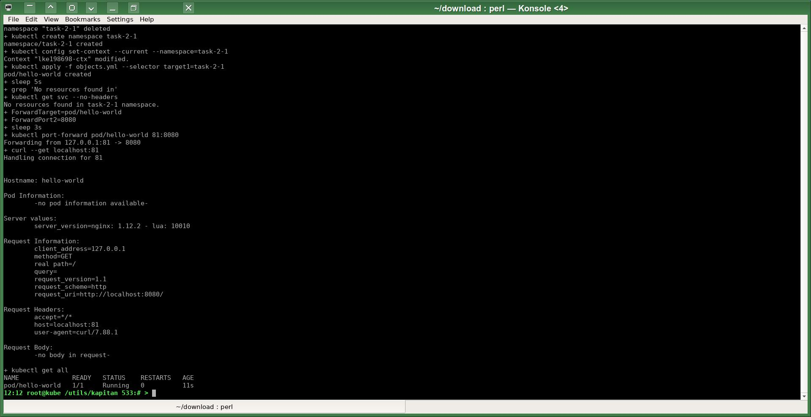
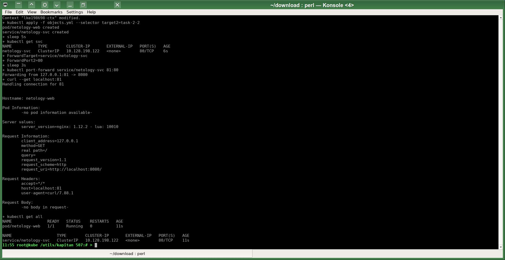

# Домашнее задание к занятию «Базовые объекты K8S»
# Автор решения - студент курса Netology DevOps27: Прокопьев Александр Борисович

Полезные линки по теме занятия:
* Описание [Pod](https://kubernetes.io/docs/concepts/workloads/pods/) и примеры манифестов.
* Описание [Service](https://kubernetes.io/docs/concepts/services-networking/service/).

Для шаблонизации следующих задач этого модуля я буду использовать [Kapitan](https://kapitan.dev/pages/blog/04/12/2022/kapitan-logo-5-years-of-kapitan/#why-do-i-need-kapitan) пока в самом примитивном режиме `Jinjinator`, но с ООП репозиторием, который позволяет в удобной форме задавать все переменные проекта и потом подставлять их при сборке конечных таргетов проекта (в моём случае задач модуля).

К сожалению новые версии `Kapitan` от [KapiCorp](https://github.com/kapicorp/kapitan) не отличаются большой стабильностью работы, но есть проприетарный форк от компании `VSHN` (блоб внутри их образа докер контейнера) - производителя cloud-native `Commodore` в рамках проекта [Project Syn](https://syn.tools/syn/about/features.html):
* https://syn.tools/commodore/index.html
* https://syn.tools/tuto/index.html
* https://github.com/projectsyn/commodore
* https://github.com/projectsyn/commodore-component-tutorial
* https://pypi.org/project/syn-commodore/

Сделал [свои скрипты](https://github.com/a-prokopyev-resume/devops-netology/tree/main/12-kuber-homeworks/kapitan) для использования этой версии `Kapitan`. В будущем собираюсь написать свою роль для `Ansible`, которая частично заменит мне `Kapitan` для моего специфичного use-case  "ООП Inventory + Jinjinator".

Исходники решения задачи до шаблонизации `Капитаном`: https://github.com/a-prokopyev-resume/devops-netology/blob/main/12-kuber-homeworks/kapitan/src/work2  

### Задание 1. Создать Pod с именем hello-world

Target специфичная версия после шаблонизации `Капитаном`:  
https://github.com/a-prokopyev-resume/devops-netology/blob/main/12-kuber-homeworks/kapitan/compiled/task-2-1/apply.sh   
https://github.com/a-prokopyev-resume/devops-netology/blob/main/12-kuber-homeworks/kapitan/compiled/task-2-1/objects.yml

### Задание 2. Создать Service и подключить его к Pod

Target специфичная версия после шаблонизации `Капитаном`:  
https://github.com/a-prokopyev-resume/devops-netology/blob/main/12-kuber-homeworks/kapitan/compiled/task-2-2/apply.sh   
https://github.com/a-prokopyev-resume/devops-netology/blob/main/12-kuber-homeworks/kapitan/compiled/task-2-2/objects.yml

