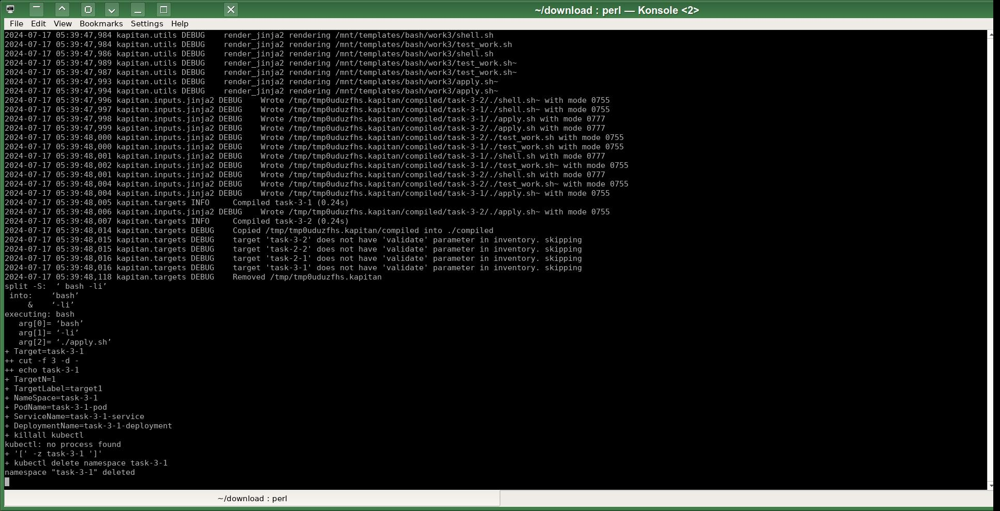
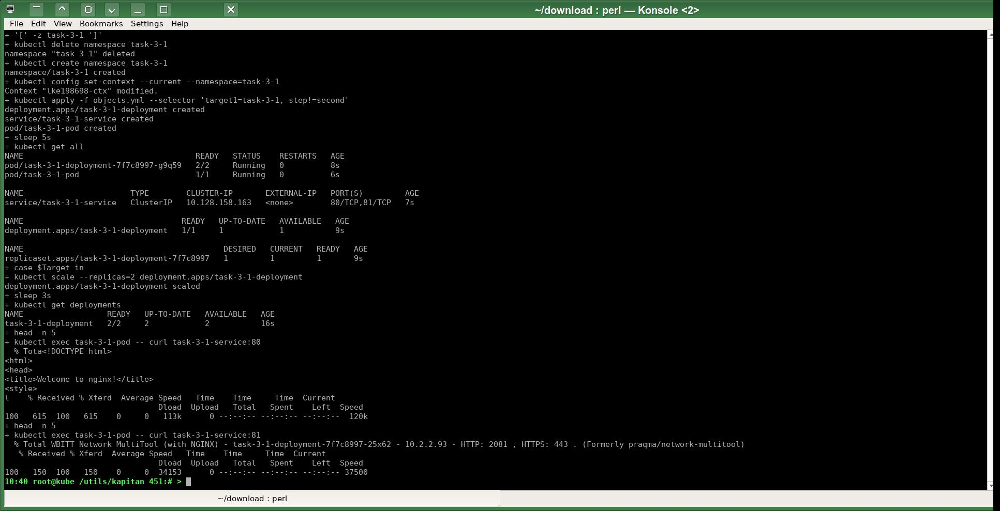
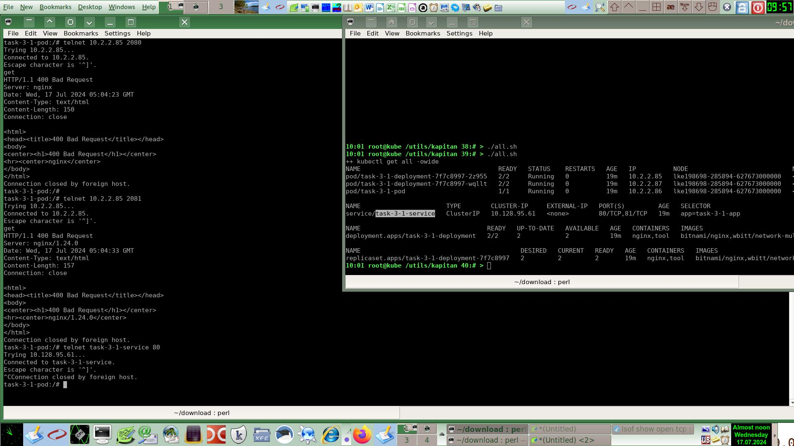
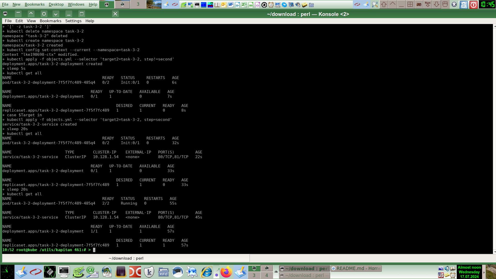

# Домашнее задание к занятию «Запуск приложений в K8S»
# Автор решения - студент курса Netology DevOps27: Прокопьев Александр Борисович

Полезные линки по теме занятия:

1. [Deployment и примеры манифестов](https://kubernetes.io/docs/concepts/workloads/controllers/deployment/).
2. [Описание Init-контейнеров](https://kubernetes.io/docs/concepts/workloads/pods/init-containers/).
3. [Описание Multitool](https://github.com/wbitt/Network-MultiTool) .

Для `Nginx` я использовал образ `bitnami/nginx`, потому что он позволяет удобно задавать `HTTP` порт `Nginx` через `env` переменную.
Написал скрипт [shell.sh](https://github.com/a-prokopyev-resume/devops-netology/blob/main/12-kuber-homeworks/kapitan/src/work3/shell.sh), который упрощает задачу поиска, подключения через `shell` и настройки нужного контейнера нужного пода вне зависимости от его пакетного менеджера. При запуске указывается подстрока названия `Pod` или `Deployment` (берётся первывй попавшийся `Pod` либо можно указать номер пода следующим параметром) и полное название контейнера.
Примеры запуска моего скрипта:
```
./shell.sh dep tool
./shell.sh dep nginx
./shell.sh pod tool
```
Мой скрипт автоматически определяет используемый в контейнере пакетный менеджер (`apt` или `apk`), обновляет метаданные репозитория установленного внутри контейнера дистрибутива Linux, далее устанавливает утилиты `netstat`, `htop` и `telnet`, потом запускает `netstat -anp4` и потом `bash -l` для тестов дополнительными интерактивными командами. Это позволяет снизить затраты времени на отладку контейнеров.

Исходники решения задач до шаблонизации `Капитаном`: https://github.com/a-prokopyev-resume/devops-netology/blob/main/12-kuber-homeworks/kapitan/src/work3  

Настройки `Kapitan` для этой работы: https://github.com/a-prokopyev-resume/devops-netology/blob/main/12-kuber-homeworks/kapitan/classes/work3.yml

### Задание 1. Создать Deployment и обеспечить доступ к репликам приложения из другого Pod

Написал свой скрипт `apply.sh` для повторяемого автоматического выполнения всех шагов каждой из задач этой работы:  
Исходник: https://github.com/a-prokopyev-resume/devops-netology/blob/main/12-kuber-homeworks/kapitan/src/work3/apply.sh  

Сначала с помощью скрипта `compile.sh` запускаю шаблонизатор `Kapitan`:  


Далее запускаю свой скрипт `apply.sh`  
  
Target специфичная версия после шаблонизации `Капитаном`:  
https://github.com/a-prokopyev-resume/devops-netology/blob/main/12-kuber-homeworks/kapitan/compiled/task-3-1/apply.sh   
https://github.com/a-prokopyev-resume/devops-netology/blob/main/12-kuber-homeworks/kapitan/compiled/task-3-1/objects.yml  

 который автоматически выполняет задачи этой работы учебного модуля:

Теперь ещё тестирую вручную из инструментального контейнера, подключаясь к нему своим скриптом `./shell.sh pod tool`


### Задание 2. Создать Deployment и обеспечить старт основного контейнера при выполнении условий

Аналогично предыдущей задаче после переключения таргета `Капитана` на текущую задачу `task-3-2` запускаю скрипты:  
https://github.com/a-prokopyev-resume/devops-netology/blob/main/12-kuber-homeworks/kapitan/compiled/task-3-2/apply.sh  
https://github.com/a-prokopyev-resume/devops-netology/blob/main/12-kuber-homeworks/kapitan/compiled/task-3-2/objects.yml  

