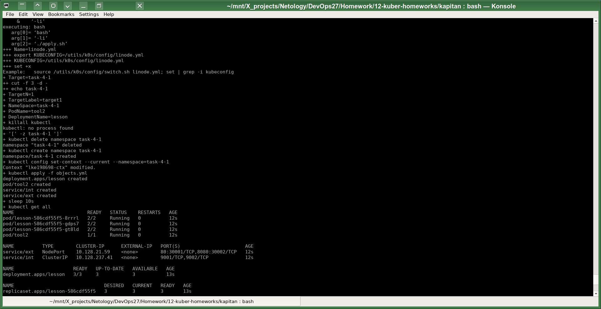
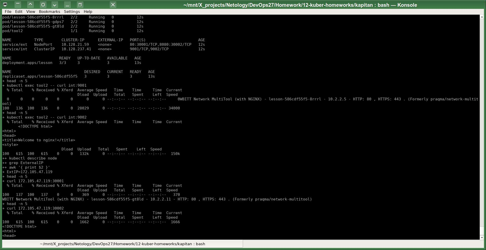

# Домашнее задание к занятию «Сетевое взаимодействие в K8S. Часть 1»
# Автор решения - студент курса Netology DevOps27: Прокопьев Александр Борисович

------

Полезные линки по теме занятия:
1. [Deployment и примеры манифестов](https://kubernetes.io/docs/concepts/workloads/controllers/deployment/)
2. [Описание Service](https://kubernetes.io/docs/concepts/services-networking/service/) 
3. [Описание Multitool](https://github.com/wbitt/Network-MultiTool)

------

Задачи этой работы решены аналогично предыдущим с помощью шаблонизатора `Kapitan`.

Исходники решения задач до шаблонизации `Капитаном`: https://github.com/a-prokopyev-resume/devops-netology/blob/main/12-kuber-homeworks/kapitan/src/work4  

Настройки `Kapitan` для этой работы: https://github.com/a-prokopyev-resume/devops-netology/blob/main/12-kuber-homeworks/kapitan/classes/work4.yml

Target специфичная версия после шаблонизации `Капитаном`:  
https://github.com/a-prokopyev-resume/devops-netology/blob/main/12-kuber-homeworks/kapitan/compiled/task-4-all/apply.sh  
https://github.com/a-prokopyev-resume/devops-netology/blob/main/12-kuber-homeworks/kapitan/compiled/task-4-all/objects.yml  

