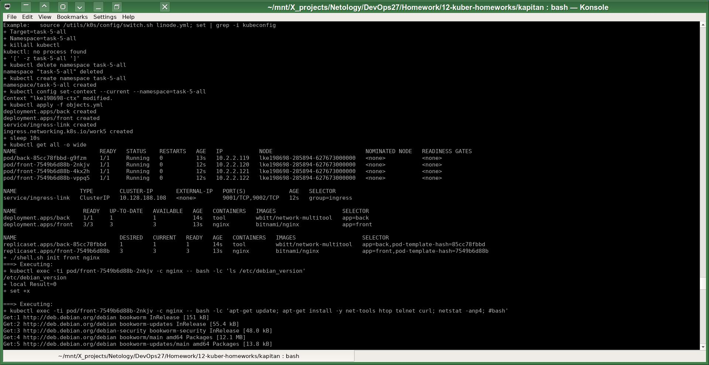
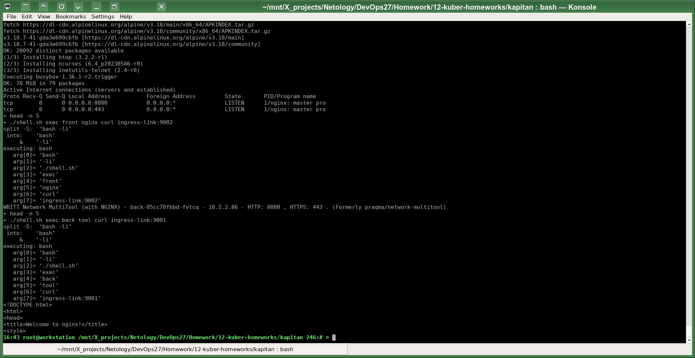
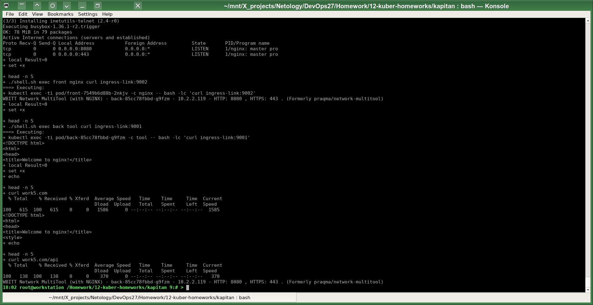

# Домашнее задание к занятию «Сетевое взаимодействие в K8S. Часть 2»
# Автор решения - студент курса Netology DevOps27: Прокопьев Александр Борисович

### Полезные линки по теме занятия:
* [K8S Service](https://kubernetes.io/docs/concepts/services-networking/service/)
* [K8S Ingress](https://kubernetes.io/docs/concepts/services-networking/ingress/)

------

Сначала я хотел настроить входящий в кластер трафик с помощью ресурса типа `Gateway` потому что по описанию это более современный способ. Но потом почитав про `Kong Gateway`, я пришёл к таким выводам:
* Пока это для меня избыточно сложно, и всё равно судя по описанию, `Kong` использует некий `Ingress` параллельно со своим `Gateway`.
* `Kong` IMHO больше нужен для API observability.
* Слишком многие `Kong` features являются платными, хотелось бы найти его более свободный бесплатный open-source аналог.
* Я привык к [Nginx Proxy Manager](https://github.com/NginxProxyManager/nginx-proxy-manager), и хотелось бы каким-то образом прикрутить к K8S именно его, [пока разбираюсь с этим вопросом](https://github.com/zimbres/nginx-proxy-manager-on-kubernetes).
* Для Nginx тоже разрабатывается свой вариант Gateway.

Задачи этой работы решены аналогично предыдущим с помощью шаблонизатора `Kapitan`.

Исходники решения задач до шаблонизации `Капитаном`: https://github.com/a-prokopyev-resume/devops-netology/blob/main/12-kuber-homeworks/kapitan/src/work5  

Настройки `Капитана` для этой работы: https://github.com/a-prokopyev-resume/devops-netology/blob/main/12-kuber-homeworks/kapitan/classes/work5.yml

Target специфичная версия после шаблонизации `Капитаном`:  
https://github.com/a-prokopyev-resume/devops-netology/blob/main/12-kuber-homeworks/kapitan/compiled/task-5-all/apply.sh  
https://github.com/a-prokopyev-resume/devops-netology/blob/main/12-kuber-homeworks/kapitan/compiled/task-5-all/objects.yml  

Запуск моего скрипта `apply.jpg`:

------

### Задание 1. Создать Deployment приложений backend и frontend

------

### Задание 2. Создать Ingress и обеспечить доступ к приложениям снаружи кластера

PS:  

По возможности, пожалуйста, предложите способ интеграции в `K8S` очень популярного (около 20K+ звёзд) [Nginx Proxy Manager](https://nginxproxymanager.com/), который обычно используется только в `docker-compose` без K8S, потому что пока не имеет реализации полноценного `Ingress` или `Gateway`.

Самое простое, вероятно, - это использование `NodePort`? Какие в этом случае могут быть недостатки по сравнению с использованием полноценного `Ingress`?

Нужно сохранить возможность доставки в `Nginx Proxy Manager` `Deployment` внутри кластера информацию о клиентских IP адресах, SSL соединениях и т.п., чтобы ему казалось, что он смотрит напрямую в интернет.