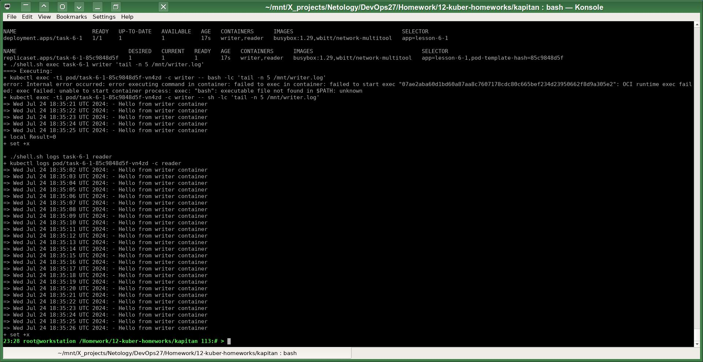
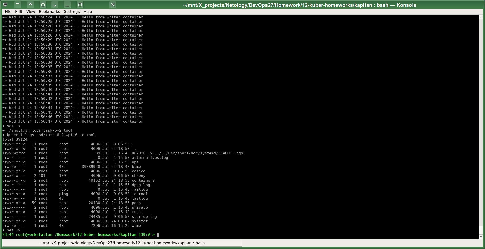

# Домашнее задание к занятию «Хранение в K8s. Часть 1»

Полезные линки по теме занятия:
* [Описание Volumes](https://kubernetes.io/docs/concepts/storage/volumes/)
* [Как мы работаем со Stateful в Kubernetes: особенности и подводные камни](https://habr.com/ru/companies/flant/articles/809377/)

------

Задачи этой работы решены аналогично предыдущим с помощью шаблонизатора `Kapitan`.

Исходники решения задач до шаблонизации `Капитаном`: https://github.com/a-prokopyev-resume/devops-netology/blob/main/12-kuber-homeworks/kapitan/src/work6  

Настройки `Капитана` для этой работы: https://github.com/a-prokopyev-resume/devops-netology/blob/main/12-kuber-homeworks/kapitan/classes/work6.yml

Target специфичная версия после шаблонизации `Капитаном`:  
https://github.com/a-prokopyev-resume/devops-netology/blob/main/12-kuber-homeworks/kapitan/compiled/task-6-all/apply.sh  
https://github.com/a-prokopyev-resume/devops-netology/blob/main/12-kuber-homeworks/kapitan/compiled/task-6-all/objects.yml  

### Задание 1 

### Задание 2

