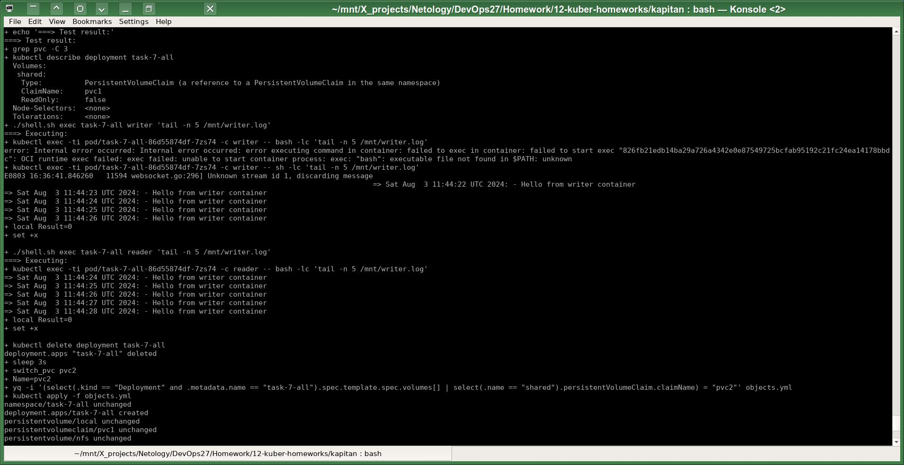
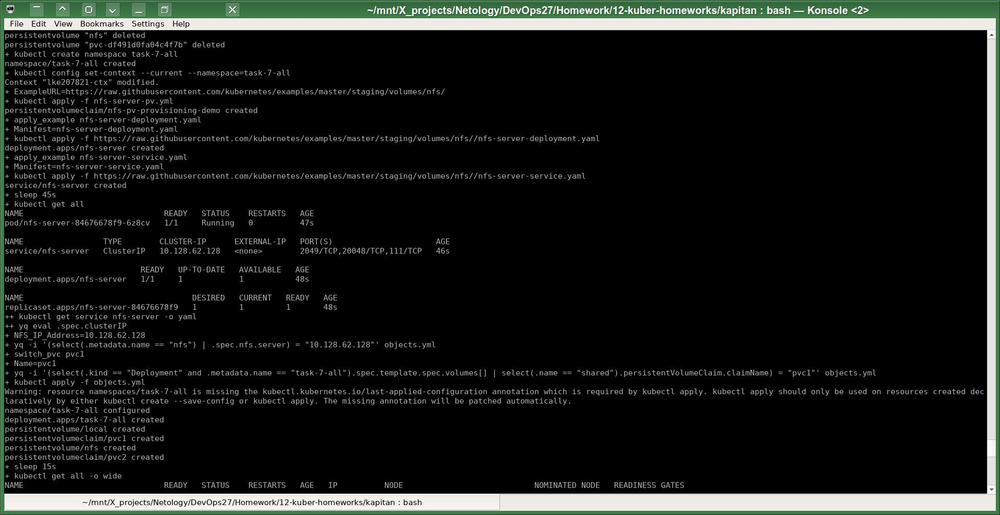
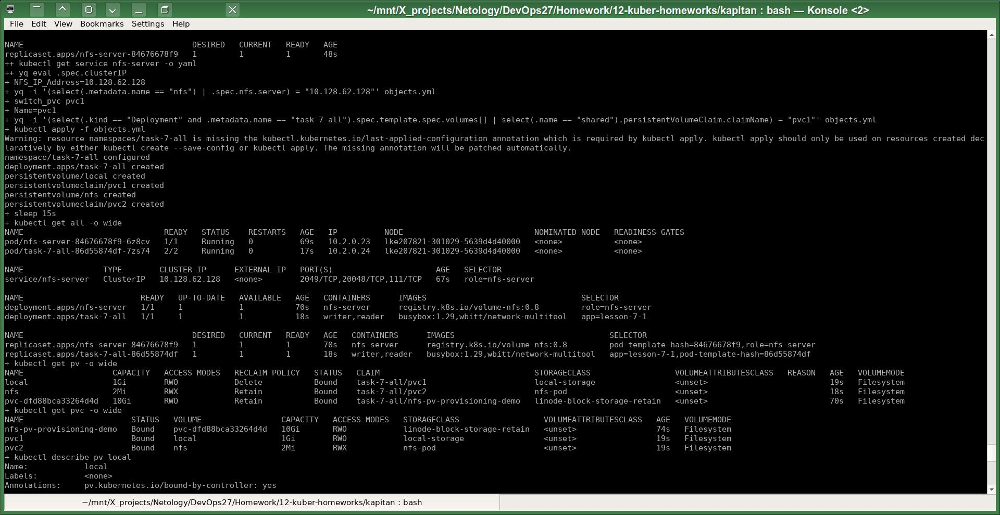
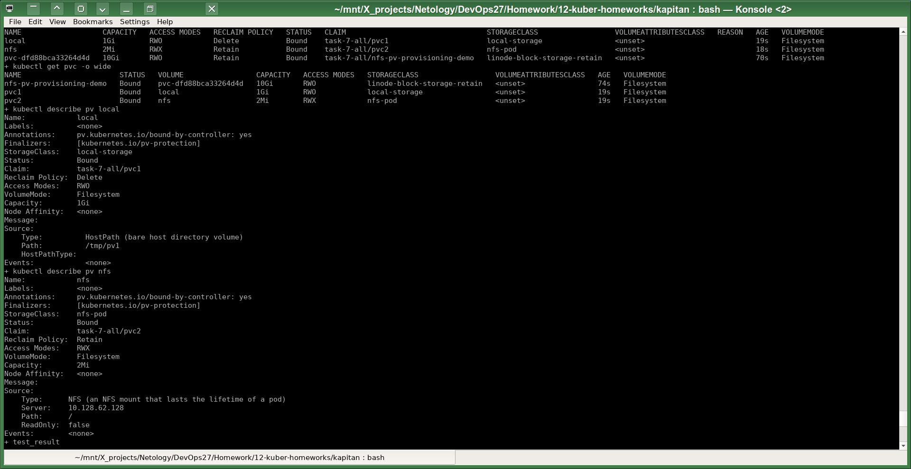
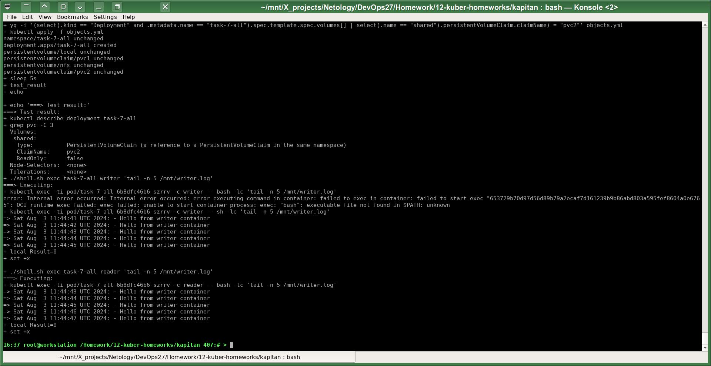

# Домашнее задание к занятию «Хранение в K8s. Часть 2»
# Автор решения - студент курса Netology DevOps27: Прокопьев Александр Борисович

------
Линки по теме занятия:
 * [Описание Persistent Volumes](https://kubernetes.io/docs/concepts/storage/persistent-volumes/)
 * [Описание динамического провижининга](https://kubernetes.io/docs/concepts/storage/dynamic-provisioning/)
 * [Описание Multitool](https://github.com/wbitt/Network-MultiTool)

------

Задачи этой работы решены аналогично предыдущим с помощью шаблонизатора `Kapitan`.

Исходники решения задач до шаблонизации `Капитаном`: https://github.com/a-prokopyev-resume/devops-netology/blob/main/12-kuber-homeworks/kapitan/src/work7 

Настройки `Капиатана` для этой работы: https://github.com/a-prokopyev-resume/devops-netology/blob/main/12-kuber-homeworks/kapitan/classes/work7.yml

Target специфичная версия после шаблонизации `Капитаном`:  
https://github.com/a-prokopyev-resume/devops-netology/blob/main/12-kuber-homeworks/kapitan/compiled/task-7-all/apply.sh  
https://github.com/a-prokopyev-resume/devops-netology/blob/main/12-kuber-homeworks/kapitan/compiled/task-7-all/objects.yml

Пришлось доработать скрипт `apply.sh`, наиболее важные имзменения:

* После деплоя NFS сервера стал плохо удаляться `K8S namespace` этой работы. Возможно это можно попытаться исправить, удаляя последовательно все ресурсы `K8S` в определённой последовательности, чтобы снизить взаимные зависимости удаляемых объектов. Но я решил воспользоваться принудительным удалением с опцией `--force` и иногда чисткой кластера его пересозданием за счёт эфимерности managed кластера. Фрагмент скрипта:
```
while true; do
        (timeout 10s kubectl delete namespace $Namespace) || (timeout 10s kubectl delete namespace $Namespace --grace-period=0 --force) || (timeout 10s kubectl delete pod --all --grace-period=0
        Result=$?;
        echo $Result;
        if [ $Result -eq 0 ]; then
                break;
        else
                sleep 5s;
        fi;
done;
```
* Использовал почти одинаковый файл `objects.yml` для решения обеих задач, но для второй задачи скрипт автоматически меняет значение подключенного к `поду` `PVC`:
```
test_result()
{
        echo;
        echo "===> Test result:";
        kubectl describe deployment task-7-all | grep pvc -C 3;
        ./shell.sh exec task-7-all writer "tail -n 5 /mnt/writer.log";
        #./shell.sh logs task-7-1 reader;
        ./shell.sh exec task-7-all reader "tail -n 5 /mnt/writer.log";

}
switch_pvc()
{
        Name=$1;
        yq -i '(select(.kind == "Deployment" and .metadata.name == "task-7-all").spec.template.spec.volumes[] | select(.name == "shared").persistentVolumeClaim.claimName) = "'$Name'"' objects.yml;
}

switch_pvc pvc1;
kubectl apply -f objects.yml;
test_result;

kubectl delete deployment task-7-all; sleep 3s;
switch_pvc pvc2;
kubectl apply -f objects.yml;
sleep 5s;
test_result;
```
* В манифесте `NFS` `PV` приходится подставлять IP адресс end point сервиса `NFS` из-за какого-то бага, описанного в т.ч. и в оригинальном примере развёртывания `NFS` сервера (там они это предлагают делать вручную):
```
NFS_IP_Address=$(kubectl get service nfs-server -o yaml | yq eval '.spec.clusterIP');
yq -i '(select(.metadata.name == "nfs") | .spec.nfs.server) = "'$NFS_IP_Address'"' objects.yml;
```

### Задание 1

Проверка записи и чтения в `pvc1`:


Сохранность данных на `PV` после удаления соответствующего `PVC` определяется параметром
[spec.persistentVolumeReclaimPolicy](https://docs.redhat.com/en/documentation/openshift_container_platform/4.3/html/storage/understanding-persistent-storage#reclaiming_understanding-persistent-storage) (перечислена только часть возможных значений):
* Retain - данные сохраняются
* Delete - данные удаляются

------

### Задание 2

Воспользовался готовыми примерами манифестов для поднятия NFS сервера в поде K8S:
https://github.com/kubernetes/examples/tree/master/staging/volumes/nfs

Фрагмент моего скрипта `apply.sh`, который применяет манифесты из примера "kubernetes/examples":
```
ExampleURL=https://raw.githubusercontent.com/kubernetes/examples/master/staging/volumes/nfs/;

apply_example()
{
        Manifest=$1;
        kubectl apply -f $ExampleURL/$Manifest;
}

kubectl apply -f nfs-server-pv.yml; # local fork modifed for another K8S
apply_example nfs-server-deployment.yaml;
apply_example nfs-server-service.yaml;
```
Создание пода c `NFS` сервером в managed кластере `K8S`:




Проверка записи и чтения в `pvc2`:
