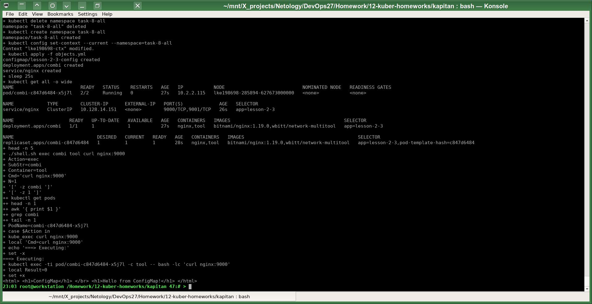
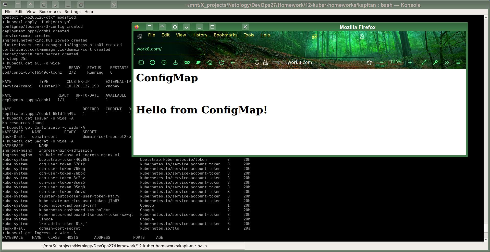

# Домашнее задание к занятию «Конфигурация приложений»

------

Линки по теме занятия:
* [Описание ConfigMap](https://kubernetes.io/docs/concepts/configuration/configmap/)
* [Описание Secret](https://kubernetes.io/docs/concepts/configuration/secret/)

Задачи этой работы решены аналогично предыдущим с помощью шаблонизатора `Kapitan`.

Исходники решения задач до шаблонизации `Капитаном`: https://github.com/a-prokopyev-resume/devops-netology/blob/main/12-kuber-homeworks/kapitan/src/work8 

Настройки `Капиатана` для этой работы: https://github.com/a-prokopyev-resume/devops-netology/blob/main/12-kuber-homeworks/kapitan/classes/work8.yml

Target специфичная версия после шаблонизации `Капитаном`:  
https://github.com/a-prokopyev-resume/devops-netology/blob/main/12-kuber-homeworks/kapitan/compiled/task-8-all/apply.sh  
https://github.com/a-prokopyev-resume/devops-netology/blob/main/12-kuber-homeworks/kapitan/compiled/task-8-all/objects.yml

------

### Задание 1. Создать Deployment приложения и решить возникшую проблему с помощью ConfigMap. Добавить веб-страницу

### Задание 2. Создать приложение с вашей веб-страницей, доступной по HTTPS 

