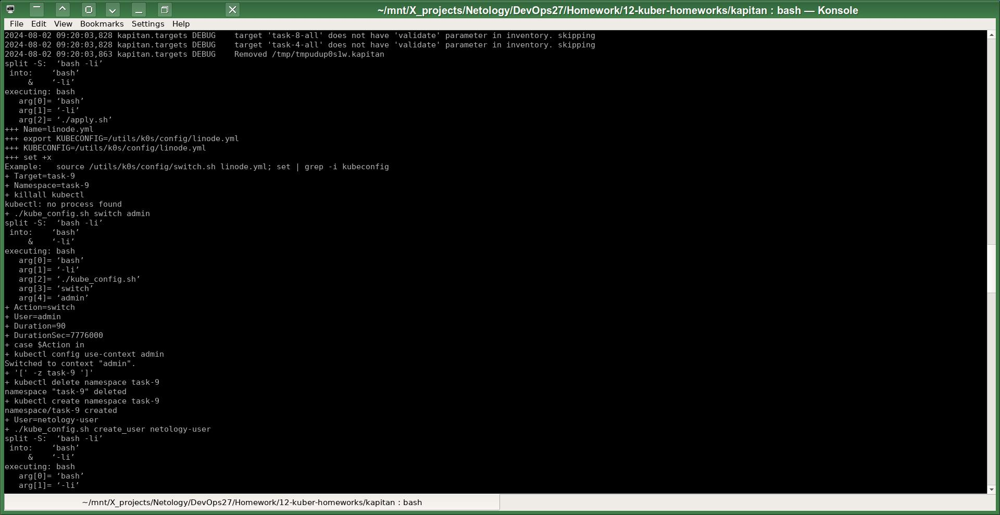
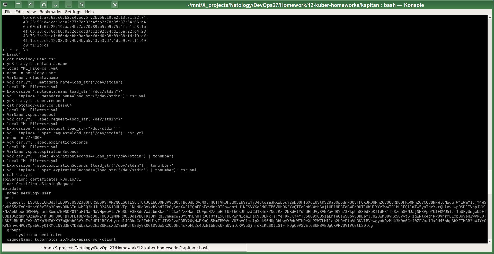
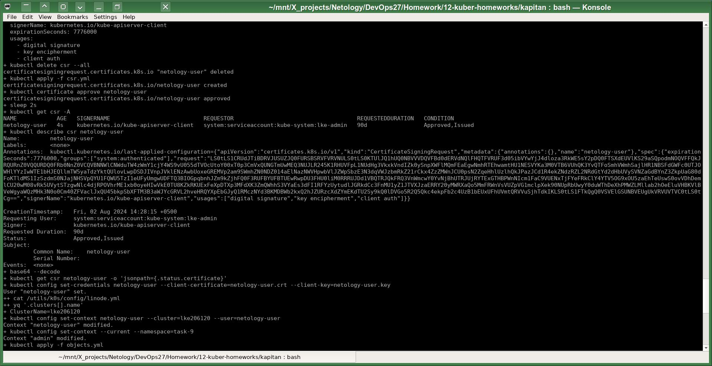
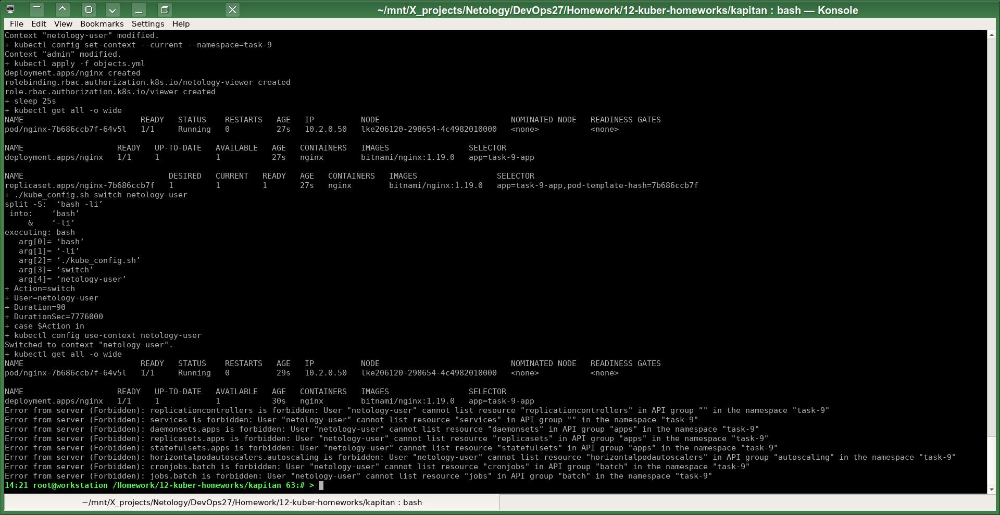

# Домашнее задание к занятию «Управление доступом»
# Автор решения - студент курса Netology DevOps27: Прокопьев Александр Борисович
------

Линки по теме занятия:
* [Описание RBAC](https://kubernetes.io/docs/reference/access-authn-authz/rbac/)
* [Пользователи и авторизация RBAC в Kubernetes](https://habr.com/ru/company/flant/blog/470503/)
* [RBAC with Kubernetes in Minikube](https://medium.com/@HoussemDellai/rbac-with-kubernetes-in-minikube-4deed658ea7b)

Задачи этой работы решены аналогично предыдущим с помощью шаблонизатора `Kapitan`.

Исходники решения задач до шаблонизации `Капитаном`: https://github.com/a-prokopyev-resume/devops-netology/blob/main/12-kuber-homeworks/kapitan/src/work9 

Настройки `Капиатана` для этой работы: https://github.com/a-prokopyev-resume/devops-netology/blob/main/12-kuber-homeworks/kapitan/classes/work9.yml

Target специфичная версия после шаблонизации `Капитаном`:  
https://github.com/a-prokopyev-resume/devops-netology/blob/main/12-kuber-homeworks/kapitan/compiled/task-9/apply.sh  
https://github.com/a-prokopyev-resume/devops-netology/blob/main/12-kuber-homeworks/kapitan/compiled/task-9/objects.yml

------

### Задание 1. Создайте конфигурацию для подключения пользователя

Решение представлено скриптом [apply.sh](https://github.com/a-prokopyev-resume/devops-netology/blob/main/12-kuber-homeworks/kapitan/src/work9/apply.sh), который в свою очередь вызывает мой скрипт [kube_config.sh](https://github.com/a-prokopyev-resume/devops-netology/blob/main/12-kuber-homeworks/kapitan/src/work9/kube_config.sh), который генерирует ключ, запрос на подписание сертификата, отправляет запрос в control plane кластера K8S, получает подписанный сертификат обратно, настраивает файл, указанный в переменной среды `KUBECONFIG`.

Все шаги задания выполняются полностью автоматически упомянутыми выше скриптами, достаточно запустить `apply.sh`, на последнем скриншоте видим, что после переключения kubectl в контекст пользователя `netology-user` остаются права для просмотра только нескольких видов ресурсов, разрешённых в соответствующей роли `viewer`:

