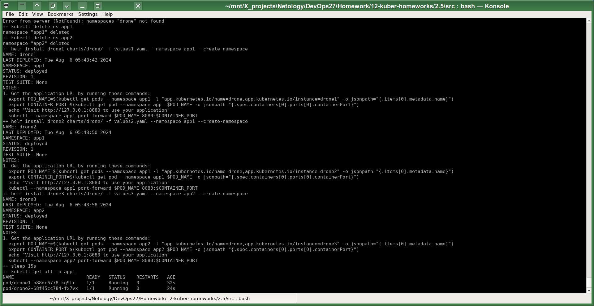
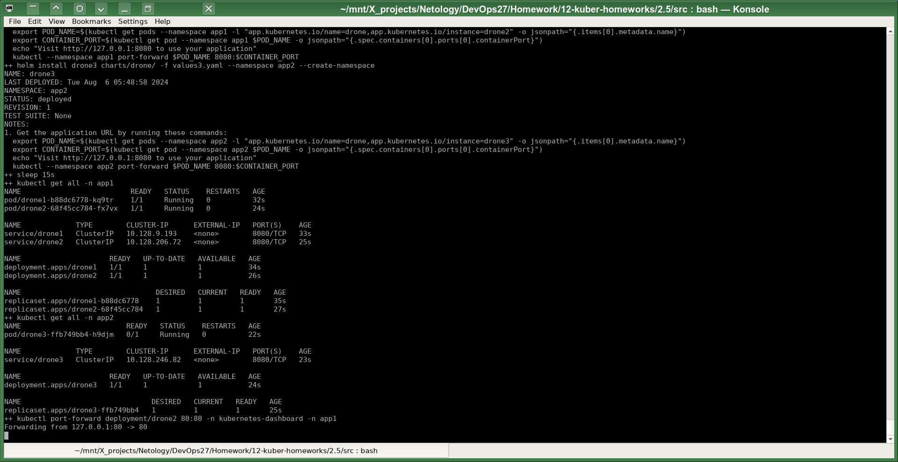
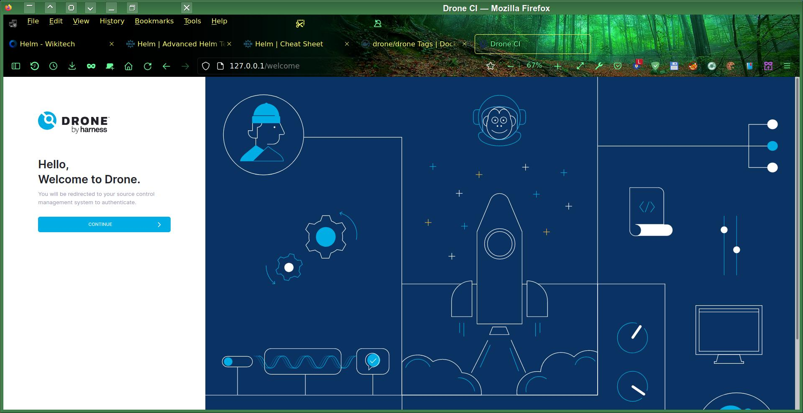

# Домашнее задание к занятию «Helm»

# Автор решения - студент курса Netology DevOps27: Прокопьев Александр Борисович

------

Линки по теме занятия:
* https://helm.sh/docs/glossary/
* https://helm.sh/docs/intro/cheatsheet/
* https://hub.docker.com/r/drone/drone/tags

Для решения задач этой работы я использовал Helm Chart для Drone CI, который собираюсь использовать в своих будущих работах.

### Задание 1. Подготовить Helm-чарт для приложения

Сначала я извлёк содержимое чарта, чтобы получить его файл `values.yml`:
```
helm repo add drone https://charts.drone.io
helm repo update;
helm pull drone/drone;
helm repo remove drone;
```
Развернул архив и сделал три копии файла `values.yml` с разными тэгами версий образа контейнера:
* `values1.yml`
* `values1.yml`
* `values1.yml`

------
### Задание 2. Запустить две версии в разных неймспейсах

Для решения этой задачи я использовал скрипт:
```
set -x;

kubectl delete ns drone;
kubectl delete ns app1;
kubectl delete ns app2;

#helm install --namespace drone drone drone/drone -f values.yaml --create-namespace;

helm install  drone1 charts/drone/ -f values1.yaml --namespace app1 --create-namespace;
helm install  drone2 charts/drone/ -f values2.yaml --namespace app1 --create-namespace;
helm install  drone3 charts/drone/ -f values3.yaml --namespace app2 --create-namespace;

kubectl get  all -n app1;
kubectl get  all -n app2;

#kubectl expose deployment drone3 --name drone3-np --type=NodePort --port=80 --target-port=80 -n app2;
kubectl port-forward deployment/drone3 80:80 -n kubernetes-dashboard -n app1;
```
Установка с помощью `Helm`:

Получившиеся `deployments`:


Далее проверил работоспособность одного из приложений в браузере:

