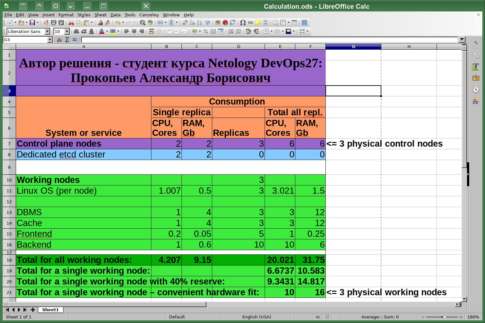

# Домашнее задание к занятию «Компоненты Kubernetes»

------

Полезные линки по теме занятия:
* [Considerations for large clusters](https://kubernetes.io/docs/setup/best-practices/cluster-large/),
* [Architecting Kubernetes clusters — choosing a worker node size](https://learnk8s.io/kubernetes-node-size).
* https://www.reddit.com/r/kubernetes/comments/wa9o4b/how_do_i_calculate_the_resource_requests_and/?rdt=43799
* https://www.linode.com/blog/kubernetes/how-to-right-size-a-kubernetes-cluster-for-efficiency/
* https://dev.to/newrelic/how-to-optimize-kubernetes-resource-configurations-for-cost-and-performance-ea4
* https://docs.kublr.com/installation/hardware-recommendation/
* https://thenewstack.io/kubernetes-requests-and-limits-demystified/
* https://learnk8s.io/setting-cpu-memory-limits-requests

------

### Задание. Необходимо определить требуемые ресурсы

Результат расчётов, нужно:
* 3 управляющих ноды: 2 vCPU + 2GB RAM каждая
* 3 рабочих ноды: 10 vCPU + 16GB RAM каждая