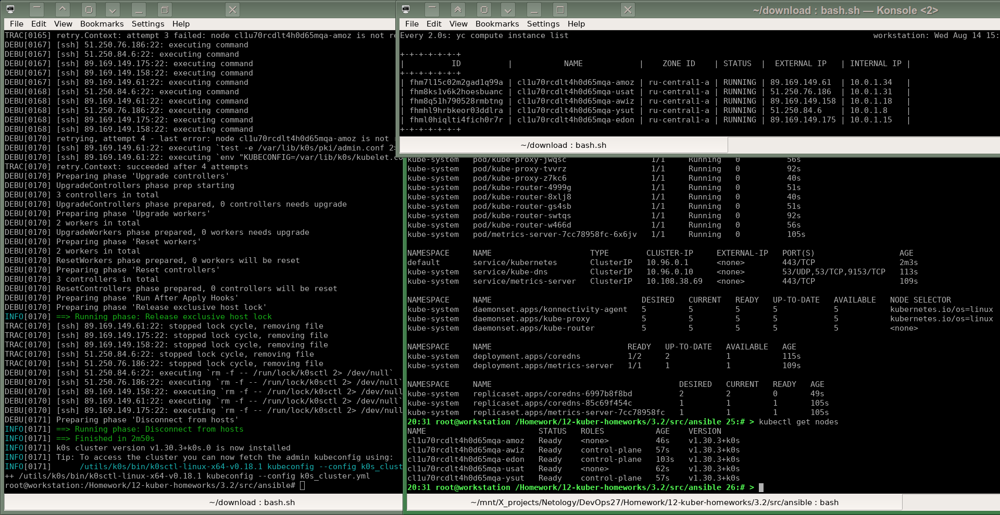
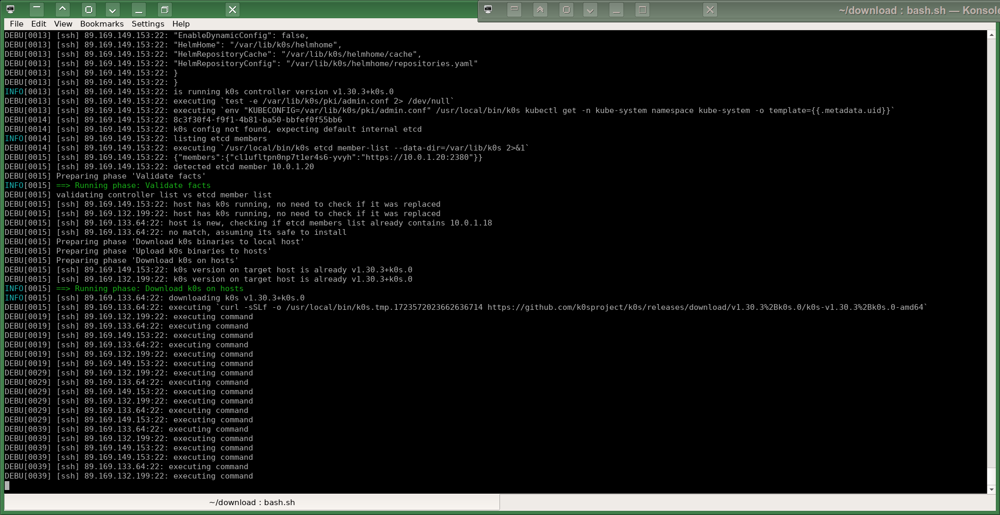
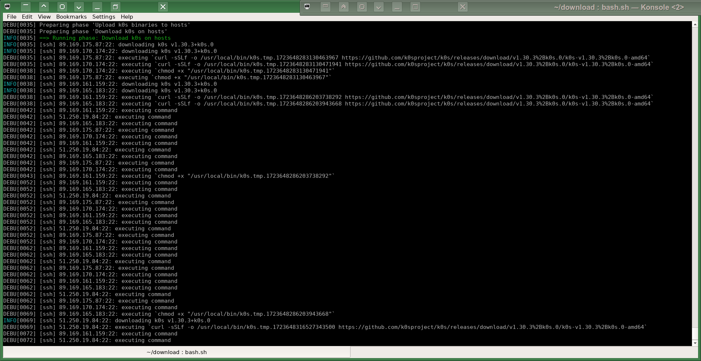

# Домашнее задание к занятию «Установка Kubernetes»
# Автор решения - студент курса Netology DevOps27: Прокопьев Александр Борисович

Способы установки `K8s`:
* [Talos immutable Linux OS](https://www.talos.dev/v1.7/introduction/getting-started/)
* [k0s](https://github.com/k0sproject/k0s/) с помощью [k0sctl](https://github.com/k0sproject/k0sctl):
  * https://docs.k0sproject.io/stable/k0sctl-install/
  * https://github.com/alessiodionisi/terraform-provider-k0s/blob/main/examples/resources/k0s_cluster/resource.tf
  * [Cilium network driver](https://docs.cilium.io/en/latest/installation/k0s/)
* `Docker` и другие контейнерные рантаймы:
  * `k0s`:
    * https://docs.k0sproject.io/stable/k0s-in-docker/
    * https://github.com/k0sproject/k0s/blob/main/docs/k0s-in-docker.md
    * https://github.com/mbentley/docker-k0s
    * https://hub.docker.com/r/k0sproject/k0s/tags
    * https://github.com/FilBot3/k0s_in_podman
  * [k3s](https://github.com/k3s-io/k3s):
    * [k3d](https://k3d.io/v5.7.3/#quick-start)
  * [KinD](https://kind.sigs.k8s.io/docs/user/quick-start)
  * [Talos](https://www.talos.dev/v1.7/introduction/quickstart/)
* `Ansible`:
  * [Kubespray](https://kubespray.io/) и надстройки над ним:
    * https://github.com/kubernetes-sigs/kubespray
    * https://github.com/MusicDin/kubitect
    * https://github.com/kubean-io/kubean
  * `k0s`:
    * https://github.com/jlnhnng/k0s-hetzner
    * https://github.com/bodsch/ansible-k0s
    * https://github.com/movd/k0s-ansible
    * https://github.com/jpb111/kubernetes-k0s-ansible-harbor/tree/main
  * `k3s`:
     * https://github.com/k3s-io/k3s-ansible
     * https://github.com/techno-tim/k3s-ansible
  * [Kubefire (using Firecracker microVM)](https://github.com/innobead/kubefire)
* [Cloudie K8s operator](https://community.hetzner.com/tutorials/kubernetes-with-claudie)
* [kubeadm](https://kubernetes.io/docs/setup/production-environment/tools/kubeadm/create-cluster-kubeadm/)


### Задание 1. Установить кластер k8s 

В качестве способа установки `K8s` я выбрал скрипт `k0sctl`, потому что он показался мне наиболее простым и удобным в настройке, кроме того мне нравится дистрибутив `k0s`.

Виртуальные машины в `Yandex Cloud` разворачиваются моим модулем `Terraform`, который вызывается из моего плейбука `Ansible`, передавая нужные мне  параметры, которые задаются в плейбуке.

Параметры моего кластера указываются и легко меняются при необходимости в переменных моего `Ansible` `playbook`:
```
   - name: Amount of k0s master nodes
      ansible.builtin.set_fact:
        MasterAmount: 3

    - name: Amount of k0s worker nodes
      ansible.builtin.set_fact:
        WorkerAmount: 2
```
Я выбрал такое количество узлов, потому что хотел сразу использовать эти настройки в задаче со звёздочкой.
Ещё на такой выбор повлияла какая-то странная особенность с `YC`+`TF` (и возможно лимитами моей учётной записи), которая не позволяла мне создавать более 6-и узлов в одной `instance group`. Сначала создаётся и большее количество `instance`, что видно по выводу `watch "yc compute instance-group list"`, но потом уже внезапно после создания их часть куда-то пропадает, и остаётся только ровно 6 экземпляров (причём это повторяемо), и состояние группы зависает на неопределённое время в таком виде:
```
yc compute instance-group list
+----------------------+-----------------------------+--------+--------+
|          ID          |            NAME             | STATUS |  SIZE  |
+----------------------+-----------------------------+--------+--------+
| cl1g1r4d23hulblas0gq | netology-12-kuber-homeworks | ACTIVE | 6 -> 7 |
+----------------------+-----------------------------+--------+--------+
```
После этого не работает даже удаление ранее созданных реусурсов через `Terraform`, приходится удалять их вручную через `yc compute instance-group delete`. Причем для количества узлов в группе до 6 включительно всё работает нормально проблема происходит только при попытке указать 7 и более узлов в группе. Проблема повторяема, я пробовал несколько раз, потом при случае спрошу в поддержке Yandex. Возможно это просто лимит моей учётной записи.

Параметры хостов - будущих узлов кластера легко меняются в этом шаге моего [Ansible playbook](src/ansible/main.yml) в виде параметров, передаваемых моему модулю [Terraform](src/terraform/yandex.tf),
который создаёт соответствующий [instance group](https://terraform-provider.yandexcloud.net/Resources/compute_instance_group):
```
    - name: Create VMs by Terraform
      community.general.terraform:
        project_path: ../terraform
        state: present
        complex_vars: true
        variables: # NO SPACES and NO COMMENTS near '=' operator are allowed !!!  Correct: var1=value1
          group="{{ Lesson }}"
          default_zone="ru-central1-a"
          disk_size=93
          disk_type="network-ssd-nonreplicated"
          image_family="debian-10"
          is_temporary=true
          amount={{ MasterAmount + WorkerAmount }}
          platform_id="standard-v2"
          cores=2
          core_fraction=100
          ram=2
```
Вместо `Ubuntu 20.04-lts` я использовал образ `Debian v10`, также ещё пробовал `Debian v11` и `Debian v12`.
Результат запуска `k0sctl`:


`k0sctl` "подвисает" (зацикливается в ожидании) на шаге загрузки на виртуальные машины в `YC` дистрибутивов `k0s` с `Github`:


Скорее всего вызвано очень низкой скоростью обмена данными между `Github` и `Yandex Cloud` по `HTTP` - загрузка с `Github` на виртуалки `Yandex` происходит достаточно медленно. Другие утилиты типа `docker-compose` я загружаю в `YC` утилитой `axel`:
`axel --num-connections=50  https://github.com/docker/compose/releases/download/v2.28.1/docker-compose-linux-x86_64 --timeout=60 --output /usr/local/bin/docker-compose && chmod 755 /usr/local/bin/docker-compose`, что ускоряет загрузку в десятки раз при указании соответствующего значения параметра `--num-connections`.

Мне таки удалось завершить установку кластера `k0s` утилитой `k0sctl`, манипулируя следующими настройками:
* Уменьшил до единицы количество потоков: `k0sctl --concurrency 1`. Но при этом другой утилитой `axel` для быстрой многопоточной загрузки файлов удаётся ускорить загрузку других файлов в десятки раз. Пробовал предварительно совсем НЕ использовать `axel` на будущем хосте кластера `k0s`, чтобы шейпер, если он есть где-то на пути, не запоминал мой хост в `YC` и потом не мешал работать `k0sctl`, но это к сожалению НЕ помогло.
* Пробовал перебирать разные ДЦ `YC`, тоже толку мало :(

Пока выполнял эту работу и общался в чате `Cozystack`, окончательно пришёл к выводу, что по возможности нужно максимально использовать `immutable` образы базового софта и стараться избегать различных установочных скриптов, кроме как для начального создания готовых образов во время сборки (заранее ДО их деплоя).   
Поэтому на данный момент времени считаю наиболее оптимальными в будущем для меня способами установки `K8s`:  
* [Talos](https://www.talos.dev/v1.7/introduction/prodnotes/) - для промышленного нагруженного кластера
* [k0s in docker](https://docs.k0sproject.io/stable/k0s-in-docker/) или `k3d`. Так же пробовал запускать `k0s` с помощью `docker-compose`, но судя по выводу `net-stat` внутри контейнера, по умолчанию процессы контейнерного `k0s` большей частью слушают порты только на адресе `127.0.0.1`, поэтому для организации кластера из контейнеров `k0s`, запущенных на разных хостах, нужно ещё поизучать проекты типа таких:
* https://github.com/tldr-devops/k0s-in-docker
* https://github.com/zengzhengrong/k0s-stack  
Упомянутые выше два проекта с гитхаба для запуска `k0s` в `docker-compose` IMHO слишком перегружены лишним, особенно первый. В идеале нужно попросить автора `k0sctl` добавить опцию поддержки установки кластера в контейнерах на несколько разных хостов, где уже установлен `docker-compose`, по идее это должно работать более предсказуемо, чем установка `k0s` напрямую на сами хосты. Теоретически контейнерный `k0s` можно запускать даже в `Docker Swarm`, но для этого нужно было бы ещё время для разработки соответствующих скриптов.

### Задание 2*. Установить HA кластер

Пока не стал делать эту необязательную для зачёта задачу, потому что сначала нужно сделать установку `K8s` через `immutable` образ, в идеале с помощью `Talos`.

Прочитал документацию по настройке `HA` на базе `HAProxy` и `keepalived`:  
* https://kubesphere.io/docs/v3.3/installing-on-linux/high-availability-configurations/set-up-ha-cluster-using-keepalived-haproxy/
* https://www.redhat.com/sysadmin/keepalived-basics
* https://www.reddit.com/r/kubernetes/comments/lmicl6/create_a_highly_available_kubernetes_cluster/
* https://kacangisnuts.com/2021/04/kubernetes-control-plane-resiliency-with-haproxy-and-keepalived/
* https://docs.k0sproject.io/v1.23.6+k0s.2/high-availability/
* https://github.com/k0sproject/k0s/blob/main/docs/high-availability.md
* https://kubespray.io/#/docs/advanced/kubernetes-reliability
* https://kubespray.io/#/docs/operations/ha-mode
* https://wiki.archlinux.org/title/Keepalived
* https://habr.com/ru/companies/flant/articles/427283/

Безотносительно к `K8s`:
* https://www.linkedin.com/pulse/5-best-practices-maintaining-high-availability
* https://docs.oracle.com/cd/E14148_02/wlcp/ocsg41_otn/archoverview/alt-redundancy.html
* https://habr.com/ru/articles/524688/
* https://www.filecloud.com/blog/an-introduction-to-high-availability-architecture/

Что такое `failover` (хорошо описываются логические взаимосвязи между `redundancy` и `failover`, на базе которых обычно и создаются современные решения `HA`):  
* https://www.reddit.com/r/cissp/comments/r0qz58/redundancy_vs_high_availability_vs_load_balancing/?rdt=64625
* https://blog.alexewerlof.com/p/failover
* https://arnav.au/2024/04/28/8-types-of-failover/
* https://en.wikipedia.org/wiki/Failover
* https://www.geeksforgeeks.org/failover-mechanisms-in-system-design/
* https://avinetworks.com/glossary/failover/
* https://www.unitrends.com/blog/failover
* https://www.druva.com/glossary/what-is-a-failover-definition-and-related-faqs

Диаграммы по теме `HA` для `K8s` из различных источников (НЕ мои):
 * 
 * 
 * 
 * 
 * 
 * 
 * 

Кроме того прочитал документацию о `HA` на сайте `Redis`:
* https://redis.io/blog/high-availability-architecture/
* https://redis.io/docs/latest/operate/rs/databases/durability-ha/

=========================== The Beginning of the Copyright Notice ===========================  
 The AUTHOR of this file and the owner of all exclusive rights in this file is Alexander Borisovich Prokopyev  
 born on December 20, 1977 resident of the city of Kurgan, Russia;  
 Series and Russian passport number of the AUTHOR (only the last two digits for each one): **22-****91  
 Russian Individual Taxpayer Number of the AUTHOR (only the last four digits): ********2007  
 Russian Insurance Number of Individual Ledger Account of the AUTHOR (only the last five digits): ***-***-859 04  
 Copyright (C) Alexander B. Prokopyev, 2024, All Rights Reserved.  
 Contact of the AUTHOR: a.prokopyev.resume at gmail dot com  
 WWW: https://github.com/a-prokopyev-resume/devops-netology  
  
 All source code and other content contained in this file is protected by copyright law.  
 This file is licensed by the AUTHOR under AGPL v3 (GNU Affero General Public License): https://www.gnu.org/licenses/agpl-3.0.en.html  
  
 THIS FILE IS LICENSED ONLY PROVIDED FOLLOWING RESTRICTIONS ALSO APPLY:  
 Nobody except the AUTHOR may alter or remove this copyright notice from any copies of this file content (including modified fragments).  
 Unless required by applicable law or agreed to in writing, software distributed under the License is distributed on an  
 "AS IS" BASIS, WITHOUT WARRANTIES OR CONDITIONS OF ANY KIND, either express or implied.   
  
 ATTENTION: If potential user's or licensee's country laws collide or are not compatible with the terms of this copyright notice or   
 if a potential user or licensee does not agree with the terms of this copyright notice then such potential user or licensee    
 is STRONGLY PROHIBITED to use this file by any method.  
============================== The End of the Copyright Notice ==============================  

