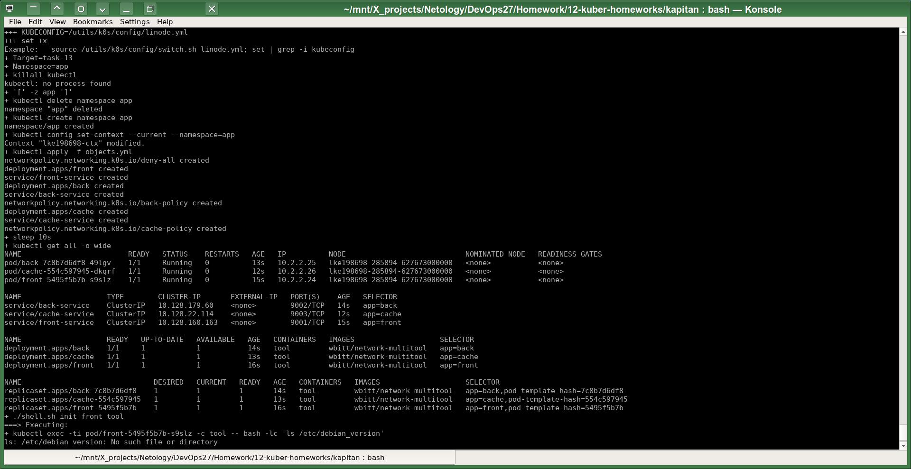
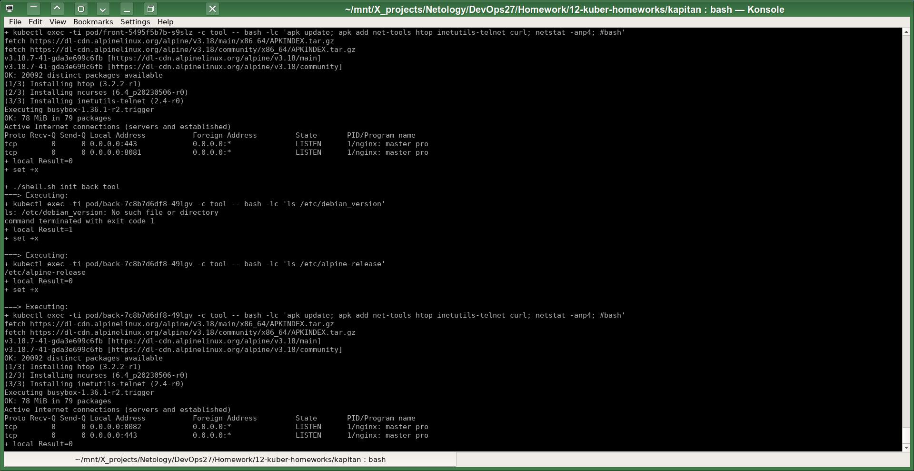
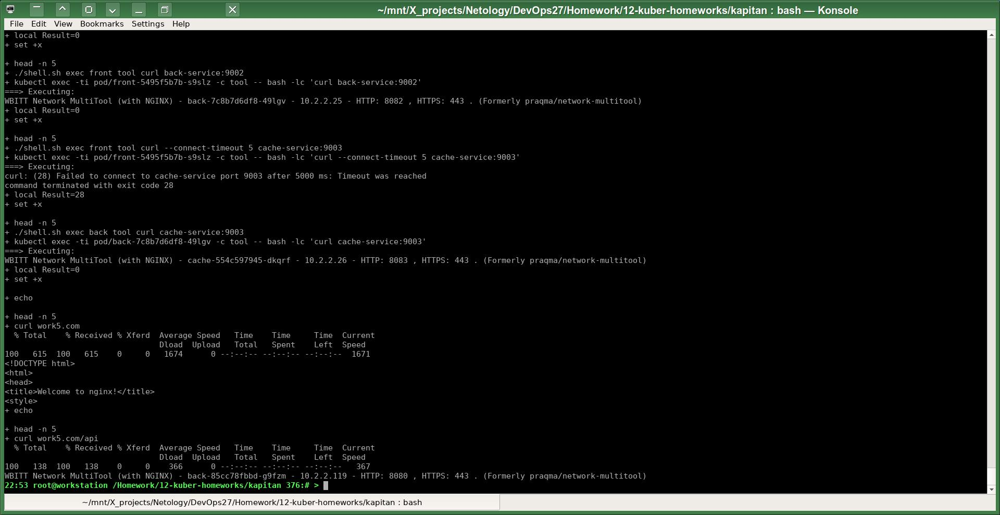

# Домашнее задание к занятию «Как работает сеть в K8s»
# Автор решения - студент курса Netology DevOps27: Прокопьев Александр Борисович

### Полезные линки по теме занятия:

1. [Документация Calico](https://www.tigera.io/project-calico/).
2. [Network Policy](https://kubernetes.io/docs/concepts/services-networking/network-policies/).
3. [About Network Policy](https://docs.projectcalico.org/about/about-network-policy).

-----

### Задание 1. Создать сетевую политику или несколько политик для обеспечения доступа

Задачи этой работы решены аналогично предыдущим с помощью шаблонизатора `Kapitan`.

Исходники решения задач до шаблонизации `Капитаном`: https://github.com/a-prokopyev-resume/devops-netology/blob/main/12-kuber-homeworks/kapitan/src/work13  

Настройки `Капиатана` для этой работы: https://github.com/a-prokopyev-resume/devops-netology/blob/main/12-kuber-homeworks/kapitan/classes/work13.yml

Target специфичная версия после шаблонизации `Капитаном`:  
https://github.com/a-prokopyev-resume/devops-netology/blob/main/12-kuber-homeworks/kapitan/compiled/task-13/apply.sh  
https://github.com/a-prokopyev-resume/devops-netology/blob/main/12-kuber-homeworks/kapitan/compiled/task-13/objects.yml  

Создание ресурсов K8S:

Мой скрипт `apply.sh` автоматически устанавливает отладочные инструменты в контейнеры подов:

 и потом запускает тестовые проверки из `curl`:
* `front` -> `back` - связь есть
* `front` -> `cache` - связи нет
* `back` -> `cache` - связь есть
