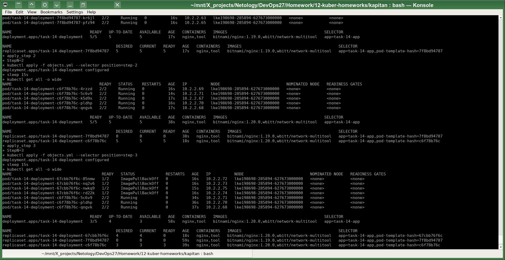
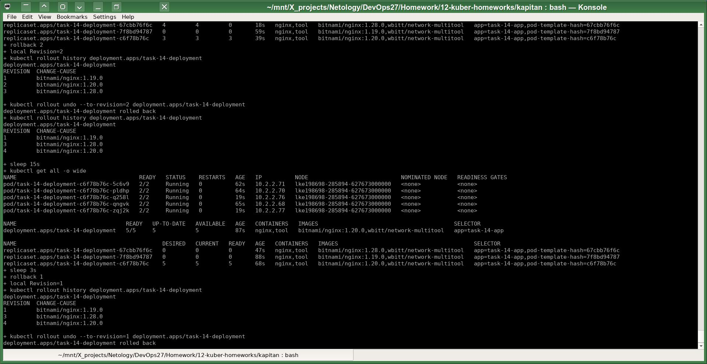
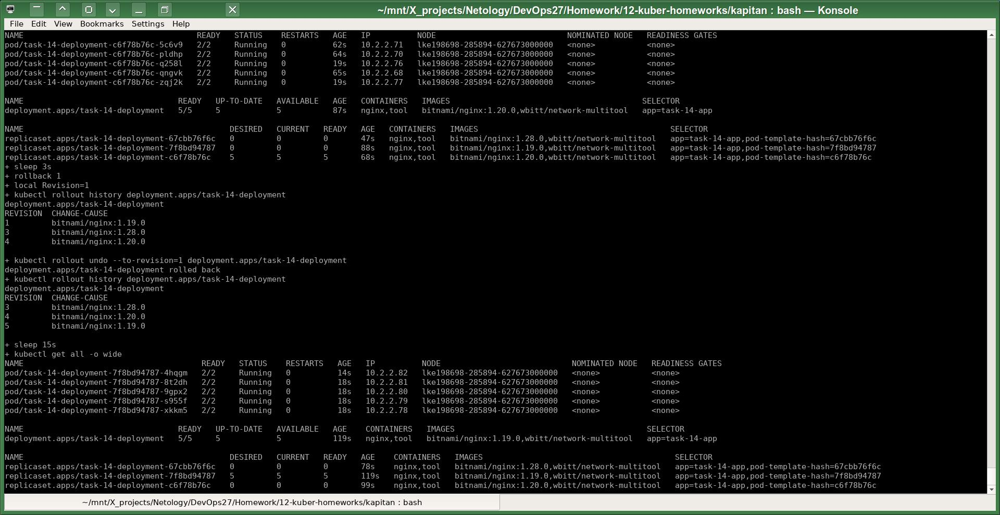

# Домашнее задание к занятию «Обновление приложений»
# Автор решения - студент курса Netology DevOps27: Прокопьев Александр Борисович

Полезные линки по теме занятия:
* [Документация Updating a Deployment](https://kubernetes.io/docs/concepts/workloads/controllers/deployment/#updating-a-deployment)
* [Статья про стратегии обновлений](https://habr.com/ru/companies/flant/articles/471620/)
* https://kubernetes.io/docs/reference/labels-annotations-taints/
* https://stackoverflow.com/questions/62926070/kubernetes-change-cause

-----

### Задание 1. Выбрать стратегию обновления приложения и описать ваш выбор

Под условия задачи возможно подойдёт стратегия `Rolling Update` с параметрами:
* maxSurge: 20%  
* maxUnavailable: 20%  

Обновлять лучше в тот период времени, когда по опыту (по истории метрик) и по текущим показаниям метрик зафиксирована наименьшая нагрузка на кластер.

Если всё же ресурсов не хватает, то можно применить стратегию обновления `Recreate`.

### Задание 2. Обновить приложение

Задачи этой работы решены аналогично предыдущим с помощью шаблонизатора `Kapitan`.

Исходники решения задач до шаблонизации `Капитаном`: https://github.com/a-prokopyev-resume/devops-netology/blob/main/12-kuber-homeworks/kapitan/src/work14  

Настройки `Капитана` для этой работы: https://github.com/a-prokopyev-resume/devops-netology/blob/main/12-kuber-homeworks/kapitan/classes/work14.yml

Target специфичная версия после шаблонизации `Капитаном`:  
https://github.com/a-prokopyev-resume/devops-netology/blob/main/12-kuber-homeworks/kapitan/compiled/task-14-all/apply.sh  
https://github.com/a-prokopyev-resume/devops-netology/blob/main/12-kuber-homeworks/kapitan/compiled/task-14-all/objects.yml  

Фрагмент моего скрипта `apply.sh`, специфичного для этой работы:
```

apply_step()
{
        StepN=$1;

        kubectl apply -f objects.yml --selector "position=step-$StepN";
        sleep 15s;
        kubectl get all -o wide;
}

apply_step 1;
apply_step 2;
apply_step 3;
```
Видим, что несмотря на проблемы с запуском контейнеров на третьем шаге, всё же старые контейнеры остаются запущены и могут продолжать обслуживать запросы пользователей:



Теперь откатываемся обратно:
```
rollback()
{
        local Revision=$1;
        kubectl rollout history deployment.apps/task-14-deployment;
        kubectl rollout undo --to-revision=$Revision deployment.apps/task-14-deployment;
        kubectl rollout history deployment.apps/task-14-deployment;
        sleep 15s;
        kubectl get all -o wide;
}

rollback 2;
sleep 3s;
rollback 1;
```


