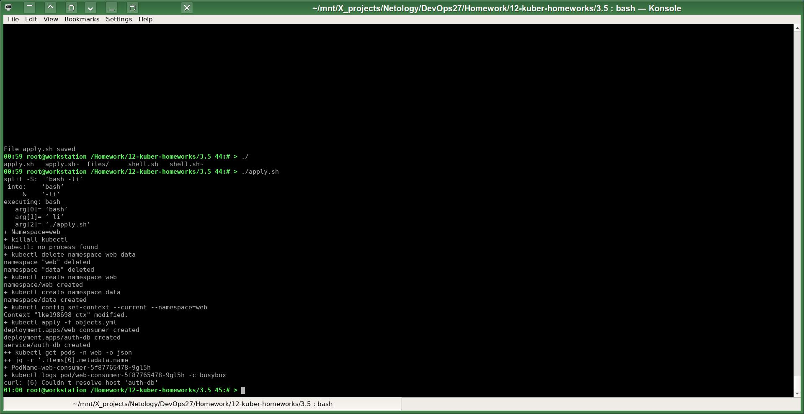
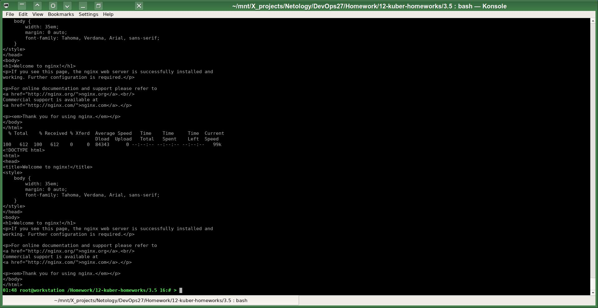

# Домашнее задание к занятию Troubleshooting
# Автор решения - студент курса Netology DevOps27: Прокопьев Александр Борисович

### Задание. При деплое приложение web-consumer не может подключиться к auth-db. Необходимо это исправить

Суть проблемы в том, что короткое локальное DNS имя сервиса без дополнительных уточняющих суффиксов имеет область видимости только в пределах одного своего `namespace`. Чтобы другие объекты `K8S` и процессы их подов других `namespaces` могли успешно разрешить имя сервиса из другого `namespace` необходимо уточнять такое имя соответствующим суффиксом, равным имени `namespace`, где находится соответствующий сервис.
Т.е. для такого inter-namespace обращения DNS имя должно выглядеть следующим образом: `service-name.namespace-name` вместо просто `service-name` (что подходит только для случая intra-namespace обращения). 

Таким образом один из вариантов решения данной задачи состоит в указании более полного имени при обращении из `Deployment` `web-consumer` к сервису `auth-db`: `auth-db.data`

Либо можно разместить оба `Deployment` в одинаковом `namespace`.

На скриншотах можно увидеть запуск моего скрипта `apply.sh` до исправления файла манифестов:

 и после исправления:

