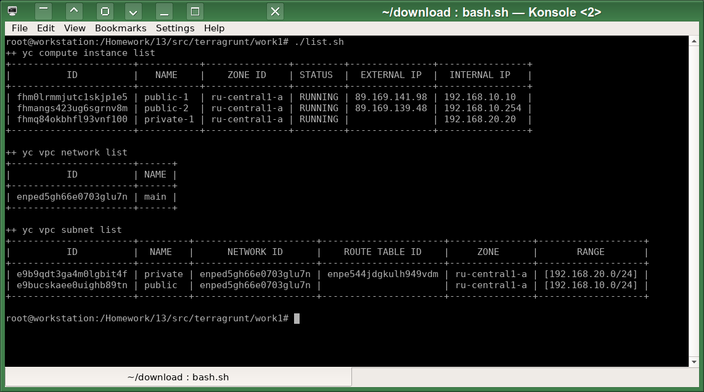
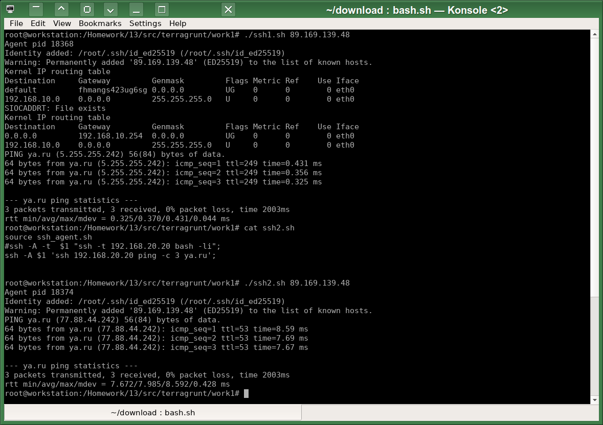

# Домашнее задание к занятию «Организация сети»
# Автор решения - студент курса Netology DevOps27: Прокопьев Александр Борисович

Все задания этого модуля я выполнял с помощью `Terraform` и надстройки над ним - [Terragrunt](https://spacelift.io/blog/terragrunt-vs-terraform).
Сначала я хотел использовать модуль `Ansible` `community.general.terraform` или коллекцию `cloud.terraform` для оркестрации параметризованных запусков `Terraform` в его разных `workspaces`, но потом решил, что `Terragrunt` для этого подходит лучше, он позволяет более гибко связывать разные готовые модули `Terraform` между собой и легче отслеживать возникающие при запуске `Terraform` ошибки. Причём можно вызывать модули `Terraform` верхнего уровня многократно для создания нескольких копий однотипных, но кастомизированных параметрами, групп объектов `Terraform`, например, можно создавать несколько виртуальных машин или подсетей используя один и тот же соответствующий группе ресурсов файл (`subnet/main.tf` или `compute/instance/main.tf` и т.п.).

Полезные линки по теме занятия:
 * https://spacelift.io/blog/terragrunt-vs-terraform
 * https://terragrunt.gruntwork.io/docs/features/keep-your-terraform-code-dry/
 * https://terragrunt.gruntwork.io/docs/getting-started/quick-start/
 * https://terragrunt.gruntwork.io/docs/reference/config-blocks-and-attributes/#dependency
 * https://terragrunt.gruntwork.io/docs/
 * https://github.com/gruntwork-io/terragrunt-infrastructure-live-example
 * https://itnext.io/terragrunt-inter-module-dependency-management-36528693acdf
 * https://medium.com/@nanditasahu031/how-to-define-dependencies-between-modules-in-terragrunt-50207a6157bf
 * https://terragrunt.gruntwork.io/docs/features/execute-terraform-commands-on-multiple-modules-at-once/
 * https://faun.pub/dependency-handling-through-terragrunt-8d5c87964e2d
 * https://terraform-provider.yandexcloud.net/Resources/vpc_route_table
 * https://yandex.cloud/ru/docs/tutorials/routing/nat-instance
 * [VPC subnet](https://registry.terraform.io/providers/yandex-cloud/yandex/latest/docs/resources/vpc_subnet)
 * [Route table](https://registry.terraform.io/providers/yandex-cloud/yandex/latest/docs/resources/vpc_route_table)
 * [Compute Instance](https://registry.terraform.io/providers/yandex-cloud/yandex/latest/docs/resources/compute_instance)

---
### Задание 1. Yandex Cloud 

1. Создать пустую VPC:  
[vpc/terragrunt.hcl](src/terragrunt/vpc/terragrunt.hcl)  
[vpc/main.tf](src/terraform/vpc/main.tf)  

2. Публичная подсеть.
 - Создать в VPC subnet с названием public, сетью 192.168.10.0/24:  
[subnet1/terragrunt.hcl](src/terragrunt/subnet1/terragrunt.hcl)  
[subnet/main.tf](src/terraform/subnet/main.tf)  

 - Создать в этой подсети NAT-инстанс, присвоив ему адрес 192.168.10.254 и виртуалку с публичным IP:  
[work1/vm1/terragrunt.hcl](src/terragrunt/work1/vm1/terragrunt.hcl), можно создавать любое количество виртуалок, указывая список их внутренних адресов:
```
terraform 
{
  source = "../../../terraform/compute/instance"
}
dependency "subnet1"
{
  config_path = "../../subnet1"
}
inputs = {
  subnet = dependency.subnet1.outputs.self
  name = "public"
  int_ifaces = [ "192.168.10.10", "192.168.10.254" ]
  ext_ifaces = [ true, true ]
  images = [ "fd8lk4dibrqmhmn8rbc4", "fd8mgjvkra979jp2psfe" ]
}
```
[compute/instance/main.tf](src/terraform/compute/instance/main.tf)  

подключиться к ней и убедиться, что есть доступ к интернету:  
Запускаю скрипт [work1/ssh1.sh](src/terragrunt/work1/ssh1.sh):  
```
source ssh_agent.sh
#ssh -A -t $1 "ssh -t  192.168.10.10 bash -li";
ssh -A $1 'ssh  192.168.10.10 bash -lc "route del default; route add default gw 192.168.10.254; route -n; ping -c 3 ya.ru"';
```



Приватная подсеть:  
 - Создать в VPC subnet с названием private, сетью 192.168.20.0/24:  
[work1/subnet2/terragrunt.hcl](src/terragrunt/work1/subnet2/terragrunt.hcl)  
[subnet/main.tf](src/terraform/subnet/main.tf)  
 - Создать route table. Добавить статический маршрут, направляющий весь исходящий трафик private сети в NAT-инстанс:  
[work1/route/terragrunt.hcl](src/terragrunt/work1/route/terragrunt.hcl)  
[subnet/main.tf](src/terraform/route/main.tf)  
 - Создать в этой приватной подсети виртуалку с внутренним IP, подключиться к ней через виртуалку, созданную ранее, и убедиться, что есть доступ к интернету:  
Запускаю скрипт [work1/ssh2.sh](src/terragrunt/work1/ssh2.sh):   
```
source ssh_agent.sh
#ssh -A -t  $1 "ssh -t 192.168.20.20 bash -li";
ssh -A $1 'ssh 192.168.20.20 ping -c 3 ya.ru';

```


=========================== The Beginning of the Copyright Notice ===========================  
 The AUTHOR of this file and the owner of all exclusive rights in this file is Alexander Borisovich Prokopyev  
 born on December 20, 1977 resident of the city of Kurgan, Russia;  
 Series and Russian passport number of the AUTHOR (only the last two digits for each one): **22-****91  
 Russian Individual Taxpayer Number of the AUTHOR (only the last four digits): ********2007  
 Russian Insurance Number of Individual Ledger Account of the AUTHOR (only the last five digits): ***-***-859 04  
 Copyright (C) Alexander B. Prokopyev, 2024, All Rights Reserved.  
 Contact of the AUTHOR: a.prokopyev.resume at gmail dot com  
 WWW: https://github.com/a-prokopyev-resume/devops-netology  
  
 All source code and other content contained in this file is protected by copyright law.  
 This file is licensed by the AUTHOR under AGPL v3 (GNU Affero General Public License): https://www.gnu.org/licenses/agpl-3.0.en.html  
  
 THIS FILE IS LICENSED ONLY PROVIDED FOLLOWING RESTRICTIONS ALSO APPLY:  
 Nobody except the AUTHOR may alter or remove this copyright notice from any copies of this file content (including modified fragments).  
 Unless required by applicable law or agreed to in writing, software distributed under the License is distributed on an  
 "AS IS" BASIS, WITHOUT WARRANTIES OR CONDITIONS OF ANY KIND, either express or implied.   
  
 ATTENTION: If potential user's or licensee's country laws collide or are not compatible with the terms of this copyright notice or   
 if a potential user or licensee does not agree with the terms of this copyright notice then such potential user or licensee    
 is STRONGLY PROHIBITED to use this file by any method.  
============================== The End of the Copyright Notice ==============================  