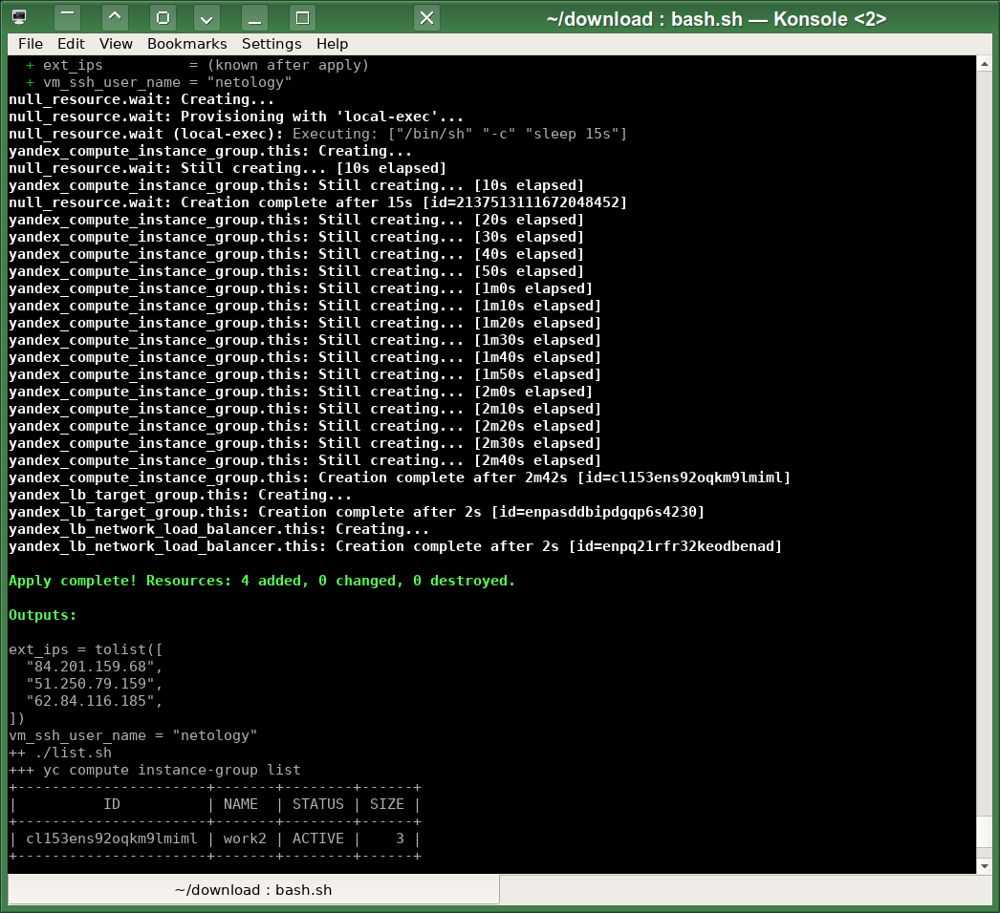
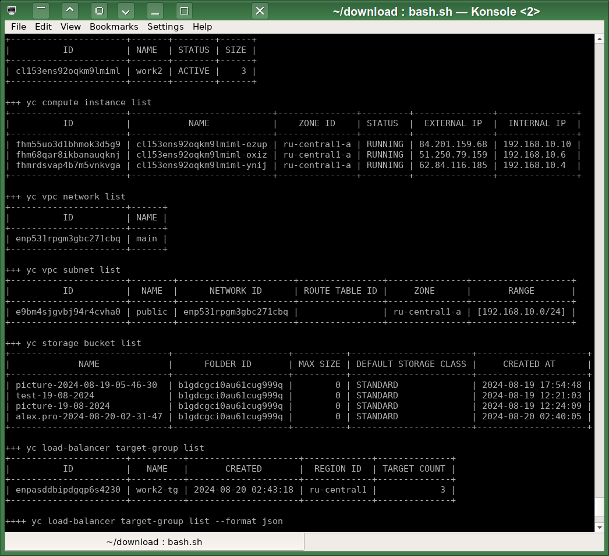
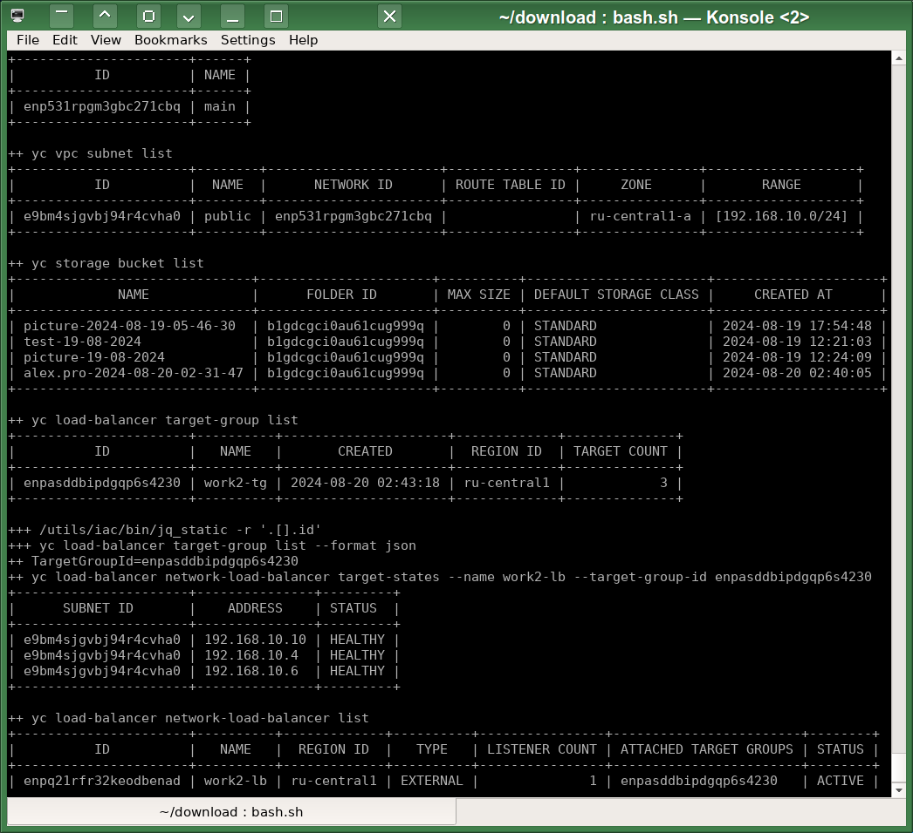
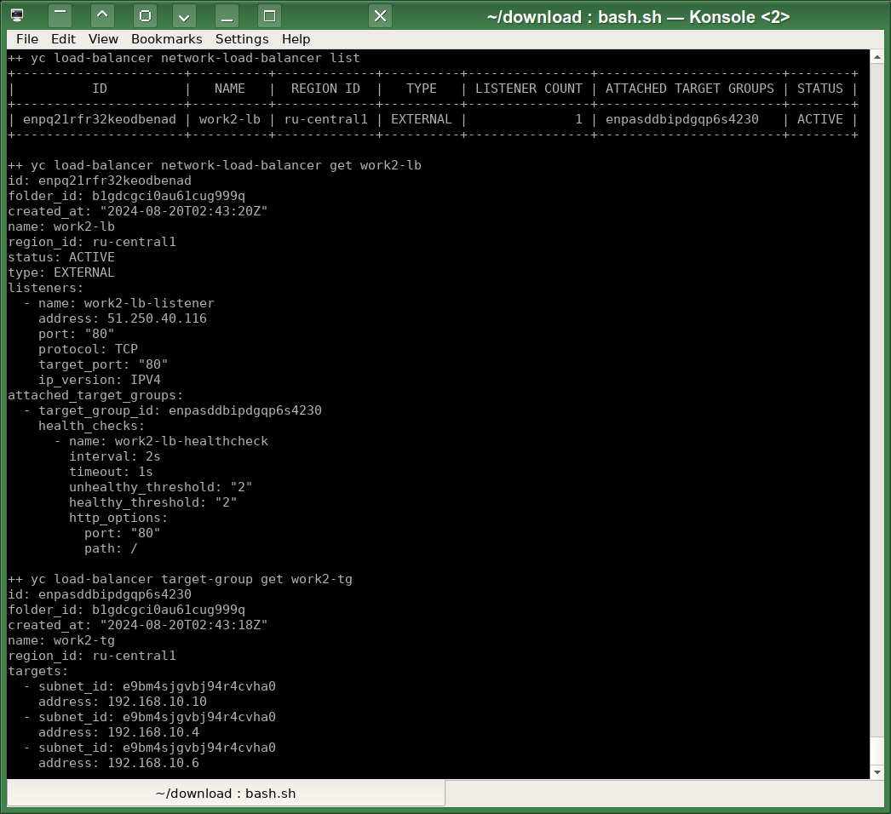
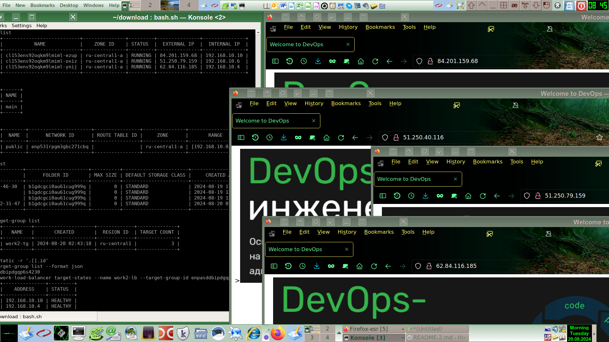

# Домашнее задание к занятию «Вычислительные мощности. Балансировщики нагрузки»  
# Автор решения - студент курса Netology DevOps27: Прокопьев Александр Борисович

Все задания этого модуля я выполнял с помощью `Terraform` и надстройки над ним - [Terragrunt](https://spacelift.io/blog/terragrunt-vs-terraform).
Сначала я хотел использовать модуль `Ansible` `community.general.terraform` или коллекцию `cloud.terraform` для оркестрации параметризованных запусков `Terraform` в его разных `workspaces`, но потом решил, что `Terragrunt` для этого подходит лучше, он позволяет более гибко связывать разные готовые модули `Terraform` между собой и легче отслеживать возникающие при запуске `Terraform` ошибки.

Полезные линки по теме занятия:
 * https://registry.terraform.io/providers/yandex-cloud/yandex/latest/docs/resources/storage_bucket
 * https://registry.terraform.io/providers/yandex-cloud/yandex/latest/docs/resources/storage_object
 * https://registry.terraform.io/providers/yandex-cloud/yandex/latest/docs/resources/lb_target_group.html
 * https://registry.terraform.io/providers/yandex-cloud/yandex/latest/docs/resources/lb_network_load_balancer
 * https://cloud.yandex.ru/docs/compute/operations/instance-groups/create-with-balancer
 * https://developer.hashicorp.com/terraform/tutorials/configuration-language/for-each
 * https://spacelift.io/blog/terraform-for-loop
 * https://blog.gruntwork.io/terraform-tips-tricks-loops-if-statements-and-gotchas-f739bbae55f9

---
## Задание 1. Yandex Cloud 

1. `Bucket` создаётся в модуле [bucket/main.tf](src/terraform/bucket/main.tf)
2. `Compute Instance Group` создаётся в модуле [compute/group/main.tf](src/terraform/compute/group/main.tf)
количество инстансов можно указывать [work2/vmg/terragrunt.hcl](src/terragrunt/work2/vmg/terragrunt.hcl) любое:  
```
inputs = {
  amount = 3
  subnet = dependency.subnet1.outputs.self
  name = "work2"
  image_id = "fd827b91d99psvq5fjit" # LAMP stack

  user_data = <<EOF
  ...
```
мой модуль `compute/group/main.tf` автоматически подстраивается под любое количество инстансов и с помощью итераторов создаёт нужное количество таргетов в `Target Group`:
```
resource "yandex_lb_target_group" "this" {
  name      = "work2-tg"
  dynamic "target" {
    for_each = toset(yandex_compute_instance_group.this.instances)
    content {
        subnet_id = "${var.subnet.id}"
        address   = "${target.value.network_interface[0].ip_address}"
    }
  }
}
```
 
3. Подключить группу к сетевому балансировщику:











=========================== The Beginning of the Copyright Notice ===========================  
 The AUTHOR of this file and the owner of all exclusive rights in this file is Alexander Borisovich Prokopyev  
 born on December 20, 1977 resident of the city of Kurgan, Russia;  
 Series and Russian passport number of the AUTHOR (only the last two digits for each one): **22-****91  
 Russian Individual Taxpayer Number of the AUTHOR (only the last four digits): ********2007  
 Russian Insurance Number of Individual Ledger Account of the AUTHOR (only the last five digits): ***-***-859 04  
 Copyright (C) Alexander B. Prokopyev, 2024, All Rights Reserved.  
 Contact of the AUTHOR: a.prokopyev.resume at gmail dot com  
 WWW: https://github.com/a-prokopyev-resume/devops-netology  
  
 All source code and other content contained in this file is protected by copyright law.  
 This file is licensed by the AUTHOR under AGPL v3 (GNU Affero General Public License): https://www.gnu.org/licenses/agpl-3.0.en.html  
  
 THIS FILE IS LICENSED ONLY PROVIDED FOLLOWING RESTRICTIONS ALSO APPLY:  
 Nobody except the AUTHOR may alter or remove this copyright notice from any copies of this file content (including modified fragments).  
 Unless required by applicable law or agreed to in writing, software distributed under the License is distributed on an  
 "AS IS" BASIS, WITHOUT WARRANTIES OR CONDITIONS OF ANY KIND, either express or implied.   
  
 ATTENTION: If potential user's or licensee's country laws collide or are not compatible with the terms of this copyright notice or   
 if a potential user or licensee does not agree with the terms of this copyright notice then such potential user or licensee    
 is STRONGLY PROHIBITED to use this file by any method.  
============================== The End of the Copyright Notice ==============================  