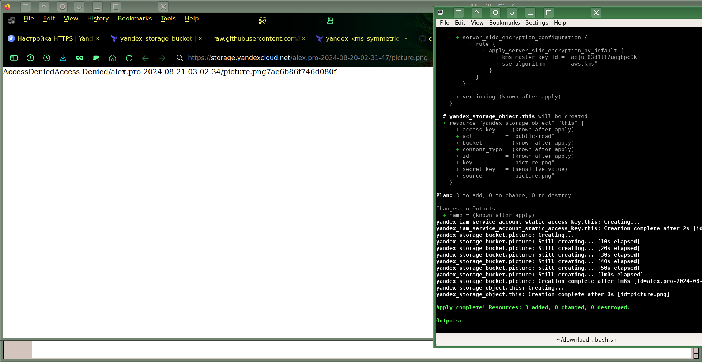

# Домашнее задание к занятию «Безопасность в облачных провайдерах»  
# Автор решения - студент курса Netology DevOps27: Прокопьев Александр Борисович

---
## Задание 1. Yandex Cloud   

1. С помощью ключа в KMS необходимо зашифровать содержимое бакета:
 - создать ключ в KMS:
   * [encrypt/main.tf](src/terraform/encrypt/main.tf)
   * [encrypt/terragrunt.hcl](src/terragrunt/work3/encrypt/terragrunt.hcl)
 - с помощью ключа зашифровать содержимое бакета, созданного ранее.
   * [bucket/main.tf](src/terraform/bucket/main.tf)
   * [bucket/terragrunt.hcl](src/terragrunt/work3/bucket/terragrunt.hcl)
  

          

2. (Выполняется не в Terraform)`*` Создать статический сайт в Object Storage c собственным публичным адресом и сделать доступным по HTTPS:

Если это задача необязательная `со звёздочкой`, то я хотел бы решить её позднее причём полностью в виде `IaC` без использования браузера после получения зачёта по этой работе, потому что уже скоро техническое закрытие этого модуля.

 