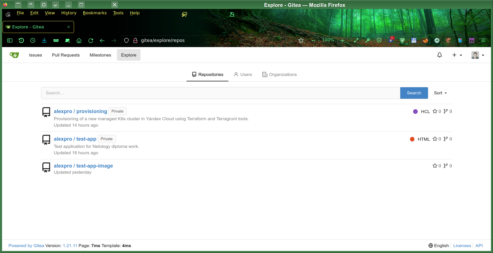
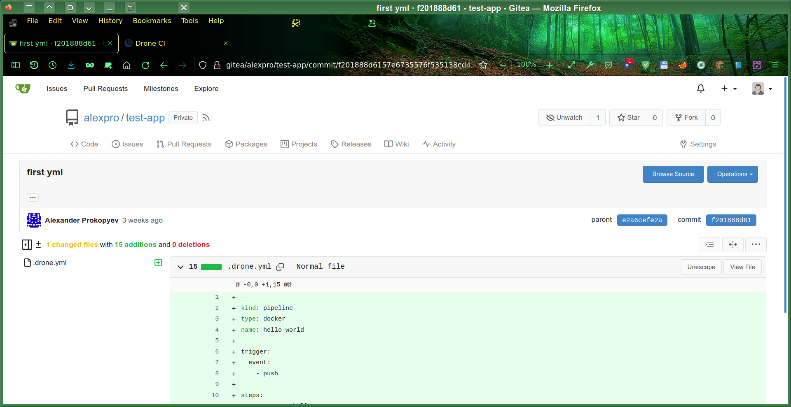
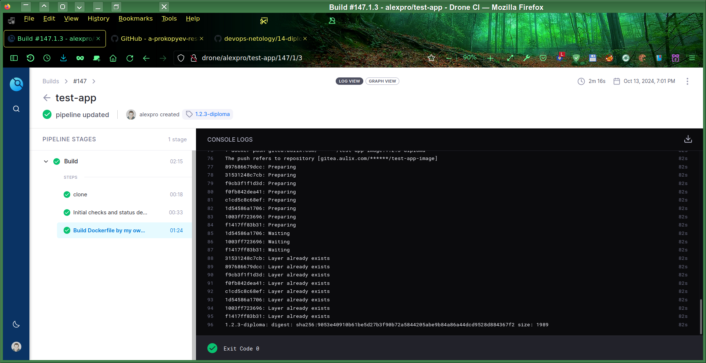
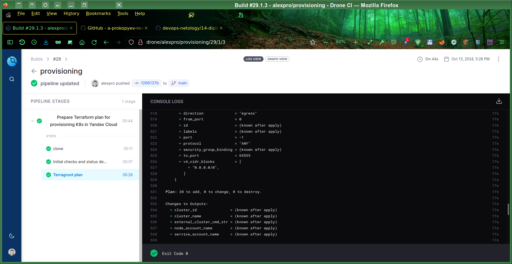
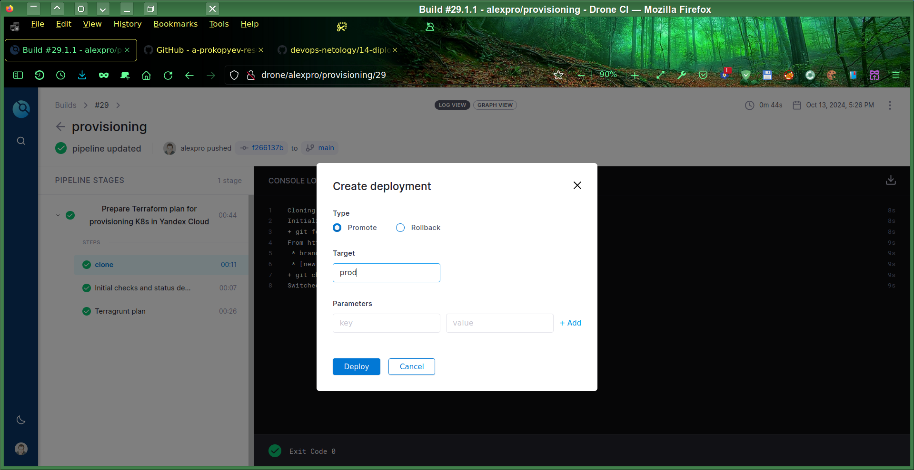
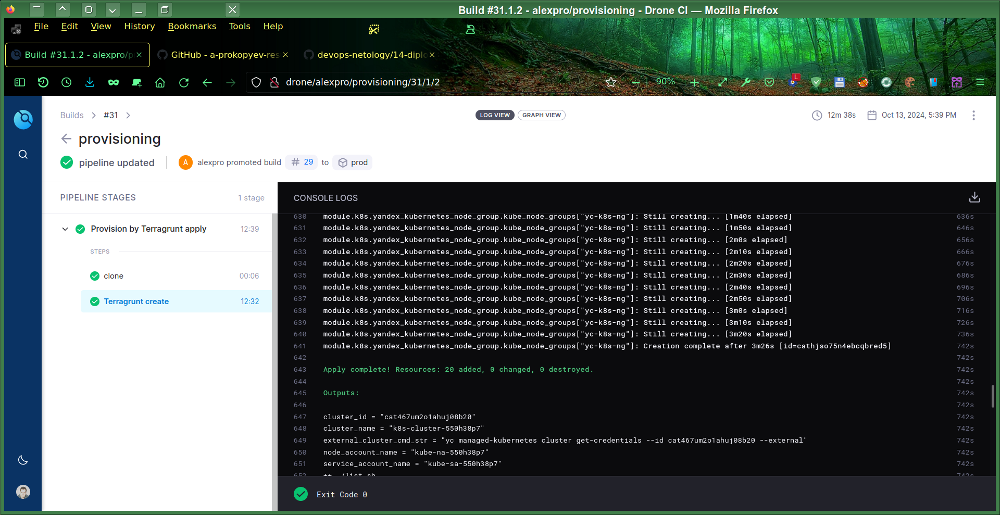
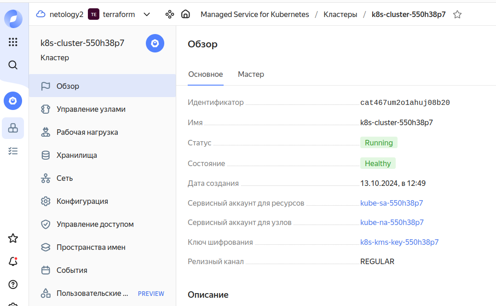
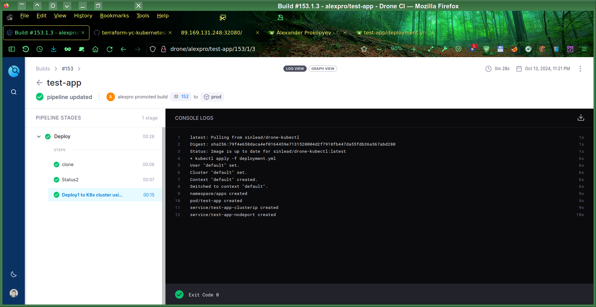
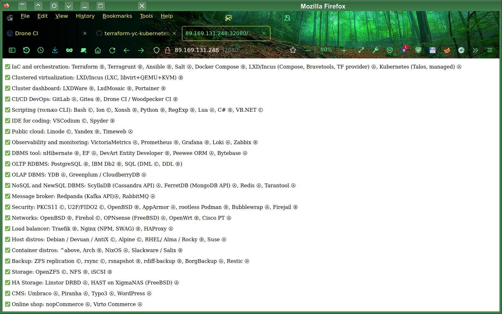

# Дипломный практикум в Yandex.Cloud
# Автор решения - студент курса Netology DevOps27: Прокопьев Александр Борисович

---

## Файлы решения находятся в приватном `Git` репозитории под управлением установленного локально `Gitea`.

### Для проверки я предоставлю проверяющему по его запросу доступ, для чего мне необходимо будет временно включить туннель до public `endpoint` и прописать `IP` адрес проверяющего в файрволе этого `endpoint`.

Текст реферата (этого текстового описания) моего дипломного проекта предоставляется по лицензии AGPLv3, но некоторые файлы решения в приватном репозитории по другим видам лицензий.

---

### Установка и настройка локального Drone CI, интегрированного с Gitea

Для этого я написал гибко конфигурируемый `docker-compose.yml`, который позволяет задавать все важные параметры (около десятка параметров) установки связки `Gitea` + `Drone CI` в файле `.env`.

<details>
    <summary>: Исходный код файла .env ...  </summary>

```
#=== Gitea:
GITEA_HOST=gitea.<mydomain>.com 
# gitea

GITEA_DOMAIN=${GITEA_HOST}
GITEA_DOMAIN_TRAEFIK=gitea.<mydomain>.com
GITEA_IP=192.168.0.<xxx>
GITEA_INT_PORT=80
GITEA_EXT_PORT=80
GITEA_PORTS="${GITEA_IP}:${GITEA_EXT_PORT}:${GITEA_INT_PORT}"

#GITEA_VERSION=1.22.2
GITEA_VERSION=1.21.11

GITEA_ADMIN_USER=<xxx>

# unused#
ACME_EMAIL=acme@<mydomain>.com


LINODE_TOKEN=<xxx>

#=== Drone:
DRONE_HOST=drone
DRONE_DOMAIN_TRAEFIK=drone.<mydomain>.com
DRONE_DOMAIN=${DRONE_HOST}
DRONE_IP=192.168.0.<xxx>
DRONE_INT_PORT=80
DRONE_EXT_PORT=80
DRONE_PORTS="${DRONE_IP}:${DRONE_EXT_PORT}:${DRONE_INT_PORT}"

#DRONE_VERSION=2.4
DRONE_VERSION=2.24
DRONE_RUNNER_VERSION=1.8.3

DRONE_RPC_SECRET=<xxx>
DRONE_USER_CREATE="username:${GITEA_ADMIN_USER},machine:false,admin:true,token:${DRONE_RPC_SECRET}"

DRONE_GITEA_CLIENT_ID=<xxx>
DRONE_GITEA_CLIENT_SECRET=<xxx>

```

</details>

В такой конфигурации `Drone CI` интегрирован с `Gitea` и вход в `Drone CI` осуществляется через OAuth провайдер `Gitea`.
В `Gitea` настроен вебхук для отправки событий от коммитов в `Drone CI`.

   
Кроме того сделал удобный скрипт запуска и перезапуска `docker-compose` в различных конфигурациях:
<details>
    <summary>: Исходный код файла restart.sh ...  </summary>

```
#!/bin/bash

Action=$1;

case $Action in
        ( all )
                StopProfiles=" --profile server --profile runner ";
                #Profiles=" --profile server ";
                StartProfiles=" --profile server --profile runner "; # for local runner
        ;;
        ( gitea )
                StopProfiles=" --profile gitea ";
                #Profiles=" --profile server ";
                StartProfiles=" --profile gitea ";
        ;;
esac;

./render_tpl.sh;

docker-compose $StopProfiles down;

/utils/docker/clean_stopped.sh;

docker-compose $StartProfiles up -d;

```

</details>

Скриншоты GUI `Gitea` и `Drone CI`:




### Создание и сборка тестового приложения

Сборка и деплой тестового приложения обеспечивается пайплайнами из файла `test-app/.drone.yml` (каталог `test-app` - это отдельный дополнительный `Git` репозиторий `alexpro/test-app`):
* `push` - сборка образа и сохранение его в `registry` с тэгом `:latest`
* `tag` - сборка приложения и сохранение его в `registry` с указанным тэгом.
* `promote` - установка приложения командой `kubectl apply -f`. Причём этот пайплайн работает только для повторного запуска после события `tag`, т.ё. только для тэгированных коммитов и соответственно потом успешно собранных образов контейнеров.
* `rollback` - удаление приложения командой `kubectl delete -f`

В качестве `registry` для образов контейнеров собранного приложения я использовал отдельный `Gitea` репозиторий:
`alexpro/test-app-image`. Пока этот репозиторий находится локально, он доступен для managed кластера `K8s` через туннель, который включается кратковременно на время проверки.

Скриншот сборки тестового приложения с тэгом `1.2.3-diploma`:


Я сделал два варианта пайплайнов с запуском сборки в `DinD` и в хостовом `Docker`.
Хостовый работает быстрее из-за медленной работы FS в `DinD`, но `DinD` считается безопаснее, хотя с моей точки зрения для большей безопасности лучше запускать сборку в `Podman` желательно `rootless`, в т.ч. в так называемом `PinD` (когда `Podman` контейнер запускается в `Docker` контейнере) и конечно на отдельном эфимерном облачном хосте для сборочного `Drone CI runner`.

<details>
    <summary>: Фрагменты моего исходного кода сборочного пайплайна .drone.yml ...  </summary>

```
---
kind: pipeline
type: docker
name: Build
trigger:
  repo:
  - alexpro/test-app
  event:
  - custom
  - push
  - tag
tasks:
 - name: Build Dockerfile by my own script
    when:
#      branch: DISABLED_TASK # for debugging   
    image: docker:cli
    environment:
      GITEA_USER:
        from_secret: GiteaUser
      GITEA_PASSWORD:
        from_secret: GiteaPassword
    volumes:
      - name: hostsock
        path: /var/run/docker.sock
#      - name: dindsock
#        path: /var/run        
#    services:
#      - docker:dind                
    commands:
      - set -x; echo $GITEA_PASSWORD | docker login -u $GITEA_USER --password-stdin $DOCKER_REGISTRY;
#     - sleep 20s; docker pull $DockerImageName:latest; # Used for testing only
      - sleep 30s; docker build -t $DockerImageName:latest .; # --pull # Whole line commented when testing
      - docker push $DockerImageName:latest;
      - |
        if [ -n "$DRONE_TAG" ]; then
          docker tag $DockerImageName:latest $DockerImageName:"$DRONE_TAG";
          docker push $DockerImageName:"$DRONE_TAG";
        fi

services:
- name: docker
  image: docker:dind #_DISABLE
  privileged: true
  volumes:
  - name: dindsock
    path: /var/run
  failure: ignore # for _DISABLE above
  when:
    branch: DISABLED_TASK # for debugging 

volumes:
- name: dindsock
  temp: {}
- name: hostsock
  host:
    path: /var/run/docker.sock
```

</details>


### Создание облачной инфраструктуры (managed кластера Kubernetes)
В качестве кластера `K8s` я использую managed PaaS `K8s` в облаке `Yandex`.
Для начального развёртывания кластера `K8s` я написал модули `Terraform`, которые управляются моими модулями `Terragrunt` для удобства параметризации:
<details>
    <summary>: Фрагмент моего исходного кода файла vpc/terragrunt.hcl ...  </summary>

```
terraform {
  source = "../../../../../terraform/k8s/vpc"
}

locals  {
  single_master = [
    {
      "v4_cidr_blocks" : ["10.121.0.0/16"],
      "zone" : "ru-central1-a"
    }
  ]

  ha_master = [
    {
      "v4_cidr_blocks" : ["10.121.0.0/16"],
      "zone" : "ru-central1-a"
    },
    {
      "v4_cidr_blocks" : ["10.131.0.0/16"],
      "zone" : "ru-central1-b"
    },
    {
      "v4_cidr_blocks" : ["10.141.0.0/16"],
      "zone" : "ru-central1-d"
    }
  ]
}

inputs = {
   subnets = local.single_master
#   subnets = local.ha_master
}
```

</details>

Выбирая в качестве значения подсетей `local.single_master` или `local.ha_master`, можно влиять на тип отказоустойчивости создаваемого кластера.

<details>
    <summary>Фрагмент моего исходного кода файла cluster/terragrunt.hcl ...  </summary>

```

terraform {
  source = "../../../../../terraform/k8s/cluster"
}

dependency "vpc" {
  config_path = "../vpc"
}

inputs = {

  subnets = dependency.vpc.outputs.public_subnets

  node_groups = {
    "yc-k8s-ng" = {
      fixed_scale = {
        size = 1
      }
      node_labels = {
        role        = "yc-k8s-ng-worker"
        environment = "testing"
      }
      max_expansion   = 1
      max_unavailable = 1

      platform_id     = "standard-v2"

      auto_repair     = true
      auto_upgrade    = false
      enable_oslogin_or_ssh_keys = true

      network_acceleration_type = "standard"
      container_runtime_type    = "containerd"

    } # "yc-k8s-ng" 
  } # node_groups


  node_groups_defaults = {
    core_fraction = 100
    disk_size = 64
    disk_type = "network-ssd"
    ipv4 = true
    ipv6 = false
    nat = true # for OS login
    node_cores = 2
    node_gpus = 0
    node_memory = 2
    platform_id = "standard-v1"
    preemptible = true
  } # node_groups_defaults

} # inputs

```

</details>

Для запуска модулей `Terragrunt` я создал вспомогательный `Bash` скрипт `ctl.sh`, который в свою очередь вызывается из пайплайна `.drone.yml` по следующим `CI/CD` событиям:
* `push` - проверка плана `Terragrunt`
* `promote` - создание инфраструктуры командой `apply`, сразу же запускается и настройка кластера (установка и настройка дополнительного софта типа мониторинга)
* `rollback` - удаление инфраструктуры командой `destroy`
<details>
    <summary>: Фрагмент моего кода скрипта ctl.sh   ...  </summary>

```
clean_cache()
{
        rm -Rf ./*/.terragrunt-cache;
        rm -Rf ./*/*/.terragrunt-cache;
}

destroy_infra()
{
        terragrunt run-all destroy $Options $Options2;
        yc_delete; 
        clean_cache;
}

create_infra()
{
        terragrunt run-all apply $Options $Options2;
}

plan_infra()
{
        ( cd vpc; terragrunt apply  $Options $Options2 );
        terragrunt run-all plan --terragrunt-ignore-dependency-errors $Options;
}


case $Action in
        ( list )
                ./list.sh;
        ;;
        ( plan )
                plan_infra;
        ;;
        ( create )
                create_infra;
        ;;
        ( destroy )
                destroy_infra;
        ;;
        ( recreate )
                destroy_infra;
                ./list.sh;
                create_infra;
        ;; 
        ( * )
                echo "Error: unknown action!";
                exit 1;
        ;;
esac;
./list.sh;

```

</details>

Скриншоты запуска пайплайна планирования инфраструктуры кластера:  


Перезапуск пайплайна с опцией `promote`:  


`Promoted` пайплайн - результат запуска:  


Созданный кластер:  



### Настройка кластера
Установка вспомогательных приложений (кроме тестового приложения) типа мониторинга  происходит на шаге `promote` пайплайна для создания кластера `K8s`.
`Grafana` с `Prometheus` ставится одним `helm` пакетом с небольшими модификациями `values.yml` для открытия их портов на соответствующих сервисах типа `NodePort`.

По завершении запуска модулей `Terragrant` и `Terraform` мой скрипт автоматически прописывает новые `K8s credentials` в конфиг `kubectl` и копирует их (токен и сертификат) в секреты `Drone CI` для последующего  деплоя тестового приложения.

### Установка и настройка CI/CD для тестового приложения

* Деплой тестового приложения происходит с помощью повторного запуска пайплайна уже успешно собранного ранее билда тестового приложения, но с признаком `promote` в среду `prod`. Доступ к порту приложения обеспечивается тоже через `NodePort`.
* Удаление приложения происходит по `CI/CD` событию `rollback`.





---

### Для проверки я предоставлю проверяющему по его запросу доступ, для чего мне необходимо будет временно включить туннель до public `endpoint` и прописать `IP` адрес проверяющего в файрволе этого `endpoint`.

Текст реферата (этого текстового описания) моего дипломного проекта предоставляется по лицензии AGPLv3, но некоторые файлы решения в приватном репозитории по другим видам лицензий.

=========================== The Beginning of the Copyright Notice ===========================  
 The AUTHOR of this file and the owner of all exclusive rights in this file is Alexander Borisovich Prokopyev  
 born on December 20, 1977 resident of the city of Kurgan, Russia;  
 Series and Russian passport number of the AUTHOR (only the last two digits for each one): **22-****91  
 Russian Individual Taxpayer Number of the AUTHOR (only the last four digits): ********2007  
 Russian Insurance Number of Individual Ledger Account of the AUTHOR (only the last five digits): ***-***-859 04  
 Copyright (C) Alexander B. Prokopyev, 2024, All Rights Reserved.  
 Contact of the AUTHOR: a.prokopyev.resume at gmail dot com  
 WWW: https://github.com/a-prokopyev-resume/devops-netology  
  
 All source code and other content contained in this file is protected by copyright law.  
 This file is licensed by the AUTHOR under AGPL v3 (GNU Affero General Public License): https://www.gnu.org/licenses/agpl-3.0.en.html  
  
 THIS FILE IS LICENSED ONLY PROVIDED FOLLOWING RESTRICTIONS ALSO APPLY:  
 Nobody except the AUTHOR may alter or remove this copyright notice from any copies of this file content (including modified fragments).  
 Unless required by applicable law or agreed to in writing, software distributed under the License is distributed on an  
 "AS IS" BASIS, WITHOUT WARRANTIES OR CONDITIONS OF ANY KIND, either express or implied.   
  
 ATTENTION: If potential user's or licensee's country laws collide or are not compatible with the terms of this copyright notice or   
 if a potential user or licensee does not agree with the terms of this copyright notice then such potential user or licensee    
 is STRONGLY PROHIBITED to use this file by any method.  
============================== The End of the Copyright Notice ==============================  